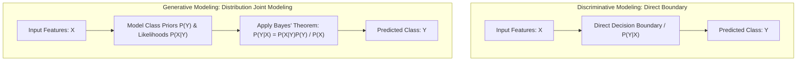
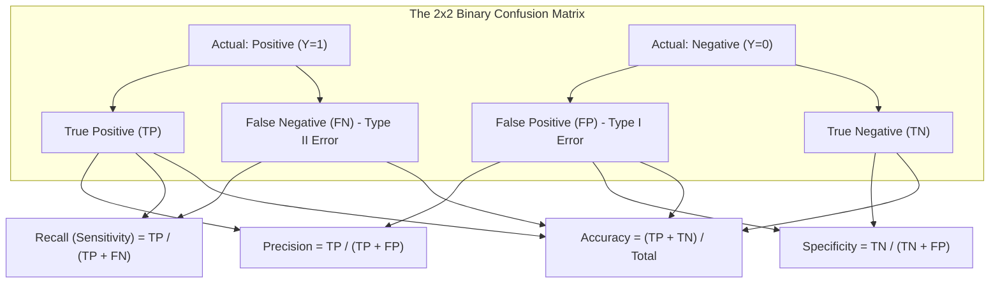

# Migration in progress
# Week 3: Introduction to Classification and Prediction

## Introduction to Classification and Prediction: Foundations and Evaluation

Supervised learning constructs parameterized functions that map input feature vectors to observed target outputs. Depending on the nature of the target variable, supervised tasks divide into numeric prediction (continuous regression) and discrete pattern categorization (classification). Evaluating predictive models requires moving beyond crude accuracy heuristics toward formal statistical metrics, trade-off curves, and loss formulations tailored to operational costs. Examining model paradigms, multiclass decomposition strategies, threshold calibration, and regression metrics establishes the analytical toolkit for supervised model evaluation.

## Foundations of Supervised Prediction

### Continuous Regression Versus Categorical Classification

- **Supervised prediction** operates on empirical datasets consisting of feature vectors paired with verified targets:
  $$\mathcal{D} = \{(x^{(1)}, y^{(1)}), (x^{(2)}, y^{(2)}), \dots, (x^{(N)}, y^{(N)})\}, \quad x^{(i)} \in \mathbb{R}^D$$
- The mathematical nature of target space $\mathcal{Y}$ dictates the learning task:
  - **Regression (Numeric Prediction):** The target variable is continuous real-valued: $\mathcal{Y} \subseteq \mathbb{R}$. The model estimates a continuous response surface:
    $$\hat{y} = f(x; \theta) \in \mathbb{R}$$
    Applications include property valuation, algorithmic load forecasting, and asset volatility estimation.
  - **Classification (Pattern Categorization):** The target variable is a discrete, categorical symbol chosen from a finite set of $C$ mutually exclusive classes: $\mathcal{Y} \in \{1, 2, \dots, C\}$. The model partitions feature space into discrete decision regions bounded by decision surfaces:
    $$\hat{y} = \arg\max_{c \in \{1, \dots, C\}} P(Y = c \mid x)$$
    Applications include fraud detection, medical diagnosis, and object recognition.

### Discriminative Versus Generative Modeling Paradigms

- Supervised classification algorithms approach class posterior estimation through two distinct probabilistic paradigms:
  - **Discriminative Models:** Directly model the posterior class probability distribution $P(Y \mid X)$ or map inputs straight to decision boundaries without modeling feature generation:
    $$f(x) = \arg\max_y P(Y = y \mid X = x)$$
    Examples include Logistic Regression, Support Vector Machines (SVMs), Decision Trees, and Multi-Layer Perceptrons. Discriminative models generally achieve higher classification accuracy on large datasets because they optimize class separation directly without expending capacity to model feature distributions $P(X)$.
  - **Generative Models:** Model the joint probability distribution $P(X, Y)$ by estimating the class-conditional feature distribution $P(X \mid Y)$ alongside the class prior $P(Y)$, deriving posteriors via **Bayes' theorem**:
    $$P(Y = y \mid X = x) = \frac{P(X = x \mid Y = y) P(Y = y)}{P(X = x)} = \frac{P(X = x \mid Y = y) P(Y = y)}{\sum_c P(X = x \mid Y = c) P(Y = c)}$$
    Examples include Naive Bayes, Linear Discriminant Analysis (LDA), and Gaussian Mixture Models. Generative models handle missing features naturally, detect out-of-distribution anomalies, and support synthetic data generation.

### Multiclass Extension Strategies: One-vs-Rest and One-vs-One

- Many foundational classifiers (such as standard Support Vector Machines and Perceptrons) are strictly binary algorithms designed for two-class problems ($y \in \{-1, +1\}$).
- Binary classifiers generalize to $C$-class problems ($C > 2$) using heuristic decomposition schemes:
  - **One-vs-Rest (OvR / One-vs-All):** Trains $C$ separate binary classifiers. Classifier $k$ trains by treating class $k$ as the positive class ($+1$) and all remaining $C-1$ classes combined as the negative class ($0$). At inference, all $C$ classifiers evaluate the input, and the class yielding the highest confidence score wins:
    $$\hat{y} = \arg\max_{k \in \{1, \dots, C\}} f_k(x)$$
  - **One-vs-One (OvO):** Trains a distinct binary classifier for every unique pair of classes, allocating $\frac{C(C - 1)}{2}$ independent classifiers. Classifier $f_{jk}$ trains exclusively on data belonging to class $j$ and class $k$. At inference, all pairwise models evaluate the input, and the class receiving the most **majority votes** is selected.

> [!Important]
> **Decomposition trades training count for sample complexity**: One-vs-Rest trains $C$ classifiers on full datasets ($N$), while One-vs-One trains $\frac{C(C-1)}{2}$ classifiers on smaller pairwise subsets ($N_j + N_k$), scaling better when individual algorithms exhibit super-linear time complexity.

## The Confusion Matrix and Core Classification Metrics

### The Four Confusion Outcomes: TP, FP, FN, and TN

- In binary classification with positive ($1$) and negative ($0$) classes, evaluating model predictions against true labels yields four fundamental operational outcomes:
  - **True Positive (TP):** Ground truth is positive, and model predicts positive (correct detection).
  - **True Negative (TN):** Ground truth is negative, and model predicts negative (correct rejection).
  - **False Positive (FP - Type I Error):** Ground truth is negative, but model predicts positive (false alarm).
  - **False Negative (FN - Type II Error):** Ground truth is positive, but model predicts negative (missed event).

### The Accuracy Paradox in Imbalanced Regimes

- **Classification Accuracy** measures the ratio of correct predictions to total observations:
  $$\text{Accuracy} = \frac{\text{TP} + \text{TN}}{\text{TP} + \text{TN} + \text{FP} + \text{FN}}$$
- **The Accuracy Paradox:** When evaluating imbalanced datasets, accuracy fails completely as a diagnostic metric.
- Consider a rare disease detection task where prevalence is $0.1\%$ ($10$ sick patients out of $10,000$). A naive dummy classifier that predicts negative for every patient achieves a stellar accuracy of $99.9\%$:
  $$\text{Accuracy} = \frac{0 + 9990}{10000} = 0.999$$
- Despite high accuracy, the model exhibits a **Recall of 0%**, missing every sick patient.

### Precision, Recall, and Specificity

- **Precision (Positive Predictive Value):** The fraction of positive predictions that are truly positive:
  $$\text{Precision} = \frac{\text{TP}}{\text{TP} + \text{FP}} = P(Y = 1 \mid \hat{Y} = 1)$$
  Precision reflects the cost of False Positives; high precision is required in email spam filtering, where marking an important work email as spam carries high operational cost.
- **Recall (Sensitivity / True Positive Rate):** The fraction of actual positive instances correctly captured:
  $$\text{Recall} = \text{TPR} = \frac{\text{TP}}{\text{TP} + \text{FN}} = P(\hat{Y} = 1 \mid Y = 1)$$
  Recall reflects the cost of False Negatives; high recall is non-negotiable in malignant tumor detection, where missing an active illness can prove fatal.
- **Specificity (True Negative Rate):** The fraction of actual negative instances correctly identified:
  $$\text{Specificity} = \text{TNR} = \frac{\text{TN}}{\text{TN} + \text{FP}} = P(\hat{Y} = 0 \mid Y = 0)$$
- **False Positive Rate (FPR / Fall-out):** The fraction of true negatives incorrectly flagged as positive:
  $$\text{FPR} = 1 - \text{Specificity} = \frac{\text{FP}}{\text{TN} + \text{FP}}$$

### The F-Beta Metric and Harmonic Balancing

- Precision and recall exist in direct tension; shifting decision thresholds to maximize recall inevitably increases False Positives, degrading precision.
- The **$F_\beta$-Score** evaluates the weighted **harmonic mean** of precision and recall, preventing models from masking poor performance in one metric with high values in the other:
  $$F_\beta = (1 + \beta^2) \frac{\text{Precision} \cdot \text{Recall}}{\beta^2 \text{Precision} + \text{Recall}}$$
- **$F_1$-Score ($\beta = 1.0$):** Gives equal balance to precision and recall:
  $$F_1 = 2 \times \frac{\text{Precision} \cdot \text{Recall}}{\text{Precision} + \text{Recall}} = \frac{2\text{TP}}{2\text{TP} + \text{FP} + \text{FN}}$$
- **$F_2$-Score ($\beta = 2.0$):** Weights recall twice as heavily as precision (favored in medical diagnosis and safety systems).
- **$F_{0.5}$-Score ($\beta = 0.5$):** Weights precision twice as heavily as recall (favored in automated document redaction and marketing outreach).

### Multiclass Aggregation: Macro, Micro, and Weighted Averaging

- In multiclass classification ($C > 2$), precision and recall evaluate independently per class $k$. Aggregating into a single global metric uses three distinct averaging schemes:
  - **Macro-Averaging:** Computes the unweighted arithmetic mean of metrics across all classes:
    $$\text{Metric}_{\text{macro}} = \frac{1}{C} \sum_{k=1}^C \text{Metric}_k$$
    Treats all classes equally, meaning poor performance on a tiny minority class impacts the score as heavily as errors on the dominant majority class.
  - **Micro-Averaging:** Aggregates global $\text{TP}, \text{FP}$, and $\text{FN}$ counts across all classes before calculating the metric:
    $$\text{Precision}_{\text{micro}} = \frac{\sum_k \text{TP}_k}{\sum_k \text{TP}_k + \sum_k \text{FP}_k}$$
    In multi-class settings where each sample has a single label, Micro-Accuracy, Micro-Precision, and Micro-Recall are mathematically identical.
  - **Weighted-Averaging:** Averages per-class metrics weighted by class support ($N_k$):
    $$\text{Metric}_{\text{weighted}} = \sum_{k=1}^C \left( \frac{N_k}{N} \right) \text{Metric}_k$$

> [!Tip]
> **Use Macro-F1 to detect minority class failure**: while Micro-F1 and Accuracy reflect majority class dominance, Macro-F1 weights all classes equally, immediately exposing models that fail on rare categories.

## Threshold Tuning and Diagnostic Curves

### Decision Thresholds and Probability Calibration

- Classifiers output continuous posterior probability scores: $\hat{p}(x) = P(Y = 1 \mid x) \in [0, 1]$.
- C