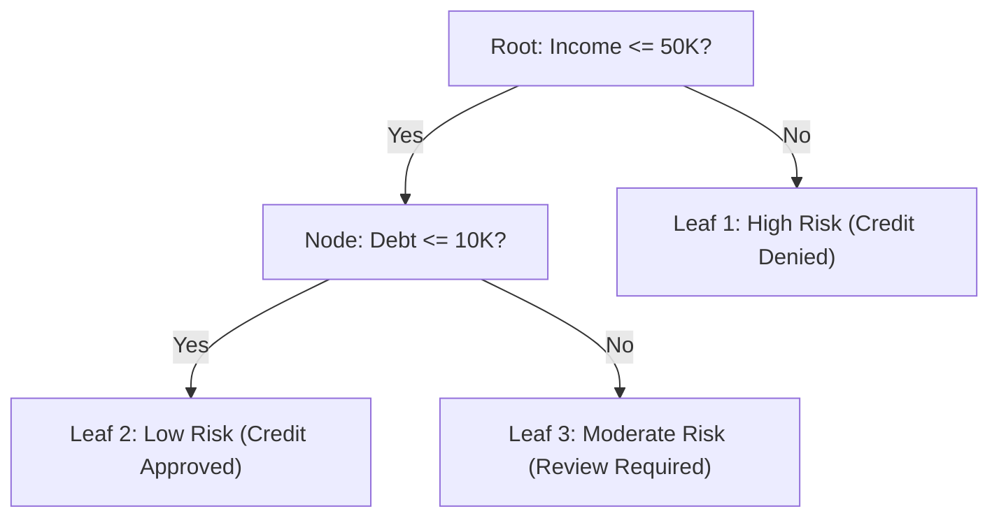
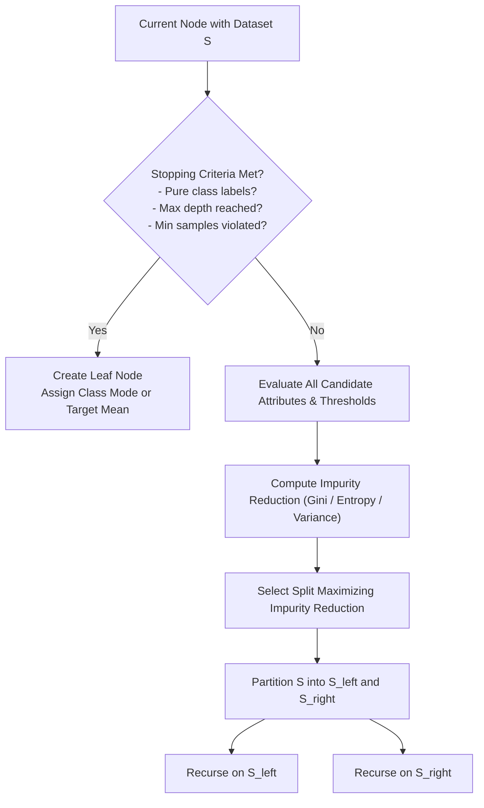

# Migration in progress
# Lesson 1: Decision Tree Learning and Model...

## Decision Tree Learning and Model Representation

Decision tree learning represents an intuitive and mathematically grounded approach to supervised classification and regression. The model expresses its hypothesis space as a rooted, directed tree where internal nodes execute univariate feature tests and terminal leaves deliver localized predictions. Examining how decision trees represent complex functions as Disjunctive Normal Form rules, how recursive partitioning algorithms construct trees top-down, and how geometric boundaries partition feature space establishes the operational mechanics of tree induction.

## Hierarchical Model Representation and Rule Extraction

### Structural Components of the Tree Graph

- A **decision tree** organizes computation into an inverted rooted graph composed of three structural primitives:
  - **Root Node:** The initial node containing the entire unpartitioned training dataset $\mathcal{D}$, executing the first feature split.
  - **Internal Decision Nodes:** Intermediate nodes evaluating an explicit logical predicate on a single attribute (e.g., $x_j \le t$ for continuous variables, or $x_j = v$ for categorical variables).
  - **Branches:** Directed edges corresponding to the mutually exclusive outcomes of a parent node test.
  - **Leaf (Terminal) Nodes:** Terminal nodes containing no outgoing edges; each leaf stores a final output prediction (the majority class label or posterior probability distribution for classification, or the sample mean for regression).

### Disjunctive Normal Form (DNF) Rule Extraction

- A primary strength of decision trees is **white box transparency**: the decision logic of any tree translates into a human-interpretable rule set.
- Every individual path traversing from the root node to a specific terminal leaf node forms a conjunction (**AND**) of attribute tests.
- The global tree model expresses itself as a **Disjunctive Normal Form (DNF)** expression, combining all root-to-leaf paths through disjunction (**OR**):
  $$\text{Model} = \text{Rule}_1 \lor \text{Rule}_2 \lor \dots \lor \text{Rule}_M$$
  where each rule evaluates as:
  $$\text{Rule}_m = (\text{Condition}_{m, 1} \land \text{Condition}_{m, 2} \land \dots \land \text{Condition}_{m, K}) \implies \hat{y} = c_m$$
- Because internal node tests partition feature space into mutually exclusive subsets, exactly one rule activates for any given input observation, eliminating rule conflicts.

### Algorithmic Interpretability and Rule Depth

- **Local Interpretability:** Tracing the decision path for an individual inference instance requires evaluating only the specific branch tests along its trajectory, scaling logarithmically with tree depth ($O(\text{depth})$).
- **Global Interpretability:** Evaluating the entire model structure requires inspecting the full set of terminal leaves and split thresholds.
- When tree depth exceeds 5 to 6 layers, the number of leaf nodes expands ($M \approx 2^{\text{depth}}$), creating complex rule interactions that degrade human interpretability and increase overfitting risk.

> [!Tip]
> **Decision trees map directly to logical rules**: every leaf node represents an AND combination of branch conditions, and the complete tree represents an OR collection of mutually exclusive rules in Disjunctive Normal Form.

## The Recursive Partitioning Induction Algorithm

### Top-Down Greedy Induction and Hunt's Framework

- Most decision tree induction algorithms (including ID3, C4.5, and CART) descend from **Hunt's Concept Learning System (1966)**, using a greedy, top-down divide-and-conquer strategy:
  1. Let $S$ denote the set of training instances reaching the current node.
  2. **Base Case Verification:** Check whether set $S$ satisfies termination criteria. If verified, convert the current node into a terminal leaf.
  3. **Candidate Split Evaluation:** If termination criteria are not met, evaluate all permissible candidate splits across all features $x_j$ using a statistical impurity metric.
  4. **Greedy Selection:** Select the attribute test and threshold that maximizes impurity reduction.
  5. **Data Partitioning:** Divide $S$ into non-overlapping child subsets according to the split outcomes.
  6. **Recursive Descent:** Apply the algorithm recursively to each child subset.

### Core Stopping Conditions for Recursive Splitting

- Recursive partitioning must terminate to prevent infinite loops and bound model complexity:
  - **Node Purity:** All training instances within subset $S$ belong to the identical target class ($H(S) = 0$ or $\text{Gini}(S) = 0$).
  - **Attribute Exhaustion:** All input features have been utilized along the current branch, or all remaining instances share identical feature values while possessing conflicting target labels.
  - **Minimum Sample Thresholds:** The number of samples reaching the node falls below the split limit (`min_samples_split`), or partitioning would create child nodes containing fewer samples than the leaf limit (`min_samples_leaf`).
  - **Maximum Depth Ceiling:** The node reaches the maximum allowable hierarchical distance from the root (`max_depth`).
  - **Impurity Gain Floor:** The maximum achievable reduction in impurity falls below a designated tolerance threshold (`min_impurity_decrease`).

### The Greedy Bottleneck and Non-Backtracking

- Tree induction algorithms operate **greedily**: at each internal node, the algorithm selects the locally optimal split that maximizes immediate impurity reduction.
- The algorithm never backtracks to revise upstream split choices based on downstream outcomes.
- A split that yields negligible immediate impurity reduction can prevent the tree from discovering a subsequent split that uncovers a strong non-linear feature interaction (such as the XOR problem).

> [!Important]
> **Greedy induction lacks global optimality**: decision trees optimize splits locally without backtracking, meaning early sub-optimal decisions persist and can prevent the discovery of complex multi-feature interactions.

## Mathematical Impurity Metrics and Feature Evaluation

### Shannon Entropy and Information Gain

- **Entropy** measures the average information content, uncertainty, or disorder of target distribution $S$ across $C$ categorical classes:
  $$H(S) = -\sum_{c=1}^C p_c \log_2(p_c)$$
  where $p_c = \frac{N_c}{|S|}$ denotes the empirical proportion of class $c$ in node $S$.
- **Information Gain ($IG$):** Measures the expected reduction in entropy achieved by partitioning $S$ along attribute $A$:
  $$IG(S, A) = H(S) - \sum_{v \in \text{Values}(A)} \frac{|S_v|}{|S|} H(S_v)$$
  where $S_v$ represents the child subset where attribute $A$ takes value $v$. The algorithm selects the feature that ma