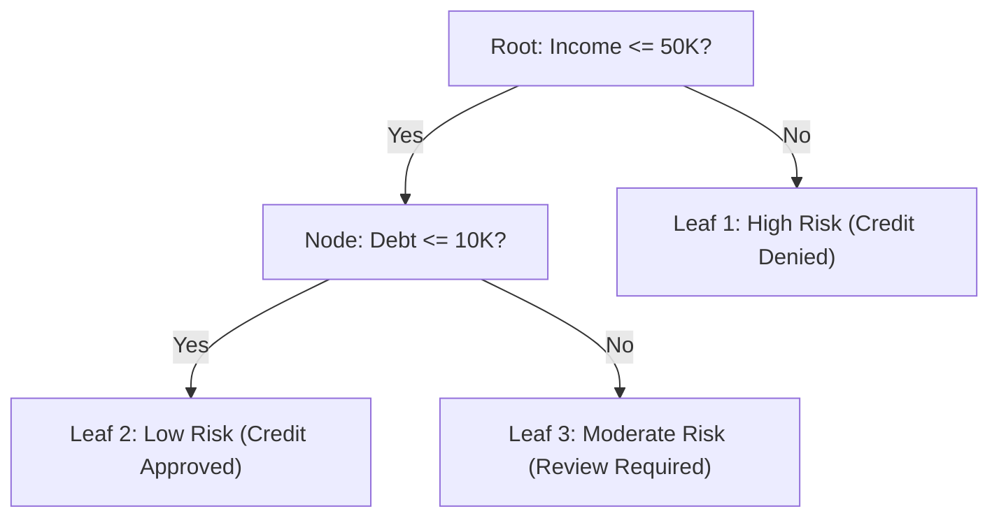
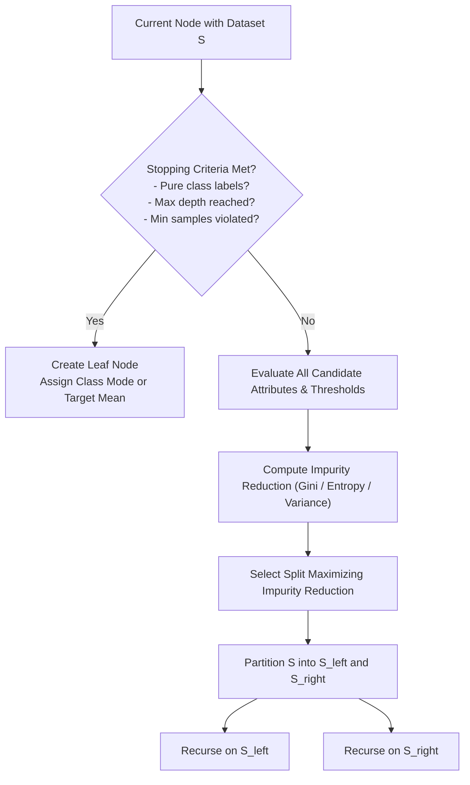
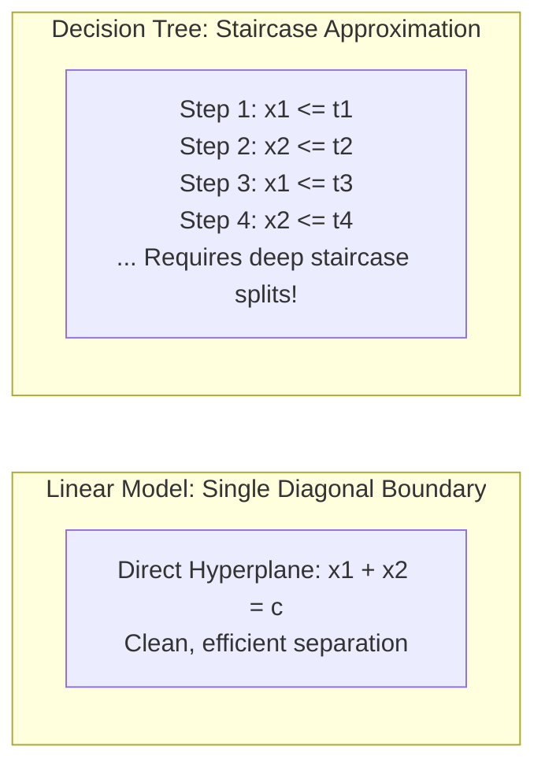

# Lesson 1: Decision Tree Learning and Model...

## Decision Tree Learning and Model Representation

Decision tree learning represents an intuitive and mathematically grounded approach to supervised classification and regression. The model expresses its hypothesis space as a rooted, directed tree where internal nodes execute univariate feature tests and terminal leaves deliver localized predictions. Examining how decision trees represent complex functions as Disjunctive Normal Form rules, how recursive partitioning algorithms construct trees top-down, and how geometric boundaries partition feature space establishes the operational mechanics of tree induction.

## Hierarchical Model Representation and Rule Extraction

### Structural Components of the Tree Graph

- A **decision tree** organizes computation into an inverted rooted graph composed of three structural primitives:
  - **Root Node:** The initial node containing the entire unpartitioned training dataset $\mathcal{D}$, executing the first feature split.
  - **Internal Decision Nodes:** Intermediate nodes evaluating an explicit logical predicate on a single attribute (e.g., $x_j \le t$ for continuous variables, or $x_j = v$ for categorical variables).
  - **Branches:** Directed edges corresponding to the mutually exclusive outcomes of a parent node test.
  - **Leaf (Terminal) Nodes:** Terminal nodes containing no outgoing edges; each leaf stores a final output prediction (the majority class label or posterior probability distribution for classification, or the sample mean for regression).

### Disjunctive Normal Form (DNF) Rule Extraction

- A primary strength of decision trees is **white box transparency**: the decision logic of any tree translates into a human-interpretable rule set.
- Every individual path traversing from the root node to a specific terminal leaf node forms a conjunction (**AND**) of attribute tests.
- The global tree model expresses itself as a **Disjunctive Normal Form (DNF)** expression, combining all root-to-leaf paths through disjunction (**OR**):
  $$\text{Model} = \text{Rule}_1 \lor \text{Rule}_2 \lor \dots \lor \text{Rule}_M$$
  where each rule evaluates as:
  $$\text{Rule}_m = (\text{Condition}_{m, 1} \land \text{Condition}_{m, 2} \land \dots \land \text{Condition}_{m, K}) \implies \hat{y} = c_m$$
- Because internal node tests partition feature space into mutually exclusive subsets, exactly one rule activates for any given input observation, eliminating rule conflicts.

### Algorithmic Interpretability and Rule Depth

- **Local Interpretability:** Tracing the decision path for an individual inference instance requires evaluating only the specific branch tests along its trajectory, scaling logarithmically with tree depth ($O(\text{depth})$).
- **Global Interpretability:** Evaluating the entire model structure requires inspecting the full set of terminal leaves and split thresholds.
- When tree depth exceeds 5 to 6 layers, the number of leaf nodes expands ($M \approx 2^{\text{depth}}$), creating complex rule interactions that degrade human interpretability and increase overfitting risk.

> [!Tip]
> **Decision trees map directly to logical rules**: every leaf node represents an AND combination of branch conditions, and the complete tree represents an OR collection of mutually exclusive rules in Disjunctive Normal Form.

## The Recursive Partitioning Induction Algorithm

### Top-Down Greedy Induction and Hunt's Framework

- Most decision tree induction algorithms (including ID3, C4.5, and CART) descend from **Hunt's Concept Learning System (1966)**, using a greedy, top-down divide-and-conquer strategy:
  1. Let $S$ denote the set of training instances reaching the current node.
  2. **Base Case Verification:** Check whether set $S$ satisfies termination criteria. If verified, convert the current node into a terminal leaf.
  3. **Candidate Split Evaluation:** If termination criteria are not met, evaluate all permissible candidate splits across all features $x_j$ using a statistical impurity metric.
  4. **Greedy Selection:** Select the attribute test and threshold that maximizes impurity reduction.
  5. **Data Partitioning:** Divide $S$ into non-overlapping child subsets according to the split outcomes.
  6. **Recursive Descent:** Apply the algorithm recursively to each child subset.

### Core Stopping Conditions for Recursive Splitting

- Recursive partitioning must terminate to prevent infinite loops and bound model complexity:
  - **Node Purity:** All training instances within subset $S$ belong to the identical target class ($H(S) = 0$ or $\text{Gini}(S) = 0$).
  - **Attribute Exhaustion:** All input features have been utilized along the current branch, or all remaining instances share identical feature values while possessing conflicting target labels.
  - **Minimum Sample Thresholds:** The number of samples reaching the node falls below the split limit (`min_samples_split`), or partitioning would create child nodes containing fewer samples than the leaf limit (`min_samples_leaf`).
  - **Maximum Depth Ceiling:** The node reaches the maximum allowable hierarchical distance from the root (`max_depth`).
  - **Impurity Gain Floor:** The maximum achievable reduction in impurity falls below a designated tolerance threshold (`min_impurity_decrease`).

### The Greedy Bottleneck and Non-Backtracking

- Tree induction algorithms operate **greedily**: at each internal node, the algorithm selects the locally optimal split that maximizes immediate impurity reduction.
- The algorithm never backtracks to revise upstream split choices based on downstream outcomes.
- A split that yields negligible immediate impurity reduction can prevent the tree from discovering a subsequent split that uncovers a strong non-linear feature interaction (such as the XOR problem).

> [!Important]
> **Greedy induction lacks global optimality**: decision trees optimize splits locally without backtracking, meaning early sub-optimal decisions persist and can prevent the discovery of complex multi-feature interactions.

## Mathematical Impurity Metrics and Feature Evaluation

### Shannon Entropy and Information Gain

- **Entropy** measures the average information content, uncertainty, or disorder of target distribution $S$ across $C$ categorical classes:
  $$H(S) = -\sum_{c=1}^C p_c \log_2(p_c)$$
  where $p_c = \frac{N_c}{|S|}$ denotes the empirical proportion of class $c$ in node $S$.
- **Information Gain ($IG$):** Measures the expected reduction in entropy achieved by partitioning $S$ along attribute $A$:
  $$IG(S, A) = H(S) - \sum_{v \in \text{Values}(A)} \frac{|S_v|}{|S|} H(S_v)$$
  where $S_v$ represents the child subset where attribute $A$ takes value $v$. The algorithm selects the feature that maximizes Information Gain.

### The Gain Ratio and Intrinsic Value Normalization

- Information Gain favors attributes possessing a large number of distinct categorical levels (high cardinality).
- Partitioning along a unique identifier (e.g., `Patient_ID`) splits data into $|S|$ singleton leaves where entropy is zero ($H(S_v) = 0$), maximizing Information Gain while creating an overfitted, non-generalizing model.
- Quinlan's **Gain Ratio** normalizes Information Gain by the **Intrinsic Value (Split Information)** of the split:
  $$IV(S, A) = -\sum_{v \in \text{Values}(A)} \frac{|S_v|}{|S|} \log_2\left( \frac{|S_v|}{|S|} \right)$$
  $$\text{Gain Ratio}(S, A) = \frac{IG(S, A)}{IV(S, A)}$$
- Intrinsic Value measures the entropy of the partition sizes: attributes that split data into many small, fragmented branches yield large $IV$ values, which penalizes the Gain Ratio.

### Gini Impurity Formulation

- **Gini Impurity** measures the probability that a randomly chosen element from node $S$ is incorrectly labeled if classified randomly according to the class distribution within the node:
  $$\text{Gini}(S) = 1 - \sum_{c=1}^C p_c^2$$
- Gini Impurity achieves its minimum ($0.0$) when a node is pure, and reaches its maximum for binary classes at $0.5$ when classes are balanced ($p_1 = p_2 = 0.5$).
- Because Gini Impurity relies on simple squaring rather than logarithmic calculations, it executes faster on hardware while generating splits nearly identical to Shannon entropy.

### Continuous Attribute Threshold Evaluation

- When an attribute $x_j$ is continuous, candidate splits evaluate as binary inequalities: $x_j \le t$ versus $x_j > t$.
- **Threshold Evaluation Algorithm:**
  1. Extract all $N$ observed values for continuous attribute $x_j$ and sort them in ascending order:
     $$v_{(1)} < v_{(2)} < \dots < v_{(N)}$$
  2. Compute candidate split thresholds as the midpoints between adjacent distinct values:
     $$t_i = \frac{v_{(i)} + v_{(i+1)}}{2}$$
  3. Evaluate impurity reduction for all $N - 1$ candidate thresholds.
  4. Select the threshold $t^*$ that maximizes impurity gain for feature $x_j$.

> [!Tip]
> **Sort continuous attributes to evaluate candidate thresholds**: continuous splitting sorts $N$ observed values and evaluates midpoints between adjacent entries ($t = \frac{v_i + v_{i+1}}{2}$), turning infinite continuous options into a finite set of $N - 1$ tests.

## Geometric Properties of Tree Decision Boundaries

### Axis-Aligned Orthogonal Hyperplanes

- Standard decision tree induction evaluates a single feature at each internal node, creating an $(D-1)$-dimensional **axis-aligned hyperplane**:
  $$\mathcal{H} = \{x \in \mathbb{R}^D \mid x_j = t\}$$
- In a 2D feature space, every split draws a vertical or horizontal line perpendicular to the coordinate axis.
- In higher dimensions, splits form orthogonal planar cuts that partition space into rectilinear hyper-rectangles (bounding boxes).

### The Diagonal Boundary Limitation

- Because splits are axis-aligned, decision trees struggle to represent diagonal, linear decision boundaries:
  $$x_1 + x_2 > c$$
- To separate classes along a diagonal boundary, a decision tree must construct a complex **staircase approximation** using multiple orthogonal steps.
- Approximating smooth linear or curved boundaries requires substantial tree depth and hundreds of parameters, making linear models or SVMs more efficient on linearly separable data.

### Invariance to Monotonic Transformations

- Evaluating split thresholds depends entirely on the **relative sorting order** of feature values rather than their absolute numerical scale:
  $$\arg\max_t \Delta \text{Impurity}(X_j, t) \equiv \arg\max_t \Delta \text{Impurity}(g(X_j), g(t))$$
  where $g(\cdot)$ is any strictly monotonically increasing function (e.g., logarithmic scaling, exponential expansion, cubic powers).
- Decision trees are invariant to feature scaling, making Z-score standardization and Min-Max normalization unnecessary during preprocessing.

> [!Important]
> **Trees are scale-invariant but rotationally sensitive**: scaling features monotonically does not change split decisions, but rotating coordinates diagonally forces trees to construct complex staircase boundaries that require substantial depth.

## Comparative Matrix of Tree Splitting Paradigms

| Splitting Paradigm | Mathematical Mechanism | Branching Factor | Handling High Cardinality | Supported Feature Types | Computational Scaling |
|---|---|---|---|---|---|
| **Multi-Way Categorical Split** | One branch per category level: $x_j = v$ | $K$-way branches ($K$ categories) | **Severe bias** (fragments data into tiny leaves) | Discrete categorical attributes | $O(N)$ scanning across categories |
| **Binary Categorical Subset Split** | Partition levels into subsets: $x_j \in \mathcal{S}_A$ vs $\notin \mathcal{S}_A$ | Strictly binary (2 branches) | Robust (evaluates $2^{K-1}-1$ combinations) | Discrete categorical attributes | $O(2^{K-1})$ exact; $O(K \log K)$ heuristic |
| **Continuous Binary Threshold** | Midpoint evaluation: $x_j \le t$ vs $x_j > t$ | Strictly binary (2 branches) | Naturally immune (evaluates rank midpoints) | Continuous real-valued attributes | $O(N \log N)$ sorting per feature |
| **Oblique (Linear Combination) Split**| Multi-feature linear cut: $\sum w_j x_j \le t$ | Strictly binary (2 branches) | Low (weights features jointly) | Continuous real-valued attributes | $O(N \cdot D^3)$ optimization per node |

> [!Tip]
> **Binary subset splitting prevents data fragmentation**: multi-way categorical splits divide training samples into tiny child subsets, while binary subset partitioning ($x_j \in \mathcal{S}_A$) preserves sample sizes across deep branches.

## Key Takeaways

- **Decision trees partition feature space non-parametrically** into rectilinear hyper-rectangles, producing piecewise constant predictions across regions.
- **Model representations translate into Disjunctive Normal Form (DNF)**: each path from root to leaf represents an AND rule, and the complete tree represents an OR collection of rules.
- **Induction relies on greedy top-down recursive partitioning**, evaluating features independently to maximize immediate impurity reduction without backtracking.
- **Stopping conditions prevent infinite recursion**: algorithms terminate upon reaching pure nodes, exhausting attributes, or violating sample size and depth limits.
- **Entropy measures statistical disorder**, while **Gini Impurity evaluates misclassification probability** using fast polynomial operations.
- **Information Gain suffers from high-cardinality bias**, which C4.5 resolves by normalizing with Intrinsic Value to calculate the **Gain Ratio**.
- **Decision boundaries are axis-aligned and orthogonal**, requiring deep staircase approximations to model diagonal or curved class separations.
- **Decision trees are invariant to monotonic transformations**, allowing raw numeric features to be processed without scaling or normalization.

> [!Tip]
> The foundational principle of decision tree learning: **recursive partitioning exchanges global optimization for interpretable local rules**; evaluating orthogonal feature tests greedily allows decision trees to capture non-linear relationships without complex parametric assumptions.
