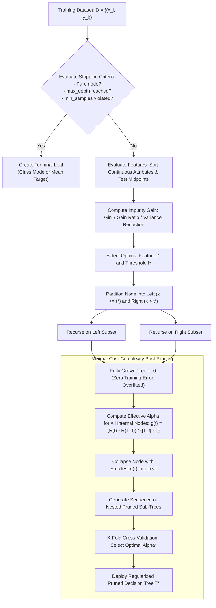

# Migration in progress
# Lesson 2: Summary and Assessment
## Decision Trees: Module Summary and Assessment

Decision Trees provide an interpretable, non-parametric approach to supervised learning by recursively partitioning feature space into axis-aligned rectangular regions. Rather than fitting a global parametric equation, decision trees construct hierarchical decision rules where internal nodes evaluate univariate feature thresholds and terminal leaves deliver localized predictions. Synthesizing splitting criteria, algorithmic variations across ID3, C4.5, and CART, regularization via cost-complexity pruning, and inherent geometric limitations prepares practitioners to train, prune, and diagnose tree-based models effectively.

## Synthesis of Core Week 4 Foundations

### Recursive Partitioning and Model Representation

- **Hierarchical tree representation:** Decision trees organize predictive logic into a rooted directed tree consisting of a **root node**, **internal decision nodes**, **branches**, and **terminal leaves**.
- **Disjunctive Normal Form (DNF):** Every root-to-leaf path maps to a conjunction (**AND**) of branch tests, and the complete tree represents a disjunction (**OR**) of mutually exclusive rules: $\bigvee (\bigwedge \text{Conditions})$.
- **Piecewise constant predictions:** The model predicts a constant value $c_m$ within each partition region $R_m$: the majority class mode for classification, or the sample arithmetic mean for regression:
  $$\hat{y} = \sum_{m=1}^M c_m \mathbf{1}[x \in R_m]$$
- **Greedy induction:** Tree construction proceeds top-down using recursive partitioning (Hunt's algorithm), selecting the locally optimal split at each node without backtracking.

### Impurity Reduction and Splitting Mechanics

- **Shannon Entropy (ID3):** Quantifies information uncertainty:
  $$H(S) = -\sum_{c=1}^C p_c \log_2(p_c)$$
  Splits maximize **Information Gain ($IG$)**, but exhibit high-cardinality bias toward attributes with many distinct levels.
- **Gain Ratio (C4.5):** Normalizes Information Gain by **Intrinsic Value (Split Information)** to penalize high-cardinality fragmentation:
  $$\text{Gain Ratio}(S, A) = \frac{IG(S, A)}{IV(S, A)}, \quad IV(S, A) = -\sum \frac{|S_v|}{|S|} \log_2\left( \frac{|S_v|}{|S|} \right)$$
- **Gini Impurity (CART):** Evaluates misclassification probability using polynomial arithmetic, executing faster than entropy while discovering near-identical splits:
  $$\text{Gini}(S) = 1 - \sum_{c=1}^C p_c^2$$
- **Variance Reduction (Regression Trees):** Evaluates split quality by maximizing the reduction in target variance around child node means, minimizing weighted Mean Squared Error (MSE).
- **Continuous splitting:** Evaluates continuous attributes by sorting $N$ values and testing midpoints between adjacent distinct entries ($t = \frac{v_i + v_{i+1}}{2}$) as candidate thresholds.

### Regularization via Pre-Pruning and Cost-Complexity Post-Pruning

- **The overfitting pathology:** Unconstrained trees grow until every leaf is pure, memorizing training noise and yielding high variance with poor test generalization.
- **Pre-pruning (early stopping):** Enforces stopping constraints during tree induction, such as limiting tree depth (`max_depth`), requiring minimum samples per split (`min_samples_split`), or demanding a minimum impurity gain (`min_impurity_decrease`).
- **Post-pruning (Cost-Complexity Pruning):** Grows an unconstrained tree $T_0$, then prunes sub-trees backward by minimizing a cost-complexity objective parameterized by $\alpha \ge 0$:
  $$R_\alpha(T) = R(T) + \alpha |T|$$
  where $R(T)$ is the empirical misclassification error, and $|T|$ is the leaf count.
- The weakest sub-tree minimizing the error penalty per removed leaf ($g(t) = \frac{R(t) - R(T_t)}{|T_t| - 1}$) collapses iteratively, selecting the optimal sub-tree $\alpha^*$ via validation cross-validation.

> [!Tip]
> **Post-pruning discovers deep interactions that pre-pruning stops**: growing a full tree and pruning backward using cost-complexity regularizer $R_\alpha(T) = R(T) + \alpha |T|$ preserves valuable multi-feature interactions that early stopping thresholds dismiss prematurely.

## The Decision Tree Lifecycle Architecture

> [!Important]
> **Minimal Cost-Complexity Pruning balances error and complexity**: tracking effective alpha values ($g(t)$) establishes a sequence of pruned sub-trees, allowing cross-validation to select the model that achieves optimal generalization without manual depth guessing.

## Comprehensive Tree Algorithms and Pruning Matrix

| Architectural Dimension | ID3 (Quinlan, 1986) | C4.5 (Quinlan, 1993) | CART: Classification (Breiman, 1984) | CART: Regression (Breiman, 1984) |
|---|---|---|---|---|
| **Target Variable Type** | Discrete categorical | Discrete categorical | Discrete categorical | **Continuous real-valued** |
| **Branching Topology** | Multi-way splits ($K$ branches) | Multi-way (categorical) and binary (numeric) | **Strictly binary splits** ($x_j \le t$) | **Strictly binary splits** ($x_j \le t$) |
| **Splitting Impurity Metric**| **Shannon Entropy** (Information Gain) | **Gain Ratio** (Entropy / Intrinsic Value) | **Gini Impurity** ($1 - \sum p_c^2$) | **Variance Reduction** (Mean Squared Error) |
| **Continuous Feature Support**| None (requires prior manual binning) | Automated midpoint evaluation ($t = \frac{v_i + v_{i+1}}{2}$) | Automated midpoint evaluation ($t = \frac{v_i + v_{i+1}}{2}$) | Automated midpoint evaluation ($t = \frac{v_i + v_{i+1}}{2}$) |
| **Missing Attribute Strategy**| Cannot handle missing values | Distributes instances fractionally down branches | Deploys **surrogate split** backup features | Deploys **surrogate split** backup features |
| **Pruning Implementation** | None (unregularized growth) | Rule post-pruning via pessimistic error | **Cost-Complexity Pruning** ($R_\alpha(T)$) | **Cost-Complexity Pruning** ($R_\alpha(T)$) |
| **Scale Invariance** | Scale invariant across discrete inputs | Scale invariant to monotonic feature scaling | Scale invariant to monotonic feature scaling | Invariant to monotonic input feature scaling |

> [!Tip]
> **CART is the modern industrial standard**: scikit-learn implements CART because its strictly binary splits prevent data fragmentation, polynomial Gini updates execute quickly, and surrogate splits handle missing data effectively.

## Assessment Preparation

### Conceptual Review Questions

- **Question 1 (The Mathematical Mechanism of High-Cardinality Bias in Information Gain):** Prove why standard Information Gain favors high-cardinality attributes like `Transaction_ID`, and demonstrate how C4.5's Gain Ratio penalizes this failure.
  - *Answer:* Let attribute $A$ be a unique identifier where every sample $x^{(i)}$ possesses a distinct value ($|S_v| = 1$ for all $v$). Splitting on $A$ partitions dataset $S$ into $|S|$ singleton subsets. Because each child subset contains only a single instance, its target entropy is zero ($H(S_v) = 0$). Evaluating Information Gain yields:
    $$IG(S, A) = H(S) - \sum_{v} \frac{|S_v|}{|S|} H(S_v) = H(S) - 0 = H(S)$$
    Information Gain achieves its theoretical maximum, prompting greedy algorithms to select $A$ at the root, producing an overfitted tree with zero predictive capability. C4.5 resolves this by dividing $IG$ by the **Intrinsic Value** of the split:
    $$IV(S, A) = -\sum_{v=1}^{|S|} \frac{1}{|S|} \log_2\left( \frac{1}{|S|} \right) = -|S| \left( \frac{1}{|S|} (-\log_2 |S|) \right) = \log_2 |S|$$
    $$\text{Gain Ratio}(S, A) = \frac{IG(S, A)}{IV(S, A)} = \frac{H(S)}{\log_2 |S|}$$
    Because $|S|$ is large, the denominator $\log_2 |S|$ penalizes the split heavily, driving the Gain Ratio to near zero and suppressing high-cardinality splits.
- **Question 2 (The Mechanics of Surrogate Splits in CART):** How does CART handle missing attributes during inference without requiring prior imputation?
  - *Answer:* When training an internal decision node on feature $x_j^* \le t^*$, CART identifies the primary optimal split and calculates a sequence of ordered **surrogate splits** using other features. A surrogate split is a candidate decision rule on an alternative feature $x_k \le t_k$ that mimics the partitioning of the primary split as closely as possible. Predictive association between primary split $s^*$ and surrogate split $\tilde{s}$ is measured by the fraction of points sent to the same child node: $\lambda(s^*, \tilde{s})$. At test time, if an incoming observation has feature $x_j^*$ missing, the tree evaluates the primary surrogate split; if that feature is also missing, it proceeds down the ranked surrogate list.
- **Question 3 (The Cost-Complexity Pruning Parameter Derivation):** Derive the effective complexity parameter equation $g(t) = \frac{R(t) - R(T_t)}{|T_t| - 1}$ used in weakest link pruning.
  - *Answer:* The cost-complexity cost of a single node $t$ collapsed into a leaf is $R_\alpha(t) = R(t) + \alpha(1) = R(t) + \alpha$. The cost-complexity cost of the entire unpruned sub-tree $T_t$ rooted at node $t$ is $R_\alpha(T_t) = R(T_t) + \alpha |T_t|$. When $\alpha = 0$, the detailed sub-tree has lower cost because it fits training data more closely: $R_0(T_t) < R_0(t)$. As penalty parameter $\alpha$ increases, the penalty term $\alpha |T_t|$ grows faster than $\alpha(1)$, because $|T_t| > 1$. Eventually, a critical threshold $\alpha$ is reached where collapsing sub-tree $T_t$ into leaf $t$ yields identical cost:
    $$R_\alpha(t) = R_\alpha(T_t) \implies R(t) + \alpha = R(T_t) + \alpha |T_t|$$
    Rearranging terms isolates the critical penalty parameter $g(t)$:
    $$R(t) - R(T_t) = \alpha (|T_t| - 1) \implies \alpha = g(t) = \frac{R(t) - R(T_t)}{|T_t| - 1}$$
    Node $t$ represents the weakest link because it incurs the smallest increase in error per leaf removed.
- **Question 4 (The Axis-Aligned Staircase Limitation):** Explain why decision trees struggle to model diagonal linear decision boundaries, and describe the resulting impact on model variance.
  - *Answer:* Standard decision trees evaluate a single feature per node ($x_j \le t$), producing hyperplanes perpendicular to coordinate axes. If the true data-generating boundary is diagonal ($x_1 + x_2 = c$), an axis-aligned tree cannot draw a continuous diagonal line. It must approximate the boundary through a fine **staircase pattern** of alternating horizontal and vertical splits ($x_1 \le t_1 \to x_2 \le t_2 \to x_1 \le t_3 \dots$). Constructing this staircase requires deep trees, dozens of parameters, and substantial training samples. This geometric constraint causes high variance: minor shifts in training points alter split thresholds, changing the entire staircase structure and degrading generalization.

### Applied Analytical Scenarios

- **Scena