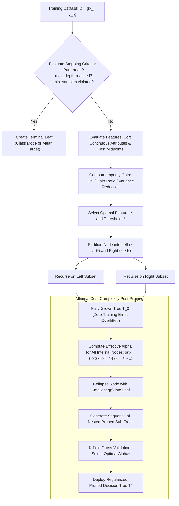

# Lesson 2: Summary and Assessment
## Decision Trees: Module Summary and Assessment

Decision Trees provide an interpretable, non-parametric approach to supervised learning by recursively partitioning feature space into axis-aligned rectangular regions. Rather than fitting a global parametric equation, decision trees construct hierarchical decision rules where internal nodes evaluate univariate feature thresholds and terminal leaves deliver localized predictions. Synthesizing splitting criteria, algorithmic variations across ID3, C4.5, and CART, regularization via cost-complexity pruning, and inherent geometric limitations prepares practitioners to train, prune, and diagnose tree-based models effectively.

## Synthesis of Core Week 4 Foundations

### Recursive Partitioning and Model Representation

- **Hierarchical tree representation:** Decision trees organize predictive logic into a rooted directed tree consisting of a **root node**, **internal decision nodes**, **branches**, and **terminal leaves**.
- **Disjunctive Normal Form (DNF):** Every root-to-leaf path maps to a conjunction (**AND**) of branch tests, and the complete tree represents a disjunction (**OR**) of mutually exclusive rules: $\bigvee (\bigwedge \text{Conditions})$.
- **Piecewise constant predictions:** The model predicts a constant value $c_m$ within each partition region $R_m$: the majority class mode for classification, or the sample arithmetic mean for regression:
  $$\hat{y} = \sum_{m=1}^M c_m \mathbf{1}[x \in R_m]$$
- **Greedy induction:** Tree construction proceeds top-down using recursive partitioning (Hunt's algorithm), selecting the locally optimal split at each node without backtracking.

### Impurity Reduction and Splitting Mechanics

- **Shannon Entropy (ID3):** Quantifies information uncertainty:
  $$H(S) = -\sum_{c=1}^C p_c \log_2(p_c)$$
  Splits maximize **Information Gain ($IG$)**, but exhibit high-cardinality bias toward attributes with many distinct levels.
- **Gain Ratio (C4.5):** Normalizes Information Gain by **Intrinsic Value (Split Information)** to penalize high-cardinality fragmentation:
  $$\text{Gain Ratio}(S, A) = \frac{IG(S, A)}{IV(S, A)}, \quad IV(S, A) = -\sum \frac{|S_v|}{|S|} \log_2\left( \frac{|S_v|}{|S|} \right)$$
- **Gini Impurity (CART):** Evaluates misclassification probability using polynomial arithmetic, executing faster than entropy while discovering near-identical splits:
  $$\text{Gini}(S) = 1 - \sum_{c=1}^C p_c^2$$
- **Variance Reduction (Regression Trees):** Evaluates split quality by maximizing the reduction in target variance around child node means, minimizing weighted Mean Squared Error (MSE).
- **Continuous splitting:** Evaluates continuous attributes by sorting $N$ values and testing midpoints between adjacent distinct entries ($t = \frac{v_i + v_{i+1}}{2}$) as candidate thresholds.

### Regularization via Pre-Pruning and Cost-Complexity Post-Pruning

- **The overfitting pathology:** Unconstrained trees grow until every leaf is pure, memorizing training noise and yielding high variance with poor test generalization.
- **Pre-pruning (early stopping):** Enforces stopping constraints during tree induction, such as limiting tree depth (`max_depth`), requiring minimum samples per split (`min_samples_split`), or demanding a minimum impurity gain (`min_impurity_decrease`).
- **Post-pruning (Cost-Complexity Pruning):** Grows an unconstrained tree $T_0$, then prunes sub-trees backward by minimizing a cost-complexity objective parameterized by $\alpha \ge 0$:
  $$R_\alpha(T) = R(T) + \alpha |T|$$
  where $R(T)$ is the empirical misclassification error, and $|T|$ is the leaf count.
- The weakest sub-tree minimizing the error penalty per removed leaf ($g(t) = \frac{R(t) - R(T_t)}{|T_t| - 1}$) collapses iteratively, selecting the optimal sub-tree $\alpha^*$ via validation cross-validation.

> [!Tip]
> **Post-pruning discovers deep interactions that pre-pruning stops**: growing a full tree and pruning backward using cost-complexity regularizer $R_\alpha(T) = R(T) + \alpha |T|$ preserves valuable multi-feature interactions that early stopping thresholds dismiss prematurely.

## The Decision Tree Lifecycle Architecture

> [!Important]
> **Minimal Cost-Complexity Pruning balances error and complexity**: tracking effective alpha values ($g(t)$) establishes a sequence of pruned sub-trees, allowing cross-validation to select the model that achieves optimal generalization without manual depth guessing.

## Comprehensive Tree Algorithms and Pruning Matrix

| Architectural Dimension | ID3 (Quinlan, 1986) | C4.5 (Quinlan, 1993) | CART: Classification (Breiman, 1984) | CART: Regression (Breiman, 1984) |
|---|---|---|---|---|
| **Target Variable Type** | Discrete categorical | Discrete categorical | Discrete categorical | **Continuous real-valued** |
| **Branching Topology** | Multi-way splits ($K$ branches) | Multi-way (categorical) and binary (numeric) | **Strictly binary splits** ($x_j \le t$) | **Strictly binary splits** ($x_j \le t$) |
| **Splitting Impurity Metric**| **Shannon Entropy** (Information Gain) | **Gain Ratio** (Entropy / Intrinsic Value) | **Gini Impurity** ($1 - \sum p_c^2$) | **Variance Reduction** (Mean Squared Error) |
| **Continuous Feature Support**| None (requires prior manual binning) | Automated midpoint evaluation ($t = \frac{v_i + v_{i+1}}{2}$) | Automated midpoint evaluation ($t = \frac{v_i + v_{i+1}}{2}$) | Automated midpoint evaluation ($t = \frac{v_i + v_{i+1}}{2}$) |
| **Missing Attribute Strategy**| Cannot handle missing values | Distributes instances fractionally down branches | Deploys **surrogate split** backup features | Deploys **surrogate split** backup features |
| **Pruning Implementation** | None (unregularized growth) | Rule post-pruning via pessimistic error | **Cost-Complexity Pruning** ($R_\alpha(T)$) | **Cost-Complexity Pruning** ($R_\alpha(T)$) |
| **Scale Invariance** | Scale invariant across discrete inputs | Scale invariant to monotonic feature scaling | Scale invariant to monotonic feature scaling | Invariant to monotonic input feature scaling |

> [!Tip]
> **CART is the modern industrial standard**: scikit-learn implements CART because its strictly binary splits prevent data fragmentation, polynomial Gini updates execute quickly, and surrogate splits handle missing data effectively.

## Assessment Preparation

### Conceptual Review Questions

- **Question 1 (The Mathematical Mechanism of High-Cardinality Bias in Information Gain):** Prove why standard Information Gain favors high-cardinality attributes like `Transaction_ID`, and demonstrate how C4.5's Gain Ratio penalizes this failure.
  - *Answer:* Let attribute $A$ be a unique identifier where every sample $x^{(i)}$ possesses a distinct value ($|S_v| = 1$ for all $v$). Splitting on $A$ partitions dataset $S$ into $|S|$ singleton subsets. Because each child subset contains only a single instance, its target entropy is zero ($H(S_v) = 0$). Evaluating Information Gain yields:
    $$IG(S, A) = H(S) - \sum_{v} \frac{|S_v|}{|S|} H(S_v) = H(S) - 0 = H(S)$$
    Information Gain achieves its theoretical maximum, prompting greedy algorithms to select $A$ at the root, producing an overfitted tree with zero predictive capability. C4.5 resolves this by dividing $IG$ by the **Intrinsic Value** of the split:
    $$IV(S, A) = -\sum_{v=1}^{|S|} \frac{1}{|S|} \log_2\left( \frac{1}{|S|} \right) = -|S| \left( \frac{1}{|S|} (-\log_2 |S|) \right) = \log_2 |S|$$
    $$\text{Gain Ratio}(S, A) = \frac{IG(S, A)}{IV(S, A)} = \frac{H(S)}{\log_2 |S|}$$
    Because $|S|$ is large, the denominator $\log_2 |S|$ penalizes the split heavily, driving the Gain Ratio to near zero and suppressing high-cardinality splits.
- **Question 2 (The Mechanics of Surrogate Splits in CART):** How does CART handle missing attributes during inference without requiring prior imputation?
  - *Answer:* When training an internal decision node on feature $x_j^* \le t^*$, CART identifies the primary optimal split and calculates a sequence of ordered **surrogate splits** using other features. A surrogate split is a candidate decision rule on an alternative feature $x_k \le t_k$ that mimics the partitioning of the primary split as closely as possible. Predictive association between primary split $s^*$ and surrogate split $\tilde{s}$ is measured by the fraction of points sent to the same child node: $\lambda(s^*, \tilde{s})$. At test time, if an incoming observation has feature $x_j^*$ missing, the tree evaluates the primary surrogate split; if that feature is also missing, it proceeds down the ranked surrogate list.
- **Question 3 (The Cost-Complexity Pruning Parameter Derivation):** Derive the effective complexity parameter equation $g(t) = \frac{R(t) - R(T_t)}{|T_t| - 1}$ used in weakest link pruning.
  - *Answer:* The cost-complexity cost of a single node $t$ collapsed into a leaf is $R_\alpha(t) = R(t) + \alpha(1) = R(t) + \alpha$. The cost-complexity cost of the entire unpruned sub-tree $T_t$ rooted at node $t$ is $R_\alpha(T_t) = R(T_t) + \alpha |T_t|$. When $\alpha = 0$, the detailed sub-tree has lower cost because it fits training data more closely: $R_0(T_t) < R_0(t)$. As penalty parameter $\alpha$ increases, the penalty term $\alpha |T_t|$ grows faster than $\alpha(1)$, because $|T_t| > 1$. Eventually, a critical threshold $\alpha$ is reached where collapsing sub-tree $T_t$ into leaf $t$ yields identical cost:
    $$R_\alpha(t) = R_\alpha(T_t) \implies R(t) + \alpha = R(T_t) + \alpha |T_t|$$
    Rearranging terms isolates the critical penalty parameter $g(t)$:
    $$R(t) - R(T_t) = \alpha (|T_t| - 1) \implies \alpha = g(t) = \frac{R(t) - R(T_t)}{|T_t| - 1}$$
    Node $t$ represents the weakest link because it incurs the smallest increase in error per leaf removed.
- **Question 4 (The Axis-Aligned Staircase Limitation):** Explain why decision trees struggle to model diagonal linear decision boundaries, and describe the resulting impact on model variance.
  - *Answer:* Standard decision trees evaluate a single feature per node ($x_j \le t$), producing hyperplanes perpendicular to coordinate axes. If the true data-generating boundary is diagonal ($x_1 + x_2 = c$), an axis-aligned tree cannot draw a continuous diagonal line. It must approximate the boundary through a fine **staircase pattern** of alternating horizontal and vertical splits ($x_1 \le t_1 \to x_2 \le t_2 \to x_1 \le t_3 \dots$). Constructing this staircase requires deep trees, dozens of parameters, and substantial training samples. This geometric constraint causes high variance: minor shifts in training points alter split thresholds, changing the entire staircase structure and degrading generalization.

### Applied Analytical Scenarios

- **Scenario A (Overfitting Diagnosis in Unconstrained Credit Risk Models):** A loan approval model built using an unpruned Decision Tree Classifier achieves 100% training accuracy, but validation accuracy drops to 68%. Inspecting the tree shows a depth of 28 with 4,200 leaves, many containing only a single training applicant.
  - *Diagnosis:* The model suffers from severe high-variance overfitting. Unconstrained recursive partitioning memorized sample-specific noise, creating pure singleton leaves that fail on unseen data distributions.
  - *Remedy:* Apply **Cost-Complexity Pruning** by computing effective alphas and running 5-fold cross-validation to select $\alpha^*$. Constrain tree induction with pre-pruning hyperparameters: set `max_depth = 6`, `min_samples_split = 20`, and `min_samples_leaf = 10` to prevent singleton leaf formation.
- **Scenario B (Data Leakage via Categorical Imputation in Medical Decision Trees):** A clinical team prepares patient records for a CART diagnostic model. Before splitting the dataset into train and test sets, the team imputes missing categorical blood types using the dataset-wide mode. The resulting model exhibits excellent cross-validation scores that degrade upon production deployment.
  - *Diagnosis:* The pipeline suffered from **data leakage**. Calculating the mode across the entire dataset allowed test set distribution statistics to contaminate training data. CART natively supports surrogate splits and does not require global imputation prior to splitting.
  - *Remedy:* Rebuild the workflow using strict partition boundaries: split raw data into train and test sets first. Fit preprocessing transformers strictly on the training partition, or rely on CART's native surrogate split mechanism to route missing attributes during inference.
- **Scenario C (High-Cardinality Splitting Breakdown in Retail Segmentation):** A marketing team trains an ID3 decision tree to predict purchase conversion. When the feature `Store_ZipCode` (containing 850 distinct categories) is added, the model selects it at the root node. Validation performance collapses.
  - *Diagnosis:* ID3 uses Information Gain, which suffers from high-cardinality bias. Partitioning on 850 zip codes created hundreds of fragmented branches with zero entropy, maximizing Information Gain while destroying generalization.
  - *Remedy:* Transition from ID3 to **CART**. CART evaluates binary subset combinations ($x_j \in \mathcal{S}_A$) rather than multi-way splits. Alternatively, convert the zip code attribute into a smoothed target encoding or group zip codes into broader geographical regions before tree induction.

> [!Important]
> **Use Cost-Complexity Pruning to resolve overfitting**: unconstrained trees memorizing training data require post-pruning via cross-validated $\alpha^*$ alongside pre-pruning sample constraints (`min_samples_leaf`) to establish robust generalization.

### Self-Assessment Technical Calculations

#### Problem 1: Stepwise Entropy, Gini Impurity, and Information Gain Evaluation

A training node $S$ contains 10 observations across two classes: 6 Positive instances ($+$) and 4 Negative instances ($-$). A candidate binary feature $A$ splits node $S$ into two subsets:
- Left Child ($S_L$, where $A=1$): 4 Positive, 1 Negative (5 total instances)
- Right Child ($S_R$, where $A=0$): 2 Positive, 3 Negative (5 total instances)

1. Compute the base Shannon Entropy $H(S)$ and Gini Impurity $\text{Gini}(S)$ of the parent node.
2. Compute the Entropy and Gini Impurity for both child nodes ($S_L$ and $S_R$).
3. Calculate the Information Gain $IG(S, A)$ and Gini Gain $\Delta \text{Gini}(S, A)$ achieved by the split.

*Stepwise Solution:*
1. Parent Node Impurity Calculations ($p_+ = \frac{6}{10} = 0.6, \; p_- = \frac{4}{10} = 0.4$):
   - Shannon Entropy:
     $$H(S) = - \left( 0.6 \log_2(0.6) + 0.4 \log_2(0.4) \right)$$
     $$\log_2(0.6) \approx -0.7370, \quad \log_2(0.4) \approx -1.3219$$
     $$H(S) = - [ 0.6(-0.7370) + 0.4(-1.3219) ] = - [ -0.4422 - 0.5288 ] = \mathbf{0.9710 \text{ bits}}$$
   - Gini Impurity:
     $$\text{Gini}(S) = 1 - (p_+^2 + p_-^2) = 1 - (0.6^2 + 0.4^2) = 1 - (0.36 + 0.16) = 1 - 0.52 = \mathbf{0.4800}$$
2. Child Node Impurity Calculations:
   - **Left Child ($S_L$):** $N_L = 5, \; p_+ = \frac{4}{5} = 0.8, \; p_- = \frac{1}{5} = 0.2$:
     $$H(S_L) = - [ 0.8 \log_2(0.8) + 0.2 \log_2(0.2) ] = - [ 0.8(-0.3219) + 0.2(-2.3219) ] = - [ -0.2575 - 0.4644 ] = \mathbf{0.7219 \text{ bits}}$$
     $$\text{Gini}(S_L) = 1 - (0.8^2 + 0.2^2) = 1 - (0.64 + 0.04) = 1 - 0.68 = \mathbf{0.3200}$$
   - **Right Child ($S_R$):** $N_R = 5, \; p_+ = \frac{2}{5} = 0.4, \; p_- = \frac{3}{5} = 0.6$:
     $$H(S_R) = H(S) = \mathbf{0.9710 \text{ bits}}$$
     $$\text{Gini}(S_R) = \text{Gini}(S) = \mathbf{0.4800}$$
3. Impurity Reduction Gains:
   - **Information Gain ($IG$):**
     $$H(S \mid A) = \frac{|S_L|}{|S|} H(S_L) + \frac{|S_R|}{|S|} H(S_R) = \frac{5}{10}(0.7219) + \frac{5}{10}(0.9710) = 0.3610 + 0.4855 = 0.8465 \text{ bits}$$
     $$IG(S, A) = H(S) - H(S \mid A) = 0.9710 - 0.8465 = \mathbf{0.1245 \text{ bits}}$$
   - **Gini Gain ($\Delta \text{Gini}$):**
     $$\text{Gini}(S \mid A) = \frac{5}{10}(0.3200) + \frac{5}{10}(0.4800) = 0.1600 + 0.2400 = 0.4000$$
     $$\Delta \text{Gini}(S, A) = \text{Gini}(S) - \text{Gini}(S \mid A) = 0.4800 - 0.4000 = \mathbf{0.0800}$$

#### Problem 2: Continuous Feature Threshold Selection and Variance Reduction

A continuous regression node contains four instances pairing feature $x$ with target $y$:
$$(x_1 = 1.0, y_1 = 2.0), \quad (x_2 = 2.0, y_2 = 4.0), \quad (x_3 = 4.0, y_3 = 10.0), \quad (x_4 = 6.0, y_4 = 12.0)$$

1. Compute the parent node sample mean $\bar{y}$ and baseline variance $\text{Var}(S)$.
2. Identify all candidate midpoint split thresholds for attribute $x$.
3. Compute weighted child variance and variance reduction for candidate threshold $t_2 = 3.0$.
4. Compute weighted child variance and variance reduction for candidate threshold $t_1 = 1.5$, and identify the optimal split threshold.

*Stepwise Solution:*
1. Parent Node Variance Calculation:
   - Mean target:
     $$\bar{y} = \frac{2.0 + 4.0 + 10.0 + 12.0}{4} = \frac{28.0}{4} = 7.0$$
   - Baseline variance (MSE):
     $$\text{Var}(S) = \frac{(2-7)^2 + (4-7)^2 + (10-7)^2 + (12-7)^2}{4} = \frac{(-5)^2 + (-3)^2 + 3^2 + 5^2}{4} = \frac{25 + 9 + 9 + 25}{4} = \frac{68.0}{4} = \mathbf{17.0}$$
2. Candidate Midpoint Thresholds:
   - Sorted feature values: $x \in \{1.0, 2.0, 4.0, 6.0\}$.
   - Candidate midpoints:
     $$t_1 = \frac{1.0 + 2.0}{2} = \mathbf{1.5}, \quad t_2 = \frac{2.0 + 4.0}{2} = \mathbf{3.0}, \quad t_3 = \frac{4.0 + 6.0}{2} = \mathbf{5.0}$$
3. Variance Reduction for Threshold $t_2 = 3.0$ ($x \le 3.0$ vs $x > 3.0$):
   - Left child $S_L$ ($x \in \{1.0, 2.0\}$): $y \in \{2.0, 4.0\} \implies \bar{y}_L = 3.0$.
     $$\text{Var}(S_L) = \frac{(2-3)^2 + (4-3)^2}{2} = \frac{1 + 1}{2} = 1.0$$
   - Right child $S_R$ ($x \in \{4.0, 6.0\}$): $y \in \{10.0, 12.0\} \implies \bar{y}_R = 11.0$.
     $$\text{Var}(S_R) = \frac{(10-11)^2 + (12-11)^2}{2} = \frac{1 + 1}{2} = 1.0$$
   - Weighted child variance:
     $$\text{Var}(S \mid t_2) = \frac{2}{4}(1.0) + \frac{2}{4}(1.0) = \mathbf{1.0}$$
   - Variance Reduction:
     $$\Delta \text{Var}(S, t_2) = 17.0 - 1.0 = \mathbf{16.0}$$
4. Variance Reduction for Threshold $t_1 = 1.5$ ($x \le 1.5$ vs $x > 1.5$):
   - Left child $S_L$ ($x \in \{1.0\}$): $y \in \{2.0\} \implies \text{Var}(S_L) = 0.0$.
   - Right child $S_R$ ($x \in \{2.0, 4.0, 6.0\}$): $y \in \{4.0, 10.0, 12.0\} \implies \bar{y}_R = \frac{26.0}{3} \approx 8.667$.
     $$\text{Var}(S_R) = \frac{(4-8.667)^2 + (10-8.667)^2 + (12-8.667)^2}{3} = \frac{(-4.667)^2 + (1.333)^2 + (3.333)^2}{3} = \frac{21.78 + 1.78 + 11.11}{3} \approx 11.556$$
   - Weighted child variance:
     $$\text{Var}(S \mid t_1) = \frac{1}{4}(0.0) + \frac{3}{4}(11.556) \approx \mathbf{8.667}$$
   - Variance Reduction:
     $$\Delta \text{Var}(S, t_1) = 17.0 - 8.667 = \mathbf{8.333}$$
*Conclusion:* Threshold $t^* = 3.0$ maximizes variance reduction ($\Delta \text{Var} = 16.0 > 8.333$), creating the optimal regression split.

#### Problem 3: Cost-Complexity Pruning and Weakest Link Identification

An internal node $t$ within an unpruned decision tree $T$ contains 100 training samples.
- If node $t$ is collapsed into a terminal leaf, it misclassifies 18 instances:
  $$R(t) = \frac{18}{100} = 0.18$$
- The full sub-tree $T_t$ rooted at node $t$ contains $|T_t| = 5$ terminal leaves.
- The combined terminal leaves of sub-tree $T_t$ misclassify 6 instances:
  $$R(T_t) = \frac{6}{100} = 0.06$$

1. Compute the effective cost-complexity parameter $g(t)$ for internal node $t$.
2. Explain the operational meaning of $g(t)$ during weakest link pruning.
3. If cross-validation determines the optimal regularization parameter is $\alpha^* = 0.04$, should sub-tree $T_t$ be pruned or retained?

*Stepwise Solution:*
1. Effective Alpha Calculation:
   - State the weakest link cost-complexity formula:
     $$g(t) = \frac{R(t) - R(T_t)}{|T_t| - 1}$$
   - Substitute values:
     $$g(t) = \frac{0.18 - 0.06}{5 - 1} = \frac{0.12}{4} = \mathbf{0.0300}$$
2. Operational Meaning of $g(t)$:
   - The value $g(t) = 0.03$ represents the error penalty incurred per leaf removed if sub-tree $T_t$ collapses into a single leaf node.
   - It defines the exact critical threshold for penalty parameter $\alpha$ at which the collapsed leaf and the full sub-tree achieve identical cost: $R_\alpha(t) = R_\alpha(T_t)$.
3. Pruning Decision for $\alpha^* = 0.04$:
   - Compare optimal penalty against the node threshold:
     $$\alpha^* = 0.04 > g(t) = 0.03$$
   - Evaluate cost-complexity values:
     $$R_{\alpha^*}(t) = R(t) + \alpha^*(1) = 0.18 + 0.04(1) = 0.22$$
     $$R_{\alpha^*}(T_t) = R(T_t) + \alpha^* |T_t| = 0.06 + 0.04(5) = 0.06 + 0.20 = 0.26$$
     $$R_{\alpha^*}(t) = 0.22 < R_{\alpha^*}(T_t) = 0.26$$
*Conclusion:* Because the complexity penalty $\alpha^* = 0.04$ exceeds the threshold $g(t) = 0.03$, the collapsed leaf achieves lower penalized cost than the sub-tree. Sub-tree $T_t$ should be **pruned**.

> [!Tip]
> **Manual trace verifies tree mechanics**: calculating Information Gain, continuous variance reduction, and effective pruning thresholds confirms how local impurity metrics and global complexity penalties govern decision tree induction.

## Key Takeaways

- **Decision trees partition feature space non-parametrically** into rectilinear hyper-rectangles, producing piecewise constant predictions across regions.
- **Model representations translate into Disjunctive Normal Form (DNF)**: each path from root to leaf represents an AND rule, and the complete tree represents an OR collection of rules.
- **Induction relies on greedy top-down recursive partitioning**, evaluating features independently to maximize immediate impurity reduction without backtracking.
- **Stopping conditions prevent infinite recursion**: algorithms terminate upon reaching pure nodes, exhausting attributes, or violating sample size and depth limits.
- **Entropy measures statistical disorder**, while **Gini Impurity evaluates misclassification probability** using fast polynomial operations.
- **Information Gain suffers from high-cardinality bias**, which C4.5 resolves by normalizing with Intrinsic Value to calculate the **Gain Ratio**.
- **CART enforces binary splits across all data types**, using Gini Impurity for classification and Variance Reduction for regression.
- **Pre-pruning stops tree growth early** using structural limits (`max_depth`, `min_samples_split`), while **post-pruning collapses sub-trees backward** using Cost-Complexity criteria ($R_\alpha(T) = R(T) + \alpha |T|$).
- **Decision trees are invariant to monotonic transformations**, eliminating the need for feature scaling, but remain sensitive to diagonal data rotations.

> [!Tip]
> The foundational principle of decision tree learning: **recursive partitioning exchanges global optimization for interpretable local rules**; evaluating orthogonal feature tests greedily allows decision trees to capture non-linear relationships without complex parametric assumptions.
