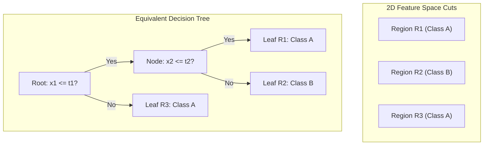

# Migration in progress
# Week 4: Supervised Learning: Decision Trees

## Supervised Learning: Decision Trees Foundations, Algorithms, and Pruning

Decision Trees represent a foundational class of non-parametric supervised learning models that solve regression and classification problems by partitioning feature space into nested, axis-aligned regions. Unlike linear models that enforce global geometric boundaries, decision trees recursively subdivide the input space using greedy, top-down splitting algorithms guided by statistical impurity metrics. Understanding the mathematical formulation of impurity functions, splitting criteria across ID3, C4.5, and CART frameworks, and regularization via cost-complexity pruning establishes the basis for both individual tree models and advanced ensemble architectures.

## Foundations of Tree-Based Modeling

### Non-Parametric Recursive Partitioning

- A **Decision Tree** is a non-parametric model that makes zero rigid structural assumptions regarding the underlying functional form $f(x)$ or data distribution $P(X, Y)$.
- Learning proceeds via **recursive binary or multi-way partitioning**, dividing the input space $\mathcal{X} \subseteq \mathbb{R}^D$ into a collection of $M$ disjoint hyper-rectangles:
  $$\mathcal{X} = R_1 \cup R_2 \cup \dots \cup R_M, \quad \text{where } R_j \cap R_k = \emptyset \; \forall j \neq k$$
- The model expresses its global prediction as a constant response $c_m$ within each partition $R_m$:
  $$\hat{y} = f(x) = \sum_{m=1}^M c_m \mathbf{1}[x \in R_m]$$
  - In continuous **Regression Trees**, the constant $c_m$ evaluates as the sample mean of training targets falling within region $R_m$:
    $$c_m = \frac{1}{N_m} \sum_{x^{(i)} \in R_m} y^{(i)}$$
  - In categorical **Classification Trees**, the constant $c_m$ evaluates as the majority class label (mode) or posterior class distribution:
    $$p_{mk} = \frac{1}{N_m} \sum_{x^{(i)} \in R_m} \mathbf{1}[y^{(i)} = k]$$

### Geometric Representation: Axis-Aligned Orthogonal Hyperplanes

- Standard decision tree induction splits on a single input feature $x_j$ at a time against a scalar threshold $t$.
- Each split introduces an $(D-1)$-dimensional **axis-aligned orthogonal hyperplane**:
  $$x_j \le t \quad \text{versus} \quad x_j > t$$
- The boundaries intersect feature axes at strictly perpendicular $90^\circ$ angles, restricting the model to constructing rectilinear, box-like decision regions.
- Approximating smooth, diagonal, or circular boundaries requires a deep staircase sequence of axis-aligned splits, which increases model complexity.

### Anatomical Components of a Decision Tree

- **Root Node:** The topmost node in the hierarchy, containing the entire unpartitioned dataset $\mathcal{D}$.
- **Internal (Decision) Nodes:** Intermediate nodes testing a specific feature condition ($x_j \le t$) to route observations down child branches.
- **Branches:** Directed edges representing the outcome of a node split condition.
- **Leaf (Terminal) Nodes:** Final nodes containing no child branches; they store the final prediction output $c_m$ (class label or numerical mean) and class probability distributions.

> [!Important]
> **Decision trees partition space into axis-aligned hyper-rectangles**: each internal node evaluates a single coordinate against a threshold ($x_j \le t$), producing piecewise constant predictions across rectilinear spatial partitions.

## Mathematical Splitting Criteria and Impurity Metrics

### Shannon Entropy and Information Gain (ID3)

- **Entropy** quantifies the expected information content, uncertainty, or statistical impurity of a dataset $S$ containing observations across $C$ discrete classes:
  $$H(S) = -\sum_{c=1}^C p_c \log_2(p_c)$$
  where $p_c$ is the empirical proportion of instances belonging to class $c$ within node $S$ ($\sum p_c = 1$). By convention, $0 \log_2(0) \equiv 0$.
- **Entropy Bounds:**
  - $H(S) = 0.0$ when the node is **completely pure** (all observations belong to a solitary class).
  - $H(S) = \log_2(C)$ when the node is **maximally impure** (classes are distributed uniformly with equal probability $\frac{1}{C}$).
- **Information Gain ($IG$):** Measures the expected reduction in entropy achieved by partitioning dataset $S$ along attribute $A$:
  $$IG(S, A) = H(S) - \sum_{v \in \text{Values}(A)} \frac{|S_v|}{|S|} H(S_v)$$
  where $S_v$ represents the subset of instances where attribute $A$ takes value $v$. The algorithm selects the feature that maximizes Information Gain.

### The High-Cardinality Bias and Gain Ratio (C4.5)

- Information Gain exhibits a pathology: it favors attributes possessing a large number of distinct values (high cardinality).
- If a dataset contains a unique identifier (such as `Customer_ID`), splitting on this feature creates $N$ singleton leaf nodes, each containing exactly one point ($H(S_v) = 0$).
- Information Gain achieves its maximum value ($IG = H(S)$), producing an overfitted tree with zero predictive generalization.
- Ross Quinlan (1993) resolved this in C4.5 by introducing the **Gain Ratio**, which normalizes Information Gain by the **Intrinsic Value (Split Information)** of the attribute:
  $$IV(S, A) = -\sum_{v \in \text{Values}(A)} \frac{|S_v|}{|S|} \log_2\left( \frac{|S_v|}{|S|} \right)$$
  $$\text{Gain Ratio}(S, A) = \frac{IG(S, A)}{IV(S, A)}$$
- The Intrinsic Value acts as an entropy penalty on the split: attributes with many uniformly populated branches yield large $IV$ values, which penalizes the Gain Ratio and suppresses high-cardinality splits.

### Gini Impurity and the Gini Gain (CART)

- Used in the CART framework, **Gini Impurity** measures the probability that a randomly chosen element from set $S$ would be incorrectly labeled if classified randomly according to the class distribution within the node:
  $$\text{Gini}(S) = 1 - \sum_{c=1}^C p_c^2 = \sum_{c=1}^C p_c (1 - p_c)$$
- **Gini Impurity Bounds:**
  - $\text{Gini}(S) = 0.0$ for a completely pure node ($p_k = 1, p_{j \neq k} = 0$).
  - $\text{Gini}(S) = 1 - \frac{1}{C} = \frac{C - 1}{C}$ for a uniform, maximally impure node (for binary classification, $\max \text{Gini} = 0.5$).
- **Gini Gain (Reduction in Impurity):** For a binary split dividing set $S$ into subsets $S_{\text{left}}$ and $S_{\text{right}}$:
  $$\Delta \text{Gini}(S, A) = \text{Gini}(S) - \left( \frac{|S_{\text{left}}|}{|S|} \text{Gini}(S_{\text{left}}) + \frac{|S_{\text{right}}|}{|S|} \text{Gini}(S_{\text{right}}) \right)$$
- Gini Impurity does not compute logarithmic functions, executing faster on computational hardware than Shannon entropy while yielding equivalent splits over $98\%$ of empirical evaluations.

### Continuous Regression Criteria: Variance Reduction

- In regression trees, impurity is evaluated using the continuous variance of the target variable $y$ around the node mean $\bar{y}$:
  $$\text{Var}(S) = \frac{1}{|S|} \sum_{i \in S} (y_i - \bar{y})^2 = \text{MSE}(S)$$
- The splitting objective seeks the feature $j$ and split threshold $t$ that maximize the **Variance Reduction** (minimizing weighted Mean Squared Error):
  $$\Delta \text{Var}(S, j, t) = \text{Var}(S) - \left( \frac{|S_{\text{left}}|}{|S|} \text{Var}(S_{\text{left}}) + \frac{|S_{\text{right}}|}{|S|} \text{Var}(S_{\text{right}}) \right)$$
- To optimize for median targets and resist continuous outliers, regression trees can substitute Mean Absolute Error (MAE), splitting to minimize absolute deviations around the median.

> [!Tip]
> **Gini and Entropy yield near-identical splits**: Gini Impurity scales as a polynomial ($1 - \sum p^2$), running faster than logarithmic Entropy ($-\sum p \log p$) while discovering the same optimal split boundaries.

## Algorithmic Implementations: ID3, C4.5, and CART

### The ID3 Algorithm Mechanics

- Proposed by Ross Quinlan (1986), **ID3 (Iterative Dichotomiser 3)** uses a greedy, top-down recursive strategy:
  1. Calculate base entropy $H(S)$ of the current node.
  2. For every categorical attribute $A$, compute Information Gain $IG(S, A)$.
  3. Select the attribute $A^*$ yielding the maximum Information Gain.
  4. Create a multi-way branch for every distinct discrete value $v \in \text{Values}(A^*)$.
  5. Partition instances into child nodes $S_v$ and recurse.
- **ID3 Limitations:** Supports strictly discrete/categorical features, cannot process continuous numerical attributes, cannot handle missing values, and implements multi-way splits that cause data fragmentation.

### C4.5 Innovations: Continuous Attributes and Missing Data

- Quinlan expanded ID3 into **C4.5**, introducing three core improvements:
  - **Continuous Feature Handling:** Sorts $N$ continuous values along feature $x_j$, evaluates midpoints between adjacent distinct values as candidate thresholds $t = \frac{v_i + v_{i+1}}{2}$, and selects the threshold that maximizes the Gain Ratio.
  - **Gain Ratio Normalization:** Penalizes high-cardinality attributes using Intrinsic Value.
  - **Handling Missing Attributes:** Assigns instances with missing values fractionally to all child branches proportional to observed branch sample counts ($w_v = \frac{|S_v|}{|S|}$).

### The CART Framework: Binary Trees and Regression Adaptation

- Formulated by Leo Breiman, Jerome Friedman, Richard Olshen, and Charles Stone (1984), **CART (Classification and Regression Trees)** is the standard algorithm implemented in modern libraries (such as scikit-learn).
- **Strictly Binary Splitting:** CART enforces bina