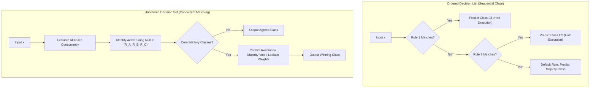

# Migration in progress
# Lesson 1: Rule-Based Classification and Rule...

## Rule-Based Classification and Rule Representation

Rule-based classification formulates predictive decision-making through modular collections of conditional IF-THEN rules. By translating complex data patterns into propositional logic, rule-based systems provide transparent models that domain experts can inspect, edit, and audit directly. Analyzing rule syntax, structural coverage properties, conflict resolution strategies, mathematical quality metrics, and search traversal directions establishes the operational foundation for rule induction.

## Structural Anatomy and Logic of Classification Rules

### Antecedent and Consequent Formulation

- A **classification rule** is a conditional implication that links an input state to a categorical class assignment:
  $$R: (\text{Condition}) \implies y$$
- **Rule Antecedent (LHS / Body):** A conjunction (**AND**) of relational tests evaluating input attributes:
  $$\text{Condition} = (A_1 \odot v_1) \land (A_2 \odot v_2) \land \dots \land (A_k \odot v_k)$$
  where each attribute test evaluates an equality ($A_i = v_i$) on discrete categorical features or an inequality ($A_i \le v_i$ or $A_i > v_i$) on continuous numerical attributes.
- **Rule Consequent (RHS / Head):** The predicted target category assigned when the antecedent condition evaluates to true:
  $$y \in \{C_1, C_2, \dots, C_K\}$$
- Each attribute test $(A_i \odot v_i)$ is termed a **conjunct** or **literal**, slicing the feature space with an axis-aligned boundary.

### Coverage and Firing Conditions

- An observation vector $x = [x_1, \dots, x_D]^T$ **triggers (covers)** a rule $R$ if and only if every attribute value in $x$ satisfies all conjuncts in the antecedent:
  $$\text{Covers}(R, x) = \text{True} \iff \bigwedge_{j=1}^k (x_{A_j} \odot v_j) = \text{True}$$
- A rule **fires** when it actively executes its predictive logic on a covered instance, delivering its consequent label $y$ as the output classification.
- An instance that violates even a single conjunct in the antecedent fails to trigger the rule, leaving the observation to subsequent evaluation branches.

### Mutual Exclusivity and Exhaustiveness

- The collective geometry of a rule set $\mathcal{R} = \{R_1, R_2, \dots, R_M\}$ depends on two formal structural properties:
  - **Mutual Exclusivity:** No two rules in the set cover the identical input instance:
    $$\text{Covers}(R_i, x) \land \text{Covers}(R_j, x) = \text{False} \quad \forall i \neq j, \; \forall x \in \mathcal{X}$$
    Mutually exclusive rules partition the feature space into disjoint non-overlapping subsets, preventing conflicting predictions.
  - **Exhaustiveness:** The rule set covers every possible point in the input feature space:
    $$\bigvee_{m=1}^M \text{Covers}(R_m, x) = \text{True} \quad \forall x \in \mathcal{X}$$
    Exhaustive rules eliminate coverage gaps, ensuring that no input instance is left unclassified.

### Default Fallback Rules and Out-of-Domain Safety

- Rule induction algorithms operating on noisy, sparse training data rarely produce rule sets that are naturally exhaustive.
- When an unseen test instance lands in an unmapped region of feature space, zero rules trigger.
- Classifiers resolve coverage gaps by appending an unconditional **default fallback rule** at the base of the model:
  $$R_{\text{default}}: \text{TRUE} \implies y_{\text{default}}$$
- The default class $y_{\text{default}}$ typically corresponds to the overall majority class in the training dataset or the class exhibiting the highest remaining unassigned sample count.

> [!Important]
> **Mutual exclusivity prevents conflict while exhaustiveness ensures coverage**: non-mutually exclusive rule sets require conflict resolution when contradictory rules trigger, while non-exhaustive rule sets require a default fallback rule to handle coverage gaps.

## Rule Organization and Conflict Resolution Schemes

### Ordered Decision Lists and Priority Chains

- An **Ordered Rule Set (Decision List)** arranges rules into a strict linear sequence:
  $$\mathcal{R} = \langle R_1, \; R_2, \; \dots, \; R_M, \; R_{\text{default}} \rangle$$
- **Inference Protocol:** An incoming instance evaluates against rules sequentially from top to bottom.
- The first rule whose antecedent is satisfied fires immediately, assigns its consequent label, and halts execution:
  $$\hat{y} = \text{Head}(R_{k}), \quad \text{where } k = \min \{i \mid \text{Covers}(R_i, x) = \text{True}\}$$
- Rules positioned lower in the list evaluate only if all preceding rules evaluate to false, meaning downstream rules implicitly encode the negation of all upstream preconditions.

### Unordered Decision Sets and Concurrent Matching

- An **Unordered Rule Set (Decision Set)** treats rules as independent, modular logical assertions that exist without hierarchical ordering.
- **Inference Protocol:** All rules evaluate concurrently against the input instance.
- An observation may trigger zero, one, or multiple rules simultaneously.
- If all firing rules agree on the identical target class, that class is returned.
- If multiple triggered rules predict conflicting target classes ($R_a \implies C_1$ while $R_b \implies C_2$), the system invokes an explicit **conflict resolution mechanism**.

### Conflict Resolution Mechanisms: Voting and Weighting

- Unordered decision sets resolve contradictory firing rules using mathematical aggregation strategies:
  - **Unweighted Majority Voting:** Each firing rule casts an equal vote for its consequent class:
    $$\hat{y} = \arg\max_{c \in \{1, \dots, K\}} \sum_{R_m \in \mathcal{R}_{\text{fired}}} \mathbf{1}[\text{Head}(R_m) = c]$$
  - **Confidence-Weighted Voting:** Votes scale by empirical rule confidence:
    $$\hat{y} = \arg\max_c \sum_{R_m \in \mathcal{R}_{\text{fired}}, \, \text{Head}(R_m)=c} \text{Conf}(R_m)$$
  - **Laplace-Weighted Voting:** Weights scale by small-sample corrected accuracy, dampening the influence of brittle rules that cover few training points.

> [!Tip]
> **Decision lists prioritize order while decision sets prioritize modularity**: ordered lists eliminate conflicts by halting at the first match, whereas unordered sets evaluate rules independently, requiring voting protocols to resolve contradictory predictions.

## Quantitative Metrics for Rule Evaluation

### Empirical Coverage and Raw Precision

- Let $|\mathcal{D}|$ denote total dataset size, $n_{\text{covers}}$ denote instances matching the antecedent, and $n_{\text{correct}}$ denote instances matching both the antecedent and consequent.
- For a rule $R: X \implies y$:
  - $A$ (True Positives): Instances satisfying $X$ and belonging to class $y$.
  - $B$ (False Positives): Instances satisfying $X$ but belonging to an alternate class $y' \neq y$.
- **Coverage:** The fraction of the dataset that satisfies the rule precondition:
  $$\text{Coverage}(R) = \frac{n_{\text{covers}}}{|\mathcal{D}|} = \frac{A + B}{|\mathcal{D}|}$$
- **Rule Accuracy (Confidence / Precision):** The conditional probability that an instance belongs to class $y$ given that it triggers condition $X$:
  $$\text{Accuracy}(R) = \frac{n_{\text{correct}}}{n_{\text{covers}}} = \frac{A}{A + B}$$

### Small-Sample Regular