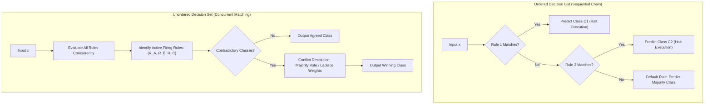
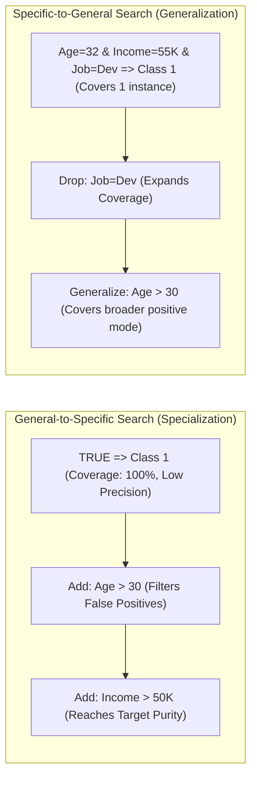

# Lesson 1: Rule-Based Classification and Rule...

## Rule-Based Classification and Rule Representation

Rule-based classification formulates predictive decision-making through modular collections of conditional IF-THEN rules. By translating complex data patterns into propositional logic, rule-based systems provide transparent models that domain experts can inspect, edit, and audit directly. Analyzing rule syntax, structural coverage properties, conflict resolution strategies, mathematical quality metrics, and search traversal directions establishes the operational foundation for rule induction.

## Structural Anatomy and Logic of Classification Rules

### Antecedent and Consequent Formulation

- A **classification rule** is a conditional implication that links an input state to a categorical class assignment:
  $$R: (\text{Condition}) \implies y$$
- **Rule Antecedent (LHS / Body):** A conjunction (**AND**) of relational tests evaluating input attributes:
  $$\text{Condition} = (A_1 \odot v_1) \land (A_2 \odot v_2) \land \dots \land (A_k \odot v_k)$$
  where each attribute test evaluates an equality ($A_i = v_i$) on discrete categorical features or an inequality ($A_i \le v_i$ or $A_i > v_i$) on continuous numerical attributes.
- **Rule Consequent (RHS / Head):** The predicted target category assigned when the antecedent condition evaluates to true:
  $$y \in \{C_1, C_2, \dots, C_K\}$$
- Each attribute test $(A_i \odot v_i)$ is termed a **conjunct** or **literal**, slicing the feature space with an axis-aligned boundary.

### Coverage and Firing Conditions

- An observation vector $x = [x_1, \dots, x_D]^T$ **triggers (covers)** a rule $R$ if and only if every attribute value in $x$ satisfies all conjuncts in the antecedent:
  $$\text{Covers}(R, x) = \text{True} \iff \bigwedge_{j=1}^k (x_{A_j} \odot v_j) = \text{True}$$
- A rule **fires** when it actively executes its predictive logic on a covered instance, delivering its consequent label $y$ as the output classification.
- An instance that violates even a single conjunct in the antecedent fails to trigger the rule, leaving the observation to subsequent evaluation branches.

### Mutual Exclusivity and Exhaustiveness

- The collective geometry of a rule set $\mathcal{R} = \{R_1, R_2, \dots, R_M\}$ depends on two formal structural properties:
  - **Mutual Exclusivity:** No two rules in the set cover the identical input instance:
    $$\text{Covers}(R_i, x) \land \text{Covers}(R_j, x) = \text{False} \quad \forall i \neq j, \; \forall x \in \mathcal{X}$$
    Mutually exclusive rules partition the feature space into disjoint non-overlapping subsets, preventing conflicting predictions.
  - **Exhaustiveness:** The rule set covers every possible point in the input feature space:
    $$\bigvee_{m=1}^M \text{Covers}(R_m, x) = \text{True} \quad \forall x \in \mathcal{X}$$
    Exhaustive rules eliminate coverage gaps, ensuring that no input instance is left unclassified.

### Default Fallback Rules and Out-of-Domain Safety

- Rule induction algorithms operating on noisy, sparse training data rarely produce rule sets that are naturally exhaustive.
- When an unseen test instance lands in an unmapped region of feature space, zero rules trigger.
- Classifiers resolve coverage gaps by appending an unconditional **default fallback rule** at the base of the model:
  $$R_{\text{default}}: \text{TRUE} \implies y_{\text{default}}$$
- The default class $y_{\text{default}}$ typically corresponds to the overall majority class in the training dataset or the class exhibiting the highest remaining unassigned sample count.

> [!Important]
> **Mutual exclusivity prevents conflict while exhaustiveness ensures coverage**: non-mutually exclusive rule sets require conflict resolution when contradictory rules trigger, while non-exhaustive rule sets require a default fallback rule to handle coverage gaps.

## Rule Organization and Conflict Resolution Schemes

### Ordered Decision Lists and Priority Chains

- An **Ordered Rule Set (Decision List)** arranges rules into a strict linear sequence:
  $$\mathcal{R} = \langle R_1, \; R_2, \; \dots, \; R_M, \; R_{\text{default}} \rangle$$
- **Inference Protocol:** An incoming instance evaluates against rules sequentially from top to bottom.
- The first rule whose antecedent is satisfied fires immediately, assigns its consequent label, and halts execution:
  $$\hat{y} = \text{Head}(R_{k}), \quad \text{where } k = \min \{i \mid \text{Covers}(R_i, x) = \text{True}\}$$
- Rules positioned lower in the list evaluate only if all preceding rules evaluate to false, meaning downstream rules implicitly encode the negation of all upstream preconditions.

### Unordered Decision Sets and Concurrent Matching

- An **Unordered Rule Set (Decision Set)** treats rules as independent, modular logical assertions that exist without hierarchical ordering.
- **Inference Protocol:** All rules evaluate concurrently against the input instance.
- An observation may trigger zero, one, or multiple rules simultaneously.
- If all firing rules agree on the identical target class, that class is returned.
- If multiple triggered rules predict conflicting target classes ($R_a \implies C_1$ while $R_b \implies C_2$), the system invokes an explicit **conflict resolution mechanism**.

### Conflict Resolution Mechanisms: Voting and Weighting

- Unordered decision sets resolve contradictory firing rules using mathematical aggregation strategies:
  - **Unweighted Majority Voting:** Each firing rule casts an equal vote for its consequent class:
    $$\hat{y} = \arg\max_{c \in \{1, \dots, K\}} \sum_{R_m \in \mathcal{R}_{\text{fired}}} \mathbf{1}[\text{Head}(R_m) = c]$$
  - **Confidence-Weighted Voting:** Votes scale by empirical rule confidence:
    $$\hat{y} = \arg\max_c \sum_{R_m \in \mathcal{R}_{\text{fired}}, \, \text{Head}(R_m)=c} \text{Conf}(R_m)$$
  - **Laplace-Weighted Voting:** Weights scale by small-sample corrected accuracy, dampening the influence of brittle rules that cover few training points.

> [!Tip]
> **Decision lists prioritize order while decision sets prioritize modularity**: ordered lists eliminate conflicts by halting at the first match, whereas unordered sets evaluate rules independently, requiring voting protocols to resolve contradictory predictions.

## Quantitative Metrics for Rule Evaluation

### Empirical Coverage and Raw Precision

- Let $|\mathcal{D}|$ denote total dataset size, $n_{\text{covers}}$ denote instances matching the antecedent, and $n_{\text{correct}}$ denote instances matching both the antecedent and consequent.
- For a rule $R: X \implies y$:
  - $A$ (True Positives): Instances satisfying $X$ and belonging to class $y$.
  - $B$ (False Positives): Instances satisfying $X$ but belonging to an alternate class $y' \neq y$.
- **Coverage:** The fraction of the dataset that satisfies the rule precondition:
  $$\text{Coverage}(R) = \frac{n_{\text{covers}}}{|\mathcal{D}|} = \frac{A + B}{|\mathcal{D}|}$$
- **Rule Accuracy (Confidence / Precision):** The conditional probability that an instance belongs to class $y$ given that it triggers condition $X$:
  $$\text{Accuracy}(R) = \frac{n_{\text{correct}}}{n_{\text{covers}}} = \frac{A}{A + B}$$

### Small-Sample Regularization via Laplace Smoothing

- Raw rule accuracy exhibits a pathology: a hyper-specific rule covering a solitary training point ($A = 1, B = 0$) achieves $100\%$ accuracy ($1/1 = 1.0$), despite having zero statistical reliability.
- The **Laplace Estimator** smooths accuracy estimates by adding a uniform prior, penalizing rules supported by tiny sample sizes:
  $$\text{Accuracy}_{\text{Laplace}}(R) = \frac{A + 1}{A + B + K}$$
  where $K$ denotes the total number of target classes.
- Comparing rules on a binary problem ($K=2$):
  - A brittle rule covering $1/1$ correct points yields $\text{Accuracy}_{\text{Laplace}} = \frac{1 + 1}{1 + 0 + 2} = \frac{2}{3} \approx \mathbf{0.67}$.
  - A robust rule covering $90/100$ correct points yields $\text{Accuracy}_{\text{Laplace}} = \frac{90 + 1}{90 + 10 + 2} = \frac{91}{102} \approx \mathbf{0.89}$.
  - Laplace correction ranks the broader, statistically reliable rule higher than the brittle single-instance rule.

### The M-Estimate and Bayesian Prior Balancing

- The **$m$-Estimate of Accuracy** generalises Laplace smoothing by incorporating non-uniform class prior probabilities:
  $$\text{Accuracy}_m(R) = \frac{A + m \cdot P(y)}{A + B + m}$$
  where $P(y)$ is the baseline prevalence of class $y$, and $m$ is an equivalent sample weight hyperparameter.
- Setting a large $m$ pulls rule evaluation strongly toward class priors unless substantial sample evidence ($A + B \gg m$) confirms high local precision.

### FOIL Information Gain for Conjunctive Search

- First-Order Inductive Learner (**FOIL**) Information Gain evaluates whether appending a candidate conjunct to an existing rule provides a statistically significant improvement:
  $$\text{FOIL\_Gain} = A_1 \times \left( \log_2\left( \frac{A_1}{A_1 + B_1} \right) - \log_2\left( \frac{A_0}{A_0 + B_0} \right) \right)$$
  where $A_0, B_0$ represent positive and negative instances covered before adding the conjunct, and $A_1, B_1$ represent counts after adding the conjunct.
- FOIL Gain favors conjuncts that increase rule precision while maintaining high positive instance coverage ($A_1$).

> [!Tip]
> **Use Laplace smoothing to avoid brittle rules**: uncorrected accuracy values favor hyper-specific rules that cover single outlier instances; adding Laplace pseudo-counts scales accuracy by coverage volume.

## The Mechanics of Rule Induction Search

### General-to-Specific (Top-Down) Specialization

- **General-to-Specific Search** begins with an unconstrained base rule that covers every instance in the feature space:
  $$R_0: \text{TRUE} \implies y$$
- The algorithm iteratively evaluates candidate conjuncts ($A_j = v$ or $A_j \le v$) to add to the antecedent via conjunction.
- Adding a condition **specializes** the rule: it contracts spatial coverage, filtering out false positives ($B \downarrow$) and increasing rule precision.
- The induction loop appends conditions until the rule achieves target purity or coverage drops below a minimum threshold.

### Specific-to-General (Bottom-Up) Generalization

- **Specific-to-General Search** begins by anchoring on a single seed positive instance, constructing a maximally specific rule that matches its exact attribute coordinates:
  $$R_{\text{seed}}: (A_1 = x_{1}^{(i)}) \land (A_2 = x_{2}^{(i)}) \land \dots \land (A_D = x_{D}^{(i)}) \implies y^{(i)}$$
- The algorithm iteratively drops conjuncts or replaces constants with wildcards to **generalize** the rule.
- Generalization expands spatial coverage, absorbing adjacent positive instances while ensuring negative instances remain excluded.

### Beam Search Traversal Across the Rule Space

- Standard greedy hill-climbing evaluates all candidate conjuncts and commits permanently to the single best-performing condition.
- Greedy searches easily trap in local minima, failing to uncover attribute combinations that only provide predictive power when added together.
- **Beam Search** balances greedy speed and exhaustive search by maintaining a priority queue of the top $w$ candidate rules, termed the **beam width**:
  - At each step, all $w$ candidate rules expand by evaluating all possible attribute tests.
  - The resulting rules are ranked using an evaluation metric (e.g., FOIL Gain or Laplace Accuracy).
  - The queue prunes back to the top $w$ rules, and the cycle repeats.
- Beam search explores multiple promising paths simultaneously, preventing premature sub-optimal commitments.

> [!Important]
> **General-to-specific beam search balances precision and exploration**: starting from an open rule and tracking the top $w$ specialized candidates prevents greedy search from committing to poor local attribute splits.

## Comparative Matrix of Rule Execution Paradigms

| Dimension | Ordered Decision Lists | Unordered Decision Sets |
|---|---|---|
| **Inference Processing Flow** | Sequential top-down priority evaluation | **Concurrent evaluation** across all active rules |
| **Handling Overlapping Activations** | Avoids conflict; first matching rule halts search | **Requires conflict resolution** (voting, Laplace weights) |
| **Rule Modularity and Editing** | Low; altering one rule changes the context of all downstream rules | **High**; individual rules evaluate as independent assertions |
| **Handling Uncovered Gaps** | Guaranteed complete via terminal default rule | Requires an external fallback default rule |
| **Human Interpretability** | Requires tracking the negation of all preceding rules | Simple standalone IF-THEN comprehension |
| **Search Induction Suitability** | Natural fit for sequential covering (separate-and-conquer) | Natural fit for associative and parallel rule mining |
| **Model Compactness** | More compact (rules assume prior conditions failed) | Larger rule sets required to avoid coverage gaps |

> [!Tip]
> **Use decision lists for compact execution and decision sets for modular auditing**: ordered lists minimize rule count through sequential exclusion, while unordered sets produce standalone rules that domain experts can validate individually.

## Key Takeaways

- **Classification rules model knowledge as conditional implications**: $R: (\text{Condition}) \implies y$, combining attribute tests via conjunctions to assign target classes.
- **Mutual exclusivity prevents conflicting predictions**, while **exhaustiveness eliminates unmapped coverage gaps**.
- **Ordered decision lists evaluate rules sequentially**, halting at the first matching condition and relying on a terminal default rule for fallback.
- **Unordered decision sets evaluate rules concurrently**, resolving contradictory predictions using voting strategies or Laplace weights.
- **Laplace smoothing regularizes rule accuracy**: $\frac{A + 1}{A + B + K}$ prevents hyper-specific rules that cover single outlier instances from dominating the model.
- **FOIL Information Gain directs rule growing**, balancing precision improvements against positive instance coverage.
- **General-to-specific search specializes rules** by appending conjuncts to filter false positives, while **beam search** tracks the top $w$ candidate paths to avoid local minima.
- **Unordered rules provide high domain modularity**, allowing individual business logic statements to be inspected or edited without disrupting other rules.

> [!Tip]
> The foundational law of rule representation: **modularity governs interpretability, while coverage regulates reliability**; structuring rules with calibrated evaluation metrics and robust conflict resolution produces transparent models that deliver dependable classifications on unseen data.
