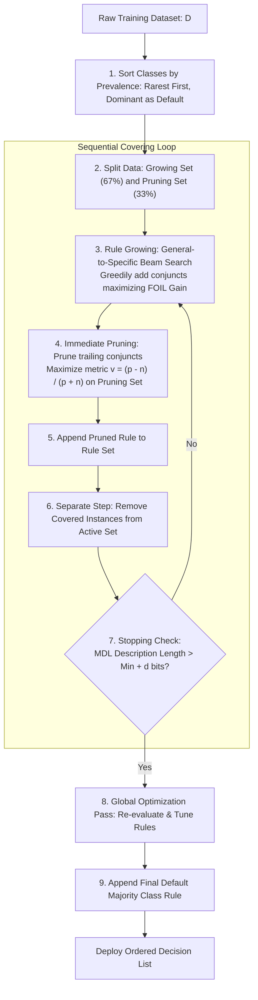

# Lesson 2: Summary and Assessment

## Rule-Based Classification: Module Summary and Assessment

Rule-based classifiers represent an expressive, transparent approach to supervised pattern recognition by modeling decision logic through modular collections of IF-THEN rules. By translating complex decision boundaries into propositional logic, rule models decouple local feature associations from global tree hierarchies, allowing direct human inspection, editing, and auditing. Synthesizing rule representation formalisms, coverage and error metrics, direct sequential covering algorithms like RIPPER, indirect tree extraction via C4.5Rules, and conflict resolution protocols equips practitioners to deploy interpretable classifiers on structured domains.

## Synthesis of Core Week 5 Foundations

### The Propositional Rule Representation

- **Rule syntax:** Each rule evaluates as an independent conditional implication:
  $$R: (\text{Condition}) \implies y$$
  where the antecedent condition is a conjunction (**AND**) of relational attribute tests, and the consequent head predicts a discrete target class.
- **Coverage properties:**
  - **Mutual Exclusivity:** Guarantees that no two rules cover the identical observation ($R_i \cap R_j = \emptyset$), eliminating prediction conflict.
  - **Exhaustiveness:** Guarantees that the rule set covers the entire feature space, eliminating unmapped gaps through a terminal **default fallback rule** ($R_{\text{default}}: \text{TRUE} \implies y_{\text{default}}$).
- **Execution topologies:**
  - **Ordered Decision Lists:** Evaluate rules sequentially; the first matching rule fires and halts search, with downstream rules implicitly encoding the negation of upstream conditions.
  - **Unordered Decision Sets:** Evaluate all rules concurrently, resolving contradictory predictions through unweighted majority voting or confidence-weighted aggregation.

### Direct Sequential Covering Versus Indirect Tree Extraction

- **Direct Sequential Covering (Separate-and-Conquer):** Mines rules directly from raw training data. It induces a high-precision rule greedily, separates (removes) all covered training records, and iterates over remaining instances until all positive cases are explained.
- **RIPPER (Repeated Incremental Pruning to Produce Error Reduction):**
  - Sorts classes by prevalence, learning rules for rare classes first while defaulting the dominant majority class.
  - Couples general-to-specific rule growing using **FOIL Information Gain** with immediate post-pruning on an isolated validation set using the metric $v = \frac{p - n}{p + n}$.
  - Halts adding rules using the **Minimum Description Length (MDL)** principle, which stops when total model bits exceed the historical minimum by more than $d$ bits.
- **Indirect Tree Extraction (C4.5Rules):** Translates every root-to-leaf path of a fully grown decision tree into an initial rule, then applies **pessimistic error pruning** to remove redundant antecedents regardless of their vertical depth in the original tree. This resolves the **sub-tree replication problem**, where identical sub-trees duplicate across different branches.

### Pruning Heuristics and Small-Sample Regularization

- **The raw accuracy pathology:** Evaluating rules by empirical accuracy ($\frac{A}{A + B}$) favors hyper-specific rules that cover a single isolated outlier ($1/1 = 100\%$), yielding brittle models that fail on unseen data.
- **Laplace Smoothing:** Corrects accuracy estimates by incorporating a uniform pseudo-count prior:
  $$\text{Accuracy}_{\text{Laplace}} = \frac{A + 1}{A + B + K}$$
  penalizing rules with small coverage and favoring statistically reliable general rules.
- **The $M$-Estimate:** Incorporates non-uniform class prior probabilities:
  $$\text{Accuracy}_m = \frac{A + m \cdot P(y)}{A + B + m}$$
  where parameter $m$ governs the weight allocated to the baseline prior.

> [!Tip]
> **Use Laplace smoothing to filter fragile rules**: uncorrected accuracy values favor hyper-specific rules that cover solitary outliers; adding Laplace pseudo-counts scales accuracy by coverage volume to ensure statistical reliability.

## The Rule Induction and Pruning Architecture

> [!Important]
> **Sequential covering separates instances to conquer classes**: learning a rule and immediately removing its covered samples prevents downstream rules from relearning redundant boundaries, allowing algorithms to target remaining instances directly.

## Comprehensive Rule-Based Systems Comparison Matrix

| Algorithmic Dimension | RIPPER (Cohen, 1995) | C4.5Rules (Quinlan, 1993) | Ordered Decision Lists | Unordered Decision Sets |
|---|---|---|---|---|
| **Underlying Mining Strategy** | **Direct Induction:** Separate-and-Conquer | **Indirect Extraction:** Tree Path Decomposition | Sequential priority execution | Concurrent rule evaluation |
| **Class Processing Order** | Ascending prevalence (rarest class first) | Class-specific groupings sorted by accuracy | Fixed priority chain ($R_1 \to R_2 \to \dots$) | Unordered collection of modular rules |
| **Pruning Protocol** | Incremental pruning on isolated validation split ($v$) | Pessimistic error rate pruning on antecedents | Pre-pruning via coverage stopping criteria | Post-pruning via validation accuracy thresholds |
| **Stopping Criterion** | **Minimum Description Length (MDL)** | Minimum coverage and leaf constraints | Unassigned sample exhaustion | Unassigned sample exhaustion |
| **Conflict Resolution** | First matching rule halts search | First matching rule in ordered sequence | First matching rule halts search | **Voting mechanisms** (Majority or Laplace-weighted) |
| **Sub-Tree Replication** | Naturally immune (constructs direct rules) | **Resolves replication** by pruning antecedents | Eliminates replication via linear priority | Eliminates replication via modular rules |
| **Primary Domain Strength** | Large, noisy datasets; imbalanced classes | Tabular domains where trees train stably | Compact, high-throughput automated execution | Highly auditable regulatory compliance models |

> [!Tip]
> **Choose decision lists for compact execution and decision sets for modular auditing**: ordered lists minimize rule count through sequential exclusion, while unordered sets produce standalone rules that domain experts can validate individually.

## Assessment Preparation

### Conceptual Review Questions

- **Question 1 (The Separate-and-Conquer Elimination Mechanism):** How does the separate-and-conquer strategy in sequential covering differ mathematically from the divide-and-conquer strategy in decision trees?
  - *Answer:* Decision trees use a **divide-and-conquer** approach: every internal node split divides the active dataset into two or more disjoint subsets, and subsequent splits must operate within those partitioned subsets. Every rule derived from a tree must share ancestral split conditions, forcing repeated splits across different branches to capture recurring patterns (the sub-tree replication problem). Sequential covering uses a **separate-and-conquer** approach: the algorithm searches the entire feature space to find a single high-quality rule $R$ that covers a subset of positive points. Once found, all instances covered by $R$ are removed (**separated**) from the dataset. The algorithm then searches the remaining unassigned data to induce the next rule. This decouples individual rules from shared hierarchical nodes, allowing the model to target remaining regions without duplicating conditions.
- **Question 2 (Mathematical Formulation of FOIL Information Gain):** In the FOIL Information Gain equation $\text{FOIL\_Gain} = A_1 \times \left( \log_2 \frac{A_1}{A_1 + B_1} - \log_2 \frac{A_0}{A_0 + B_0} \right)$, why is the logarithmic difference multiplied by $A_1$ rather than $A_0$ or total coverage $(A_1 + B_1)$?
  - *Answer:* The logarithmic term measures the increase in rule precision: $\log_2(\text{Precision}_1) - \log_2(\text{Precision}_0)$. If an added conjunct increases precision from 50% to 100%, the logarithmic term evaluates to $\log_2(1.0) - \log_2(0.5) = 0 - (-1) = 1.0 \text{ bit}$. Multiplying by $A_1$ (the count of positive instances *still covered* after adding the conjunct) scales the precision gain by the volume of true positive signal preserved. If the conjunct is hyper-specific and covers only 1 positive point, the total gain is small ($1 \times 1.0 = 1.0$). If the conjunct covers 50 positive points, the gain is large ($50 \times 1.0 = 50.0$). Multiplying by $A_1$ prevents the search algorithm from selecting brittle conjuncts that achieve high precision by eliminating almost all positive coverage.
- **Question 3 (The Strategic Rationale for Class Ordering in RIPPER):** Why does RIPPER sort target classes in ascending order of prevalence rather than descending order?
  - *Answer:* Sorting classes in ascending order of prevalence means RIPPER induces rules for the rarest minority class first, proceeds through intermediate classes, and defaults the most common majority class as the final fallback. This strategy provides two distinct advantages:
    1. *Class Imbalance Robustness:* Learning rules for rare classes first prevents minority instances from being overwhelmed by majority noise. The algorithm optimizes precision specifically for small positive modes without interference from the dominant class.
    2. *Model Compactness:* The dominant class covers the largest volume of feature space. Inducing explicit rules for the majority class would require dozens of complex, overlapping conjuncts. Assigning the dominant class to the default rule ($\text{ELSE } y = C_{\text{majority}}$) ensures that all unassigned regions default to the most probable class without allocating extra rules.
- **Question 4 (Resolving the Sub-Tree Replication Problem):** How does indirect rule extraction via C4.5Rules eliminate the sub-tree replication problem inherent in decision trees?
  - *Answer:* In decision trees, if an identical decision concept applies across different contexts, the tree must duplicate the exact same sub-tree across multiple separate branches, bloating tree size. When C4.5Rules decomposes a tree into rules, every root-to-leaf path converts into an independent proposition. The algorithm evaluates each rule independently, testing whether dropping an antecedent condition reduces estimated pessimistic error. If an upstream condition (which was required in the tree to partition an unrelated class) is irrelevant to the specific leaf, post-pruning removes it. This collapses duplicate branches into a single concise rule, eliminating structural tree redundancy.

### Applied Analytical Scenarios

- **Scenario A (Contradictory Rules in Clinical Decision Support):** A hospital deploys an unordered decision set to recommend patient triage therapies. An emergency patient triggers two contradictory rules simultaneously: Rule 14 predicts $\text{Administer Thrombolytics}$ (Accuracy: $88\%$, Coverage: $25$ cases), while Rule 29 predicts $\text{Withhold Thrombolytics}$ (Accuracy: $92\%$, Coverage: $3$ cases). The clinical team requires an automated conflict resolution protocol.
  - *Diagnosis:* The rule set is not mutually exclusive, producing a high-stakes classification conflict. Relying on raw accuracy favors Rule 29 ($92\% > 88\%$), but Rule 29 is supported by only 3 historical cases, making it statistically brittle.
  - *Remedy:* Implement **Laplace-Weighted Voting**. For a binary decision ($K=2$):
    - Rule 14 Laplace Accuracy: $\frac{22 + 1}{25 + 2} = \frac{23}{27} \approx \mathbf{0.8519}$.
    - Rule 29 Laplace Accuracy: $\frac{2.76 + 1}{3 + 2} = \frac{3.76}{5} \approx \mathbf{0.7520}$.
    Laplace smoothing penalizes Rule 29 for small sample support, allowing the robust evidence of Rule 14 to win the conflict resolution vote.
- **Scenario B (Overfitting in Unpruned Sequential Covering on IoT Sensors):** An engineer trains a sequential covering model on industrial vibration data. The learned rule set contains 450 rules, achieving 99.8% training accuracy. However, when deployed to monitor factory turbines, false alarm rates spike to 42%.
  - *Diagnosis:* The algorithm grew rules until training precision reached 100% without post-pruning or complexity stopping constraints. Sequential covering memorized localized sensor noise, generating hyper-specific rules that overfit sample quirks.
  - *Remedy:* Replace naive sequential covering with **RIPPER**. Split active data into growing (67%) and pruning (33%) sets. Prune trailing conjuncts immediately using validation metric $v = \frac{p - n}{p + n}$, and enforce the **Minimum Description Length (MDL)** stopping criterion to halt rule generation when total model complexity exceeds the historical minimum.
- **Scenario C (High-Cardinality Rule Bloat in Fraud Detection):** A fraud analyst uses an indirect decision tree extractor to generate fraud rules. The resulting rule set contains over 2,000 rules because the base tree split repeatedly on categorical attributes like `Merchant_ZipCode` and `Card_Country`.
  - *Diagnosis:* Decision trees split on categorical features by partitioning branches hierarchically, fragmenting instances and generating deep, unwieldy rules that repeat common conditions.
  - *Remedy:* Apply **C4.5Rules antecedent pruning**. For each extracted rule, evaluate dropping intermediate conditions using pessimistic error estimation. Pruning removes redundant geographic splits that do not contribute to fraud detection, consolidating thousands of fragmented paths into a compact set of generalized rules.

> [!Important]
> **Use Laplace weighting to resolve decision set conflicts**: raw rule accuracy favors brittle rules supported by tiny sample sizes; applying Laplace smoothing weights rules by empirical evidence, ensuring robust rules override small-sample noise.

### Self-Assessment Technical Calculations

#### Problem 1: FOIL Information Gain Calculation and Sequential Separation

A sequential covering algorithm is learning a classification rule for target class $y = \text{Positive}$.
The active training dataset contains $N_0 = 60$ instances:
- Positive instances: $p_0 = 30$
- Negative instances: $n_0 = 30$
- Baseline Precision: $\frac{p_0}{p_0 + n_0} = \frac{30}{60} = 0.50$

The algorithm evaluates two candidate conjuncts to specialize the current rule:
- **Candidate Conjunct 1 ($A_1 \le 5.0$):** Covers 25 total instances: $p_1 = 20$ positive, $n_1 = 5$ negative.
- **Candidate Conjunct 2 ($A_2 = \text{'High'}$):** Covers 13 total instances: $p_2 = 12$ positive, $n_2 = 1$ negative.

1. Compute the updated precision for Candidate 1 and Candidate 2.
2. Calculate the FOIL Information Gain for both candidates.
3. Identify the winning conjunct, and describe the subsequent separation step.

*Stepwise Solution:*
1. Updated Precision Evaluations:
   - **Candidate 1 ($A_1 \le 5.0$):**
     $$\text{Precision}_1 = \frac{p_1}{p_1 + n_1} = \frac{20}{20 + 5} = \frac{20}{25} = \mathbf{0.8000} \quad (80.0\%)$$
   - **Candidate 2 ($A_2 = \text{'High'}$):**
     $$\text{Precision}_2 = \frac{p_2}{p_2 + n_2} = \frac{12}{12 + 1} = \frac{12}{13} \approx \mathbf{0.9231} \quad (92.31\%)$$
2. FOIL Information Gain Calculation:
   - State the FOIL Gain equation:
     $$\text{FOIL\_Gain} = p_{\text{new}} \times \left( \log_2\left( \frac{p_{\text{new}}}{p_{\text{new}} + n_{\text{new}}} \right) - \log_2\left( \frac{p_0}{p_0 + n_0} \right) \right)$$
   - Baseline log-precision:
     $$\log_2(0.50) = -1.0000 \text{ bits}$$
   - **Evaluate Candidate 1 ($p_1 = 20$):**
     $$\log_2(\text{Precision}_1) = \log_2(0.80) \approx -0.3219 \text{ bits}$$
     $$\text{FOIL\_Gain}_1 = 20 \times (-0.3219 - (-1.0000)) = 20 \times (0.6781) = \mathbf{13.5620 \text{ bits}}$$
   - **Evaluate Candidate 2 ($p_2 = 12$):**
     $$\log_2(\text{Precision}_2) = \log_2(0.9231) \approx -0.1154 \text{ bits}$$
     $$\text{FOIL\_Gain}_2 = 12 \times (-0.1154 - (-1.0000)) = 12 \times (0.8846) = \mathbf{10.6152 \text{ bits}}$$
3. Selection and Separation:
   - **Winning Conjunct:** Candidate 1 ($A_1 \le 5.0$) wins because its FOIL Gain is higher ($13.562 > 10.615$). While Candidate 2 achieves higher precision ($92.3\%$ vs $80.0\%$), Candidate 1 covers significantly more positive instances ($20$ vs $12$), preserving more true positive signal.
   - **Separation Step:** The 25 instances covered by the learned rule ($20$ positive and $5$ negative) are removed from the active training dataset. The active dataset for the next rule induction cycle retains $60 - 25 = 35$ instances ($10$ positive and $25$ negative).

#### Problem 2: Comparative Rule Metric Evaluation (Raw Accuracy, Laplace, and M-Estimate)

A 3-class classification problem ($K = 3$) has an overall prior probability for Class 1 of $P(y = 1) = 0.20$. An analyst evaluates two candidate rules predicting Class 1:
- **Rule 1:** Covers $A_1 = 3$ positive instances, $B_1 = 0$ negative instances (Total covered = 3).
- **Rule 2:** Covers $A_2 = 45$ positive instances, $B_2 = 5$ negative instances (Total covered = 50).

1. Compute raw empirical accuracy for Rule 1 and Rule 2.
2. Compute Laplace-corrected accuracy for Rule 1 and Rule 2.
3. Compute the $m$-estimate of accuracy for Rule 1 and Rule 2 using weight parameter $m = 5$.
4. Contrast the rankings across metrics and explain how regularization alters rule preference.

*Stepwise Solution:*
1. Raw Empirical Accuracy:
   $$\text{Accuracy}(R_1) = \frac{A_1}{A_1 + B_1} = \frac{3}{3 + 0} = \mathbf{1.0000} \quad (100.0\%)$$
   $$\text{Accuracy}(R_2) = \frac{A_2}{A_2 + B_2} = \frac{45}{45 + 5} = \frac{45}{50} = \mathbf{0.9000} \quad (90.0\%)$$
   Ranking: $\mathbf{R_1 > R_2}$.
2. Laplace-Corrected Accuracy ($K = 3$):
   $$\text{Accuracy}_{\text{Laplace}} = \frac{A + 1}{A + B + K}$$
   $$\text{Accuracy}_{\text{Laplace}}(R_1) = \frac{3 + 1}{3 + 0 + 3} = \frac{4}{6} \approx \mathbf{0.6667} \quad (66.67\%)$$
   $$\text{Accuracy}_{\text{Laplace}}(R_2) = \frac{45 + 1}{45 + 5 + 3} = \frac{46}{53} \approx \mathbf{0.8679} \quad (86.79\%)$$
   Ranking: $\mathbf{R_2 > R_1}$.
3. $M$-Estimate of Accuracy ($m = 5, \; P(y=1) = 0.20$):
   $$\text{Accuracy}_m = \frac{A + m \cdot P(y)}{A + B + m}$$
   $$\text{Prior Component} = m \cdot P(y) = 5 \times 0.20 = 1.0$$
   $$\text{Accuracy}_m(R_1) = \frac{3 + 1.0}{3 + 0 + 5} = \frac{4.0}{8} = \mathbf{0.5000} \quad (50.0\%)$$
   $$\text{Accuracy}_m(R_2) = \frac{45 + 1.0}{45 + 5 + 5} = \frac{46.0}{55} \approx \mathbf{0.8364} \quad (83.64\%)$$
   Ranking: $\mathbf{R_2 > R_1}$.
4. Ranking Interpretation:
   - Raw accuracy selects Rule 1 because it achieved zero training errors on 3 samples.
   - Laplace smoothing and the $m$-estimate reverse the ranking, favoring Rule 2 ($86.8\%$ vs $66.7\%$).
   - Regularization penalizes Rule 1 for tiny sample support, correctly recognizing that a rule supported by 50 instances at 90% accuracy is statistically more dependable than a brittle rule supported by only 3 instances.

#### Problem 3: Incremental Rule Pruning via Validation Optimization Metric

In RIPPER, an individual rule is grown on a training split and evaluated on an independent pruning set containing $P_{\text{val}} = 40$ positive instances and $N_{\text{val}} = 60$ negative instances.
A fully grown rule consists of three conjuncts:
$$R_3: (A_1 \le 3.0) \land (A_2 = \text{'True'}) \land (A_3 > 50) \implies \text{Class } 1$$
RIPPER evaluates pruning candidate rules using the metric:
$$v = \frac{p - n}{p + n}$$
where $p$ and $n$ denote positive and negative instances in the pruning set covered by the rule.

Evaluating candidate sub-rules on the pruning set yields:
- Unpruned Rule $R_3$ (all 3 conjuncts): Covers $p = 10$ positive, $n = 1$ negative.
- Candidate Rule $R_2$ (pruning $A_3$): Covers $p = 18$ positive, $n = 2$ negative.
- Candidate Rule $R_1$ (pruning $A_2$ and $A_3$): Covers $p = 25$ positive, $n = 6$ negative.

1. Compute pruning metric $v$ for $R_3$, $R_2$, and $R_1$.
2. Determine which rule configuration maximizes metric $v$.
3. State the final pruned rule that RIPPER retains.

*Stepwise Solution:*
1. Pruning Metric Calculations:
   - **For Unpruned Rule $R_3$ ($p = 10, n = 1$):**
     $$v(R_3) = \frac{10 - 1}{10 + 1} = \frac{9}{11} \approx \mathbf{0.8182}$$
   - **For Pruned Rule $R_2$ ($p = 18, n = 2$):**
     $$v(R_2) = \frac{18 - 2}{18 + 2} = \frac{16}{20} = \mathbf{0.8000}$$
   - **For Pruned Rule $R_1$ ($p = 25, n = 6$):**
     $$v(R_1) = \frac{25 - 6}{25 + 6} = \frac{19}{31} \approx \mathbf{0.6129}$$
2. Optimal Configuration Identification:
   - Comparing calculated values:
     $$v(R_3) \approx 0.8182 > v(R_2) = 0.8000 > v(R_1) \approx 0.6129$$
   - While dropping conjunct $A_3$ increases positive coverage from 10 to 18, it also increases negative coverage, causing metric $v$ to drop from $0.8182$ to $0.8000$.
3. Pruning Decision:
   - Because metric $v$ achieves its maximum on the unpruned rule ($R_3$), RIPPER rejects both pruning candidates.
   - **Final Retained Rule:**
     $$R_{\text{final}} = R_3: (A_1 \le 3.0) \land (A_2 = \text{'True'}) \land (A_3 > 50) \implies \text{Class } 1$$

> [!Tip]
> **Manual calculation confirms pruning thresholds**: calculating FOIL Gain, Laplace estimates, and pruning metrics on numerical instances clarifies how algorithms balance sample coverage against misclassification error during rule induction.

## Key Takeaways

- **Rule-based models express logic via propositional implications**, mapping feature conjunctions to categorical class predictions.
- **Ordered decision lists evaluate rules sequentially**, halting at the first matching condition and relying on a terminal default rule for fallback.
- **Unordered decision sets evaluate rules concurrently**, resolving contradictory predictions using voting strategies or Laplace weights.
- **Laplace smoothing regularizes rule accuracy**: $\frac{A + 1}{A + B + K}$ prevents hyper-specific rules that cover single outlier instances from dominating models.
- **FOIL Information Gain directs rule growing**, balancing precision improvements against positive instance coverage.
- **Sequential covering uses separate-and-conquer loops**: learn a single high-quality rule, remove all covered training points, and repeat until positive instances are exhausted.
- **RIPPER optimizes rule induction** by growing rules with FOIL Information Gain, pruning immediately on validation splits, and stopping via Minimum Description Length (MDL).
- **Indirect methods extract rules from decision trees**, translating root-to-leaf paths into rules and pruning redundant antecedents to solve the sub-tree replication problem.
- **Unordered rules offer modular explainability**, allowing individual domain logic rules to be inspected, edited, or audited independently.

> [!Tip]
> The foundational law of rule classification: **modularity governs interpretability, while coverage regulates reliability**; structuring rules with calibrated evaluation metrics and robust conflict resolution produces transparent models that deliver dependable classifications on unseen data.
