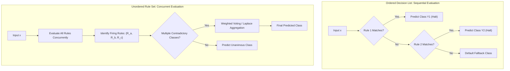

# Migration in progress
# Week 5: Supervised Learning: Rule-Based Classification

## Supervised Learning: Rule-Based Classification Foundations and Algorithms

Rule-based classifiers represent an expressive, highly interpretable class of supervised models that partition feature space using disjunctive collections of IF-THEN rules. While decision trees enforce a rigid hierarchical structure where every rule must share ancestral splitting nodes, rule-based systems decouple individual classification rules, allowing flexible and modular representations. Examining rule syntax, evaluation metrics, the separate-and-conquer sequential covering strategy, direct algorithms such as RIPPER, and indirect extraction from decision trees establishes the technical foundations of rule-based supervised learning.

## Foundations of Rule-Based Representation

### Syntax of IF-THEN Classification Rules

- A **rule-based classifier** models predictive logic using a collection of conditional implication rules:
  $$R: (\text{Condition}) \implies y$$
- **Rule Antecedent (LHS / Precondition):** A conjunction (**AND**) of attribute tests over input features:
  $$\text{Condition} = (A_1 \text{ op } v_1) \land (A_2 \text{ op } v_2) \land \dots \land (A_k \text{ op } v_k)$$
  where each attribute test evaluates an equality ($A_i = v_i$) or relational inequality ($A_i \le v_i$) on input coordinates.
- **Rule Consequent (RHS / Head):** The assigned target classification class label:
  $$y \in \{C_1, C_2, \dots, C_K\}$$
- An observation $x$ **triggers or covers** a rule if the feature values of $x$ satisfy every conjunct in the antecedent.
- A rule **fires** when it actively delivers its consequent class prediction for the covered instance.

### Mutually Exclusive and Exhaustive Rule Properties

- The operational behavior of a rule set depends on two structural properties:
  - **Mutually Exclusive Rules:** Every observation $x \in \mathcal{X}$ triggers at most one rule in the rule set. Rule antecedents partition feature space into non-overlapping regions; no two rules fire on the identical input instance, preventing classification conflict.
  - **Exhaustive Rules:** Every observation $x \in \mathcal{X}$ triggers at least one rule in the rule set. The collective antecedents cover the entire feature space without leaving unmapped gaps.
- Real-world rule sets learned from noisy data rarely satisfy both properties simultaneously:
  - Non-mutually exclusive rule sets cause **conflict**: an instance satisfies multiple rules predicting contradictory classes.
  - Non-exhaustive rule sets cause **coverage gaps**: an instance satisfies zero rules, requiring a **default fallback rule** ($\text{ELSE } y = C_{\text{default}}$).

### Ordered Decision Lists Versus Unordered Rule Sets

- **Ordered Rules (Decision Lists):** Rules organize into a strict linear priority sequence:
  $$R_1, \; R_2, \; \dots, \; R_M, \; R_{\text{default}}$$
  - An input instance evaluates against rules sequentially from top to bottom.
  - The first rule whose antecedent is satisfied classifies the instance, and all subsequent rules are ignored.
  - The final rule in the sequence is an unconditional default rule assigning the majority training class.
- **Unordered Rules (Decision Sets):** Rules exist as an independent, unordered collection.
  - All rules evaluate concurrently against the input instance.
  - If multiple contradictory rules fire, a **conflict resolution strategy** determines the outcome:
    - *Majority Voting:* Each firing rule casts an equal vote for its consequent class.
    - *Weighted Voting:* Votes scale by rule quality metrics (e.g., rule confidence, Laplace-corrected accuracy, or support).
  - If no rule fires, the default class is assigned.



> [!Important]
> **Rule organization dictates inference mechanics**: ordered decision lists evaluate rules sequentially and halt at the first match, while unordered decision sets evaluate all rules concurrently, requiring voting protocols to resolve conflicts.

## Quantitative Rule Evaluation Metrics

### Coverage and Empirical Rule Accuracy

- Let $|\mathcal{D}|$ denote the total number of training instances, $n_{\text{covers}}$ denote the number of instances matching the rule antecedent, and $n_{\text{correct}}$ denote the number of instances matching both the antecedent and the consequent.
- **Coverage:** Measures the fraction of the total dataset that satisfies the rule antecedent:
  $$\text{Coverage}(R) = \frac{n_{\text{covers}}}{|\mathcal{D}|} = \frac{A + B}{|\mathcal{D}|}$$
  where $A$ represents correctly covered instances (True Positives for the rule), and $B$ represents incorrectly covered instances (False Positives for the rule).
- **Rule Accuracy (Precision):** Measures the conditional probability that an instance belongs to class $y$ given that it triggers rule $R$:
  $$\text{Accuracy}(R) = \frac{n_{\text{correct}}}{n_{\text{covers}}} = \frac{A}{A + B}$$

### Laplace Correction for Small-Sample Regularization

- Evaluating rules using naive accuracy exhibits a flaw: a hyper-specific rule covering a solitary training point ($A = 1, B = 0$) achieves an accuracy of $100\%$ ($1/1 = 1.0$), despite having zero statistical reliability.
- **Laplace Correction:** Smooths accuracy estimates by adding a pseudo-count prior, penalizing rules supported by tiny sample sizes:
  $$\text{Accuracy}_{\text{Laplace}}(R) = \frac{A + 1}{A + B + K}$$
  where $K$ denotes the total number of target classes.
- For a two-class problem ($K=2$):
  - A rule covering $1/1$ correct points yields $\text{Accuracy}_{\text{Laplace}} = \frac{1 + 1}{1 + 0 + 2} = \frac{2}{3} \approx 0.67$.
  - A rule covering $90/100$ correct points yields $\text{Accuracy}_{\text{Laplace}} = \frac{90 + 1}{90 + 10 + 2} = \frac{91}{102} \approx 0.89$.
  - Laplace correction correctly ranks the broader rule above the brittle single-instance rule.

### The M-Estimate and FOIL Information Gain

- **$M$-Estimate of Accuracy:** Generalizes Laplace correction by incorporating domain class priors:
  $$\text{Accuracy}_m(R) = \frac{A + m \cdot P(y)}{A + B + m}$$
  where $P(y)$ is the prior probability of the target class, and $m$ is a tunable equivalent sample weight parameter.
- **FOIL's Information Gain:** Used in inductive logic programming and rule growing algorithms (such as RIPPER) to evaluate the benefit of adding an extra conjunct to an existing rule:
  $$\text{FOIL\_Gain} = A_1 \times \left( \log_2\left( \frac{A_1}{A_1 + B_1} \right) - \log_2\left( \frac{A_0}{A_0 + B_0} \right) \right)$$
  where $A_0, B_0$ represent positive and negative instances covered before adding the conjunct, and $A_1, B_1$ represent counts after adding the conjunct.
- FOIL Gain favors candidate conjuncts that increase rule precision while maintaining substantial positive sample coverage ($A_1$).

> [!Tip]
> **Use Laplace correction to penalize small coverage**: raw rule accuracy favors brittle rules that cover a single outlier point; adding Laplace smoothing scales accuracy by sample size, favoring statistically robust rules.

## Direct Rule Induction: The Sequential Covering Paradigm

### The Separate-and-Conquer Strategy

- Direct rule learners extract classification rules directly from training data without first building an intermediate decision tree.
- Most direct algorithms execute the **Sequential Covering (Separate-and-Conquer)** algorithm:
  1. Let $\mathcal{D}$ represent the active training dataset.
  2. While the dataset contains positive instances:
     - **Learn a Single Rule ($R$):** Search the feature space greedily to induce a rule that covers many positive instances and minimal negative instances.
     - **Separate (Remove) Covered Instances:** Delete all training records covered by rule $R$ from active dataset $\mathcal{D}$:
       $$\mathcal{D} \leftarrow \mathcal{D} \setminus \{x^{(i)} \in \mathcal{D} \mid x^{(i)} \text{ satisfies } \text{Antecedent}(R)\}$$
     - **Accumulate Rule:** Append rule $R$ to the global rule set.
  3. Terminate when remaining instances satisfy stopping criteria, assigning a default class to unassigned regions.

```mermaid
flowchart TD
    Start["Active Training Dataset D"] --> Check{"Positive Samples Remain in D?"}
    
    Check -- No --> Default["Append Default Majority Class Rule"]
    Default --> Terminate["Return Complete Rule Set"]
    
    Check -- Yes --> LearnRule["Learn One Rule R: Greedy Top-Down Search<br/>Maximize FOIL Gain / Laplace Accuracy"]
    LearnRule --> PruneRule["Prune Rule R: Minimize Error o