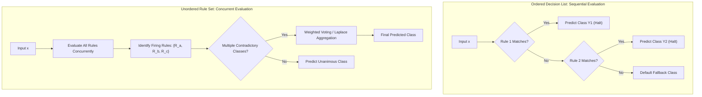
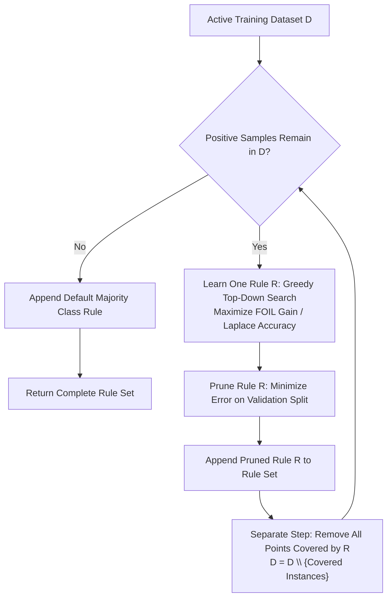
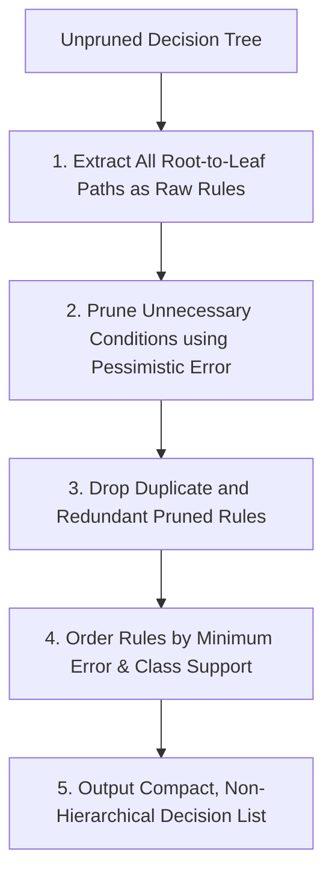

# Week 5: Supervised Learning: Rule-Based Classification

## Supervised Learning: Rule-Based Classification Foundations and Algorithms

Rule-based classifiers represent an expressive, highly interpretable class of supervised models that partition feature space using disjunctive collections of IF-THEN rules. While decision trees enforce a rigid hierarchical structure where every rule must share ancestral splitting nodes, rule-based systems decouple individual classification rules, allowing flexible and modular representations. Examining rule syntax, evaluation metrics, the separate-and-conquer sequential covering strategy, direct algorithms such as RIPPER, and indirect extraction from decision trees establishes the technical foundations of rule-based supervised learning.

## Foundations of Rule-Based Representation

### Syntax of IF-THEN Classification Rules

- A **rule-based classifier** models predictive logic using a collection of conditional implication rules:
  $$R: (\text{Condition}) \implies y$$
- **Rule Antecedent (LHS / Precondition):** A conjunction (**AND**) of attribute tests over input features:
  $$\text{Condition} = (A_1 \text{ op } v_1) \land (A_2 \text{ op } v_2) \land \dots \land (A_k \text{ op } v_k)$$
  where each attribute test evaluates an equality ($A_i = v_i$) or relational inequality ($A_i \le v_i$) on input coordinates.
- **Rule Consequent (RHS / Head):** The assigned target classification class label:
  $$y \in \{C_1, C_2, \dots, C_K\}$$
- An observation $x$ **triggers or covers** a rule if the feature values of $x$ satisfy every conjunct in the antecedent.
- A rule **fires** when it actively delivers its consequent class prediction for the covered instance.

### Mutually Exclusive and Exhaustive Rule Properties

- The operational behavior of a rule set depends on two structural properties:
  - **Mutually Exclusive Rules:** Every observation $x \in \mathcal{X}$ triggers at most one rule in the rule set. Rule antecedents partition feature space into non-overlapping regions; no two rules fire on the identical input instance, preventing classification conflict.
  - **Exhaustive Rules:** Every observation $x \in \mathcal{X}$ triggers at least one rule in the rule set. The collective antecedents cover the entire feature space without leaving unmapped gaps.
- Real-world rule sets learned from noisy data rarely satisfy both properties simultaneously:
  - Non-mutually exclusive rule sets cause **conflict**: an instance satisfies multiple rules predicting contradictory classes.
  - Non-exhaustive rule sets cause **coverage gaps**: an instance satisfies zero rules, requiring a **default fallback rule** ($\text{ELSE } y = C_{\text{default}}$).

### Ordered Decision Lists Versus Unordered Rule Sets

- **Ordered Rules (Decision Lists):** Rules organize into a strict linear priority sequence:
  $$R_1, \; R_2, \; \dots, \; R_M, \; R_{\text{default}}$$
  - An input instance evaluates against rules sequentially from top to bottom.
  - The first rule whose antecedent is satisfied classifies the instance, and all subsequent rules are ignored.
  - The final rule in the sequence is an unconditional default rule assigning the majority training class.
- **Unordered Rules (Decision Sets):** Rules exist as an independent, unordered collection.
  - All rules evaluate concurrently against the input instance.
  - If multiple contradictory rules fire, a **conflict resolution strategy** determines the outcome:
    - *Majority Voting:* Each firing rule casts an equal vote for its consequent class.
    - *Weighted Voting:* Votes scale by rule quality metrics (e.g., rule confidence, Laplace-corrected accuracy, or support).
  - If no rule fires, the default class is assigned.

> [!Important]
> **Rule organization dictates inference mechanics**: ordered decision lists evaluate rules sequentially and halt at the first match, while unordered decision sets evaluate all rules concurrently, requiring voting protocols to resolve conflicts.

## Quantitative Rule Evaluation Metrics

### Coverage and Empirical Rule Accuracy

- Let $|\mathcal{D}|$ denote the total number of training instances, $n_{\text{covers}}$ denote the number of instances matching the rule antecedent, and $n_{\text{correct}}$ denote the number of instances matching both the antecedent and the consequent.
- **Coverage:** Measures the fraction of the total dataset that satisfies the rule antecedent:
  $$\text{Coverage}(R) = \frac{n_{\text{covers}}}{|\mathcal{D}|} = \frac{A + B}{|\mathcal{D}|}$$
  where $A$ represents correctly covered instances (True Positives for the rule), and $B$ represents incorrectly covered instances (False Positives for the rule).
- **Rule Accuracy (Precision):** Measures the conditional probability that an instance belongs to class $y$ given that it triggers rule $R$:
  $$\text{Accuracy}(R) = \frac{n_{\text{correct}}}{n_{\text{covers}}} = \frac{A}{A + B}$$

### Laplace Correction for Small-Sample Regularization

- Evaluating rules using naive accuracy exhibits a flaw: a hyper-specific rule covering a solitary training point ($A = 1, B = 0$) achieves an accuracy of $100\%$ ($1/1 = 1.0$), despite having zero statistical reliability.
- **Laplace Correction:** Smooths accuracy estimates by adding a pseudo-count prior, penalizing rules supported by tiny sample sizes:
  $$\text{Accuracy}_{\text{Laplace}}(R) = \frac{A + 1}{A + B + K}$$
  where $K$ denotes the total number of target classes.
- For a two-class problem ($K=2$):
  - A rule covering $1/1$ correct points yields $\text{Accuracy}_{\text{Laplace}} = \frac{1 + 1}{1 + 0 + 2} = \frac{2}{3} \approx 0.67$.
  - A rule covering $90/100$ correct points yields $\text{Accuracy}_{\text{Laplace}} = \frac{90 + 1}{90 + 10 + 2} = \frac{91}{102} \approx 0.89$.
  - Laplace correction correctly ranks the broader rule above the brittle single-instance rule.

### The M-Estimate and FOIL Information Gain

- **$M$-Estimate of Accuracy:** Generalizes Laplace correction by incorporating domain class priors:
  $$\text{Accuracy}_m(R) = \frac{A + m \cdot P(y)}{A + B + m}$$
  where $P(y)$ is the prior probability of the target class, and $m$ is a tunable equivalent sample weight parameter.
- **FOIL's Information Gain:** Used in inductive logic programming and rule growing algorithms (such as RIPPER) to evaluate the benefit of adding an extra conjunct to an existing rule:
  $$\text{FOIL\_Gain} = A_1 \times \left( \log_2\left( \frac{A_1}{A_1 + B_1} \right) - \log_2\left( \frac{A_0}{A_0 + B_0} \right) \right)$$
  where $A_0, B_0$ represent positive and negative instances covered before adding the conjunct, and $A_1, B_1$ represent counts after adding the conjunct.
- FOIL Gain favors candidate conjuncts that increase rule precision while maintaining substantial positive sample coverage ($A_1$).

> [!Tip]
> **Use Laplace correction to penalize small coverage**: raw rule accuracy favors brittle rules that cover a single outlier point; adding Laplace smoothing scales accuracy by sample size, favoring statistically robust rules.

## Direct Rule Induction: The Sequential Covering Paradigm

### The Separate-and-Conquer Strategy

- Direct rule learners extract classification rules directly from training data without first building an intermediate decision tree.
- Most direct algorithms execute the **Sequential Covering (Separate-and-Conquer)** algorithm:
  1. Let $\mathcal{D}$ represent the active training dataset.
  2. While the dataset contains positive instances:
     - **Learn a Single Rule ($R$):** Search the feature space greedily to induce a rule that covers many positive instances and minimal negative instances.
     - **Separate (Remove) Covered Instances:** Delete all training records covered by rule $R$ from active dataset $\mathcal{D}$:
       $$\mathcal{D} \leftarrow \mathcal{D} \setminus \{x^{(i)} \in \mathcal{D} \mid x^{(i)} \text{ satisfies } \text{Antecedent}(R)\}$$
     - **Accumulate Rule:** Append rule $R$ to the global rule set.
  3. Terminate when remaining instances satisfy stopping criteria, assigning a default class to unassigned regions.

### General-to-Specific Beam Search Induction

- Learning an individual rule typically proceeds as a **general-to-specific search**:
  - Begin with an empty rule antecedent that covers all data: $\text{TRUE} \implies y$.
  - Iteratively evaluate candidate conjuncts ($A_j = v$ or $A_j \le v$) to add to the antecedent.
  - Adding a condition restricts coverage, eliminating false positives and refining rule precision.
- Pure greedy search selects the single best condition at each step, which risks trapping in local minima.
- **Beam Search:** Maintains a queue of the top $k$ candidate rules (the beam width $k$), expanding all $k$ paths concurrently to avoid premature sub-optimal commitments.

### The RIPPER Algorithm Framework

- Proposed by William W. Cohen (1995), **RIPPER (Repeated Incremental Pruning to Produce Error Reduction)** is the benchmark direct rule induction algorithm, optimized for efficiency on large, noisy datasets.
- **Class Ordering:** Sorts target classes in ascending order of prevalence (rarest class first, most common class last). RIPPER induces rules for rare classes first; the dominant class defaults as the final fallback.
- **Two-Phase Rule Induction per Rule:**
  - **Rule Growing:** Splits active data into a growing set (67%) and a pruning set (33%). Greedily adds conditions using FOIL Information Gain until the rule achieves 100% precision on the growing set ($B = 0$).
  - **Incremental Rule Pruning:** Prunes trailing conditions immediately using the independent pruning set. Evaluates the metric:
    $$v = \frac{p - n}{p + n}$$
    where $p$ and $n$ are positive and negative instances in the pruning set covered by the rule. Conditions are pruned backward until $v$ stops improving.
- **Rule Set Optimization:** Following complete rule set induction, RIPPER executes a global optimization pass, re-evaluating each rule against alternative replacement rules and revised variants to minimize global error.

### Minimum Description Length (MDL) Stopping Criteria

- RIPPER terminates sequential covering using the **Minimum Description Length (MDL)** principle.
- Total description length measures the combined bits required to encode the model parameters plus the exceptions (misclassified instances):
  $$\text{Description Length} = \text{Bits}(\text{Rule Set}) + \text{Bits}(\text{Misclassifications})$$
- As rules are added, misclassifications decrease while model bits increase.
- RIPPER halts adding rules when the total description length exceeds the minimum observed description length by more than $d$ bits (typically $d = 64$).

> [!Important]
> **RIPPER pairs rule growing with immediate pruning**: growing conditions on a sub-split and pruning immediately on an isolated validation set prevents overfitting, while MDL bounds total rule set complexity.

## Indirect Rule Extraction from Decision Trees

### Path Decomposition of Tree Hierarchies

- **Indirect rule induction** trains an unconstrained decision tree first, then translates the hierarchical tree structure into an equivalent flat rule set.
- Every individual path from the root node to a terminal leaf decomposes into an explicit rule:
  $$\text{Root} \to \text{Node}_1 \to \text{Node}_2 \to \text{Leaf} \implies (\text{Test}_{\text{Root}} \land \text{Test}_1 \land \text{Test}_2) \implies y_{\text{Leaf}}$$
- A tree containing $M$ leaves extracts exactly $M$ initial rules that are mutually exclusive and exhaustive.

### Rule Post-Pruning and Antecedent Elimination (C4.5Rules)

- Rules extracted directly from trees are often unnecessarily complex because conditions near the leaves reflect localized splits constrained by upstream nodes.
- **C4.5Rules (Quinlan, 1993)** post-prunes extracted rules:
  1. Extract unpruned rules from all root-to-leaf paths.
  2. For each rule, evaluate removing each condition independently, regardless of its original vertical depth in the tree.
  3. Estimate rule error using **pessimistic error estimation** (binomial confidence bounds).
  4. If dropping a condition reduces or maintains estimated pessimistic error, permanently remove the condition from the rule.
  5. Remove duplicate rules resulting from antecedent pruning.
  6. Organize surviving rules into class-specific subsets, order rules by accuracy, and assign an unassigned default class.

### Overcoming the Sub-Tree Replication Problem

- Decision trees suffer from the **sub-tree replication problem**: when a concept requires testing an attribute condition across multiple alternative paths, identical sub-trees duplicate across different branches.
- Decomposing trees into rules resolves this structural redundancy: post-pruning eliminates the duplicated conditions, compressing complex duplicated tree branches into a single concise rule.

> [!Tip]
> **C4.5Rules eliminates tree structure constraints**: converting tree paths into rules and pruning antecedents independently allows conditions from the root to be discarded if intermediate tests render them redundant, resolving the sub-tree replication problem.

## Comparative Matrices of Rule Systems and Algorithms

| System Characteristic | Ordered Decision Lists | Unordered Decision Sets |
|---|---|---|
| **Inference Evaluation Sequence** | Sequential top-down priority evaluation | **Concurrent evaluation** across all rules |
| **Handling Overlapping Rules** | Avoids conflict; first matching rule halts search | **Requires conflict resolution** (voting, Laplace weights) |
| **Rule Modularity** | Low; moving or deleting a rule changes all downstream logic | **High**; individual rules evaluate independently |
| **Handling Uncovered Gaps** | Terminal default rule guarantees complete coverage | Requires a separate fallback rule |
| **Human Interpretability** | Requires understanding upstream exclusion context | Simple standalone IF-THEN comprehension |
| **Model Size** | Typically more compact due to sequential exclusion | Often larger to ensure complete domain coverage |

### Direct Versus Indirect Rule Induction Frameworks

| Operational Dimension | Direct Induction: Sequential Covering (RIPPER, CN2) | Indirect Extraction: Tree-Based (C4.5Rules) |
|---|---|---|
| **Underlying Strategy** | **Separate-and-Conquer** (Greedy rule search) | **Divide-and-Conquer** (Global tree construction) |
| **Intermediate Representation** | None; mines rules directly from data points | Full Decision Tree (CART or C4.5) |
| **Search Space Traversal** | General-to-specific beam search over feature terms | Hierarchical orthogonal recursive partitioning |
| **Computational Complexity** | Faster on dense datasets; scales well with samples | Bounded by tree training ($O(N \log N \cdot D)$) + pruning |
| **Sub-Tree Replication** | Naturally avoids sub-tree replication | Resolves replication via post-pruning |
| **Rule Quality Focus** | Optimizes individual rules sequentially | Optimizes global tree partitions before extraction |

> [!Important]
> **Direct methods scale to large datasets while indirect methods leverage tree structures**: RIPPER mines rules directly using fast separate-and-conquer loops, whereas C4.5Rules extracts rules from trees to eliminate redundant hierarchical splits.

## Key Takeaways

- **Rule-based classifiers represent knowledge via IF-THEN implications**, mapping feature conjunctions to categorical class predictions.
- **Rule sets can be ordered (decision lists)**, halting at the first matching rule, or **unordered (decision sets)**, requiring voting protocols to resolve conflicts.
- **Rule accuracy must be regularized on small coverage**: Laplace smoothing ($\frac{A+1}{A+B+K}$) prevents brittle rules that cover solitary outliers from dominating models.
- **Direct sequential covering uses separate-and-conquer loops**: learn a single high-quality rule, remove all covered training points, and repeat until positive instances are exhausted.
- **RIPPER optimizes rule induction** by growing rules with FOIL Information Gain, pruning immediately on validation splits, and stopping via Minimum Description Length (MDL).
- **Indirect methods extract rules from decision trees**, translating root-to-leaf paths into rules and pruning redundant antecedents to solve the sub-tree replication problem.
- **Unordered rules offer modular explainability**, allowing individual domain logic rules to be inspected, edited, or audited independently.

> [!Tip]
> The defining principle of rule-based classification: **decouple hierarchical splits into modular logical assertions**; by extracting modular IF-THEN rules directly from data or pruning them from decision trees, rule classifiers deliver transparent models that human domain experts can easily inspect and audit.
