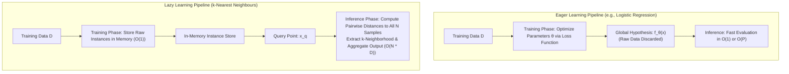
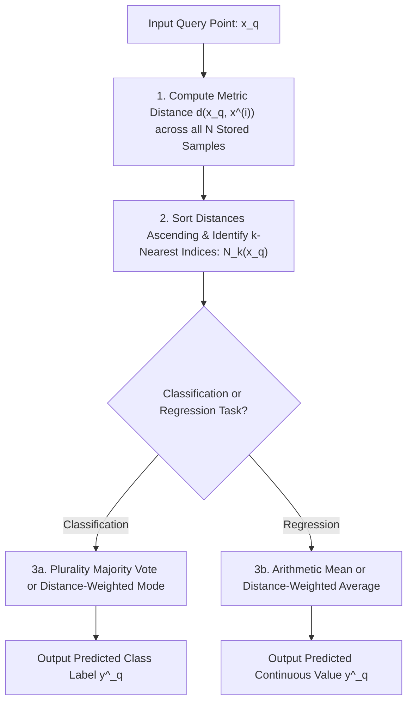
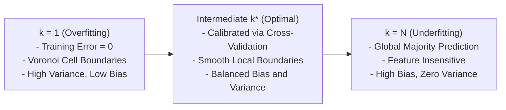

## Lazy Learning Principles and the k-Nearest Neighbours Algorithm

The $k$-Nearest Neighbours (KNN) algorithm provides a non-parametric, instance-based foundation for supervised classification and continuous regression. Rather than optimizing a generalized mathematical function during a dedicated training phase, lazy learners store empirical observations directly in memory, deferring all computational work until an inference query arrives. Examining the operational mechanics of instance-based learning, distance-weighted consensus rules, hyperparameter calibration across the bias-variance spectrum, and the necessity of feature scaling establishes the core principles of proximity-based prediction.

## The Instance-Based Lazy Learning Paradigm

### Eager Versus Lazy Learning Architectures

- **Eager Learning:** Classifiers such as Logistic Regression, Decision Trees, and Neural Networks process training data during an upfront optimization phase. They fit parameter weights $\theta$ to construct an abstract global hypothesis function $f_\theta(x)$ and discard the raw training data once training concludes.
- **Lazy Learning:** The algorithm performs zero abstraction or optimization during training ($O(1)$ training time). The training phase consists solely of allocating memory to store the raw feature vectors and target labels:
  $$\mathcal{D} = \{(x^{(1)}, y^{(1)}), (x^{(2)}, y^{(2)}), \dots, (x^{(N)}, y^{(N)})\}, \quad x^{(i)} \in \mathbb{R}^D, \; y^{(i)} \in \mathcal{Y}$$
- Computational cost shifts to the **inference phase**: when predicting an unobserved query point $x_q$, the algorithm scans stored instances, calculates pairwise distance metrics, and constructs a localized model specific to that query coordinate.

### Local Approximation and the Smoothness Inductive Bias

- Lazy learning relies on the **smoothness inductive bias**: observations mapped close together in continuous metric space $\mathbb{R}^D$ are assumed to share identical target classes or similar numerical responses:
  $$d(x_i, x_j) \to 0 \implies P(Y \mid X = x_i) \approx P(Y \mid X = x_j)$$
- This operational logic assumes the data-generating function satisfies **Lipschitz continuity**, bounding the rate at which target values can diverge relative to spatial displacement:
  $$\|f(x_1) - f(x_2)\| \le L \|x_1 - x_2\|$$
  where $L < \infty$ represents the Lipschitz constant.

### Dynamic Hypothesis Construction at Inference

- An eager learner commits to a single global decision boundary designed to perform well across the entire feature space.
- A lazy learner constructs a temporary, localized hypothesis $f_{x_q}(x)$ valid strictly within the local neighborhood surrounding query point $x_q$.
- Because hypotheses are built locally on demand, lazy learners handle complex, non-linear boundaries naturally without requiring polynomial feature expansions or kernel transformations.

> [!Important]
> **Lazy learners construct local hypotheses at query time**: unlike eager models that optimize a single global function during training, KNN delays computation until inference, constructing a localized decision boundary for each individual query point.

## The KNN Algorithmic Execution Pipeline

### Step-by-Step Inference Protocol

- Given an unlabelled query instance $x_q \in \mathbb{R}^D$, the standard KNN execution pipeline follows four sequential stages:
  1. **Distance Computation:** Calculate the scalar distance between query point $x_q$ and every stored training sample $x^{(i)} \in \mathcal{D}$ using a chosen distance metric:
     $$d_i = d(x_q, x^{(i)}) \quad \forall i \in \{1, \dots, N\}$$
  2. **Neighborhood Sorting:** Sort the calculated distances in ascending order to identify the indices of the $k$ smallest values, forming the neighborhood set $N_k(x_q) \subset \mathcal{D}$:
     $$N_k(x_q) = \{x^{(1)}, x^{(2)}, \dots, x^{(k)}\} \quad \text{such that } d(x_q, x^{(i)}) \le d(x_q, x^{(j)}) \; \forall x^{(j)} \notin N_k(x_q)$$
  3. **Target Aggregation:** Extract the target labels $\{y^{(1)}, \dots, y^{(k)}\}$ associated with the $k$ identified neighbors.
  4. **Consensus Prediction:** Combine neighbor labels using majority voting (for classification) or local averaging (for continuous regression) to output $\hat{y}_q$.

### Unweighted Majority Voting for Categorical Targets

- In standard classification, each neighbor within $N_k(x_q)$ casts an identical, unweighted vote for its class.
- The query point is assigned to the most frequent categorical mode:
  $$\hat{y}_q = \arg\max_{c \in \{1, \dots, C\}} \sum_{i \in N_k(x_q)} \mathbf{1}[y^{(i)} = c]$$
  where $\mathbf{1}[\cdot]$ is the indicator function evaluating to one if true and zero otherwise.
- The posterior class probability estimates as the empirical proportion of neighbors belonging to class $c$:
  $$P(Y = c \mid X = x_q) = \frac{1}{k} \sum_{i \in N_k(x_q)} \mathbf{1}[y^{(i)} = c]$$

### Distance-Weighted Voting Formulations

- Unweighted majority voting treats all $k$ neighbors equally, regardless of whether a neighbor is adjacent to the query point or on the outer boundary of the neighborhood.
- In **Distance-Weighted KNN**, each neighbor's vote scales inversely with its distance to query point $x_q$:
  $$w_i = \frac{1}{d(x_q, x^{(i)})^2 + \epsilon}$$
  where $\epsilon \approx 10^{-8}$ prevents division-by-zero errors when an evaluation point coincides with a training point.
- The weighted consensus rule evaluates as:
  $$\hat{y}_q = \arg\max_{c \in \{1, \dots, C\}} \sum_{i \in N_k(x_q)} w_i \mathbf{1}[y^{(i)} = c]$$
- Distance weighting dampens the negative influence of distant neighbors, allowing models to use larger values of $k$ without over-smoothing sharp local boundaries.

### Continuous Locally Weighted Regression

- For continuous regression tasks ($y \in \mathbb{R}$), KNN outputs the arithmetic mean of neighbor values:
  $$\hat{y}_q = \frac{1}{k} \sum_{i \in N_k(x_q)} y^{(i)}$$
- Applying distance weights converts the estimator into a **locally weighted kernel smoother**:
  $$\hat{y}_q = \frac{\sum_{i \in N_k(x_q)} w_i y^{(i)}}{\sum_{i \in N_k(x_q)} w_i}, \quad w_i = \frac{1}{d(x_q, x^{(i)})}$$

> [!Tip]
> **Distance weighting mitigates neighbor boundary bias**: weighting votes by inverse squared distance ($\frac{1}{d^2}$) ensures closer points dominate the consensus, preventing distant neighbors from overpowering local signals.

## The Hyperparameter Spectrum of $k$ and Asymptotic Bounds

### The Extreme of $k=1$: Voronoi Tessellations and Overfitting

- Setting $k = 1$ assigns query points strictly to the class of their single nearest neighbor.
- Geometrically, the feature space partitions into a **Voronoi tessellation**: an array of convex polyhedral cells enclosing each training sample.
- **Error Characteristics:**
  - Training error evaluates to zero ($R_{\text{emp}} = 0$) because every training point serves as its own closest neighbor.
  - The model exhibits **low bias and high variance**, creating sharp, complex decision boundaries that wrap around noise, anomalies, and mislabeled points (**overfitting**).

### The Extreme of $k=N$: Majority Underfitting

- Setting $k = N$ expands the neighborhood to encompass the entire training dataset.
- In classification, every query point receives an identical prediction: the global majority class. In regression, the model outputs the global sample mean $\bar{y}$.
- **Error Characteristics:**
  - The model exhibits **high bias and zero variance**, completely ignoring local feature variations (**underfitting**).

### Cross-Validation Calibration Protocols

- Model capacity scales inversely with $k$: small $k$ increases variance, while large $k$ increases bias.
- Calibrating the optimal $k^*$ uses $K$-Fold cross-validation, selecting the value that minimizes validation error:
  $$k^* = \arg\min_k \text{Error}_{\text{val}}(k)$$
- **Tie-Breaking Convention:** For binary classification tasks ($C = 2$), practitioners enforce an **odd value of $k$** (e.g., $k \in \{3, 5, 7, 9\}$) to guarantee that voting tallies cannot tie.

### The Cover-Hart Asymptotic Generalization Bound

- In 1967, Thomas Cover and Peter Hart proved a fundamental theoretical bound linking the nearest-neighbour rule to the theoretical limits of statistical classification.
- Let $R^*$ represent the **Bayes error rate**, the lowest achievable error rate by any classifier with complete knowledge of the true distributions $P(X, Y)$.
- As the number of training samples approaches infinity ($N \to \infty$), the asymptotic probability of error for a 1-Nearest Neighbour classifier ($R_{1\text{-NN}}$) satisfies:
  $$R^* \le R_{1\text{-NN}} \le 2 R^* (1 - R^*) \le 2 R^*$$
- This theorem proves that an unparameterized 1-NN classifier trained on infinite data achieves an error rate at most twice the optimal Bayes error, providing strong baseline performance without functional tuning.

> [!Important]
> **The Cover-Hart bound guarantees performance**: as sample size approaches infinity ($N \to \infty$), the error rate of a simple 1-NN model is upper-bounded by at most twice the theoretical Bayes error rate ($R_{1\text{-NN}} \le 2R^*$).

## Distance Metrics and the Normalization Prerequisite

### Minkowski Metric Space Formulations

- Nearest-neighbor identification depends directly on the chosen distance metric. The generalized **Minkowski distance** between vectors $x, z \in \mathbb{R}^D$ is parameterized by order $p \ge 1$:
  $$D(x, z) = \left( \sum_{d=1}^D |x_d - z_d|^p \right)^{\frac{1}{p}}$$
- **Manhattan Distance ($L_1$ Norm, $p = 1$):**
  $$D_{L_1}(x, z) = \sum_{d=1}^D |x_d - z_d|$$
  Measures rectilinear grid displacements. It is less sensitive to extreme outliers along individual axes than higher-order norms.
- **Euclidean Distance ($L_2$ Norm, $p = 2$):**
  $$D_{L_2}(x, z) = \sqrt{\sum_{d=1}^D (x_d - z_d)^2}$$
  Measures straight-line physical displacement, forming isotropic hyperspherical neighborhoods.
- **Chebyshev Distance ($L_\infty$ Norm, $p \to \infty$):**
  $$D_{L_\infty}(x, z) = \max_{d \in \{1, \dots, D\}} |x_d - z_d|$$
  Measures the maximum single coordinate deviation, defining hypercubic search windows.

### The Scale Distortion Phenomenon

- Distance metrics evaluate numerical differences across coordinate axes without intrinsic knowledge of physical units.
- Consider an unscaled customer dataset with two attributes:
  - Feature 1 ($A_1$): `Annual Income` ranging from $\$20,000$ to $\$200,000$.
  - Feature 2 ($A_2$): `Credit Inquiries` ranging from $0$ to $5$.
- Evaluating the Euclidean distance between two applicants ($x = [50000, 1]$ and $z = [52000, 4]$):
  $$d(x, z) = \sqrt{(50000 - 52000)^2 + (1 - 4)^2} = \sqrt{(-2000)^2 + (-3)^2} = \sqrt{4,000,000 + 9} \approx 2000.002$$
- The income attribute contributes $4,000,000$ to the squared sum, while the credit inquiry attribute contributes only $9$.
- The unscaled feature dominates the distance calculation entirely, rendering the smaller attribute mathematically irrelevant to neighbor selection.

### Normalization Protocols for Proximity Validity

- To guarantee that all feature dimensions contribute proportionally to metric distances, continuous attributes must undergo rescaling prior to distance calculation:
  - **Z-Score Standardization:** Rescales attributes to zero mean and unit variance:
    $$x_{\text{std}} = \frac{x - \mu}{\sigma}$$
  - **Min-Max Normalization:** Linearly compresses attributes into a fixed interval $[0, 1]$:
    $$x_{\text{norm}} = \frac{x - x_{\min}}{x_{\max} - x_{\min}}$$
- Preprocessing parameters ($\mu, \sigma, x_{\min}, x_{\max}$) must be estimated strictly from the training partition to prevent data leakage.

> [!Tip]
> **Standardize features before running KNN**: because distance metrics sum numerical differences across dimensions, attributes with large raw numerical scales dominate neighbor selection unless standardized to unit variance.

## Comparative Matrix of Learning Paradigms

| Operational Dimension | Eager Learning (e.g., Logistic Regression, Decision Trees) | Lazy Learning (k-Nearest Neighbours) |
|---|---|---|
| **Training Time Complexity** | **High:** $O(N \cdot D)$ to $O(N \cdot D \cdot I)$ (Parameter optimization) | **Instantaneous:** $O(1)$ (Direct memory allocation) |
| **Query (Inference) Latency** | **Fast:** $O(D)$ or $O(\text{depth})$ (Evaluate compact function) | **Slow:** $O(N \cdot D)$ (Must calculate distances to all $N$ points) |
| **Model Memory Footprint** | Low: Stores only compact weight vectors $\theta \in \mathbb{R}^P$ | High: Must retain the entire training dataset $\mathcal{D}$ in RAM |
| **Hypothesis Space Nature** | Global: A single mathematical boundary fits all regions | **Local:** Dynamically constructs custom hypotheses per query |
| **Adaptability to New Data** | Slow: Requires full retraining or online gradient updates | **Instantaneous:** Simply append new observations to memory |
| **Sensitivity to Outliers** | Controlled via regularization and robust loss functions | High when $k=1$; mitigated by increasing $k$ and distance weighting |

> [!Important]
> **KNN trades training time for inference latency**: while eager models invest compute during training to achieve sub-millisecond inference, KNN trains instantly but requires substantial computational time per query on large datasets.

## Key Takeaways

- **KNN is an instance-based lazy learner**, storing raw observations without optimization ($O(1)$ training) and deferring distance calculations to query time ($O(N \cdot D)$).
- **The algorithm assumes local smoothness**, relying on spatial proximity under Lipschitz continuity assumptions to estimate target labels.
- **The hyperparameter $k$ governs model capacity**: setting $k=1$ produces non-linear Voronoi partitions prone to overfitting, while setting $k=N$ outputs global sample means, causing underfitting.
- **The Cover-Hart Theorem bounds asymptotic 1-NN error**: as sample size approaches infinity ($N \to \infty$), the 1-NN error rate is bounded by at most twice the optimal Bayes error rate ($R^* \le R_{1\text{-NN}} \le 2R^*$).
- **Odd values of $k$ prevent binary voting ties**, while distance-weighted voting ($\frac{1}{d^2}$) prioritizes closer points over distant neighbors.
- **Feature scaling is mandatory**: because distance metrics sum numerical differences across dimensions, unscaled attributes dominate distance calculations.
- **KNN adapts instantaneously to new data** by appending new vectors to memory, but requires storing the entire training set in RAM during deployment.

> [!Tip]
> The foundational rule of nearest-neighbour prediction: **local proximity defines target likelihood, but feature scaling governs metric validity**; standardizing continuous attributes to unit variance ensures that spatial neighborhoods accurately reflect multi-attribute domain relationships.
