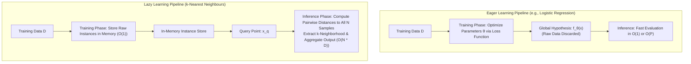
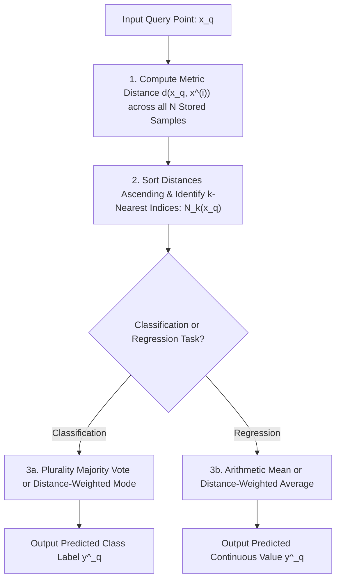

# Migration in progress
## Lazy Learning Principles and the k-Nearest Neighbours Algorithm

The $k$-Nearest Neighbours (KNN) algorithm provides a non-parametric, instance-based foundation for supervised classification and continuous regression. Rather than optimizing a generalized mathematical function during a dedicated training phase, lazy learners store empirical observations directly in memory, deferring all computational work until an inference query arrives. Examining the operational mechanics of instance-based learning, distance-weighted consensus rules, hyperparameter calibration across the bias-variance spectrum, and the necessity of feature scaling establishes the core principles of proximity-based prediction.

## The Instance-Based Lazy Learning Paradigm

### Eager Versus Lazy Learning Architectures

- **Eager Learning:** Classifiers such as Logistic Regression, Decision Trees, and Neural Networks process training data during an upfront optimization phase. They fit parameter weights $\theta$ to construct an abstract global hypothesis function $f_\theta(x)$ and discard the raw training data once training concludes.
- **Lazy Learning:** The algorithm performs zero abstraction or optimization during training ($O(1)$ training time). The training phase consists solely of allocating memory to store the raw feature vectors and target labels:
  $$\mathcal{D} = \{(x^{(1)}, y^{(1)}), (x^{(2)}, y^{(2)}), \dots, (x^{(N)}, y^{(N)})\}, \quad x^{(i)} \in \mathbb{R}^D, \; y^{(i)} \in \mathcal{Y}$$
- Computational cost shifts to the **inference phase**: when predicting an unobserved query point $x_q$, the algorithm scans stored instances, calculates pairwise distance metrics, and constructs a localized model specific to that query coordinate.

### Local Approximation and the Smoothness Inductive Bias

- Lazy learning relies on the **smoothness inductive bias**: observations mapped close together in continuous metric space $\mathbb{R}^D$ are assumed to share identical target classes or similar numerical responses:
  $$d(x_i, x_j) \to 0 \implies P(Y \mid X = x_i) \approx P(Y \mid X = x_j)$$
- This operational logic assumes the data-generating function satisfies **Lipschitz continuity**, bounding the rate at which target values can diverge relative to spatial displacement:
  $$\|f(x_1) - f(x_2)\| \le L \|x_1 - x_2\|$$
  where $L < \infty$ represents the Lipschitz constant.

### Dynamic Hypothesis Construction at Inference

- An eager learner commits to a single global decision boundary designed to perform well across the entire feature space.
- A lazy learner constructs a temporary, localized hypothesis $f_{x_q}(x)$ valid strictly within the local neighborhood surrounding query point $x_q$.
- Because hypotheses are built locally on demand, lazy learners handle complex, non-linear boundaries naturally without requiring polynomial feature expansions or kernel transformations.

> [!Important]
> **Lazy learners construct local hypotheses at query time**: unlike eager models that optimize a single global function during training, KNN delays computation until inference, constructing a localized decision boundary for each individual query point.

## The KNN Algorithmic Execution Pipeline

### Step-by-Step Inference Protocol

- Given an unlabelled query instance $x_q \in \mathbb{R}^D$, the standard KNN execution pipeline follows four sequential stages:
  1. **Distance Computation:** Calculate the scalar distance between query point $x_q$ and every stored training sample $x^{(i)} \in \mathcal{D}$ using a chosen distance metric:
     $$d_i = d(x_q, x^{(i)}) \quad \forall i \in \{1, \dots, N\}$$
  2. **Neighborhood Sorting:** Sort the calculated distances in ascending order to identify the indices of the $k$ smallest values, forming the neighborhood set $N_k(x_q) \subset \mathcal{D}$:
     $$N_k(x_q) = \{x^{(1)}, x^{(2)}, \dots, x^{(k)}\} \quad \text{such that } d(x_q, x^{(i)}) \le d(x_q, x^{(j)}) \; \forall x^{(j)} \notin N_k(x_q)$$
  3. **Target Aggregation:** Extract the target labels $\{y^{(1)}, \dots, y^{(k)}\}$ associated with the $k$ identified neighbors.
  4. **Consensus Prediction:** Combine neighbor labels using majority voting (for classification) or local averaging (for continuous regression) to output $\hat{y}_q$.

### Unweighted Majority Voting for Categorical Targets

- In standard classification, each neighbor within $N_k(x_q)$ casts an identical, unweighted vote for its class.
- The query point is assigned to the most frequent categorical mode:
  $$\hat{y}_q = \arg\max_{c \in \{1, \dots, C\}} \sum_{i \in N_k(x_q)} \mathbf{1}[y^{(i)} = c]$$
  where $\mathbf{1}[\cdot]$ is the indicator function evaluating to one if true and zero otherwise.
- The posterior class probability estimates as the empirical proportion of neighbors belonging to class $c$:
  $$P(Y = c \mid X = x_q) = \frac{1}{k} \sum_{i \in N_k(x_q)} \mathbf{1}[y^{(i)} = c]$$

### Distance-Weighted Voting Formulations

- Unweighted majority voting treats all $k$ neighbors equally, regardless of whether a neighbor is adjacent to the query point or on the outer boundary of the neighborhood.
- In **Distance-Weighted KNN**, each neighbor's vote scales inversely with its distance to query point $x_q$:
  $$w_i = \frac{1}{d(x_q, x^{(i)})^2 + \epsilon}$$
  where $\epsilon \approx 10^{-8}$ prevents division-by-zero errors when an evaluation point coincides with a training point.
- The weighted consensus rule evaluates as:
  $$\hat{y}_q = \arg\max_{c \in \{1, \dots, C\}} \sum_{i \in N_k(x_q)} w_i \mathbf{1}[y^{(i)} = c]$$
- Distance weighting dampens the negative influence of distant neighbors, allowing models to use larger values of $k$ without over-smoothing sharp local boundaries.

### Continuous Locally Weighted Regression

- For continuous regression tasks ($y \in \mathbb{R}$), KNN outputs the arithmetic mean of neighbor values:
  $$\hat{y}_q = \frac{1}{k} \sum_{i \in N_k(x_q)} y^{(i)}$$
- Applying distance weights converts the estimator into a **locally weighted kernel smoother**:
  $$\hat{y}_q = \frac{\sum_{i \in N_k(x_q)} w_i y^{(i)}}{\sum_{i \in N_k(x_q)} w_i}, \quad w_i = \frac{1}{d(x_q, x^{(i)})}$$

> [!Tip]
> **Distance weighting mitigates neighbor boundary bias**: weighting votes by inverse squared distance ($\frac{1}{d^2}$) ensures closer points dominate the consensus, preventing distant neighbors from overpowering local signals.

## The Hyperparameter Spectrum of $k$ and Asymptotic Bounds

### The Extreme of $k=1$: Voronoi Tessellations and Overfitting

- Setting $k = 1$ assigns query points strictly to the class of their single nearest neighbor.
- Geometrically, the feature space partitions into a **Voronoi tessellation**: an array of convex polyhedral cells enclosing each training sample.
- **Error Characteristics:**
  - Training error evaluates to zero ($R_{\text{emp}} = 0$) because every training point serves as its own closest neighbor.
  - The model exh