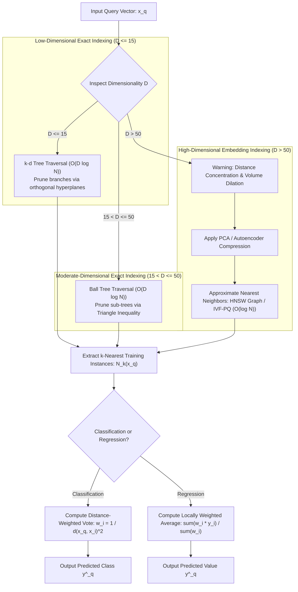

# Migration in progress
# Lesson 2: Summary and Assessment
## k-Nearest Neighbours: Module Summary and Assessment

The $k$-Nearest Neighbours (KNN) algorithm provides a non-parametric, instance-based approach to supervised learning by deferring functional abstraction until inference. Relying on the smoothness inductive bias, KNN assumes that observations mapped in close spatial proximity share identical categorical classes or continuous target values. Synthesizing lazy learning dynamics, voting mechanisms, the bias-variance trade-off across $k$, metric space geometry, the curse of dimensionality, and spatial indexing acceleration trees equips machine learning practitioners to deploy, calibrate, and scale proximity-based prediction systems.

## Synthesis of Core Week 6 Foundations

### The Lazy Learning Paradigm and Non-Parametric Capacity

- **Instance-based memory mechanics:** KNN executes zero parameter optimization during training ($O(1)$ time complexity), storing empirical training observations directly in memory:
  $$\mathcal{D} = \{(x^{(1)}, y^{(1)}), (x^{(2)}, y^{(2)}), \dots, (x^{(N)}, y^{(N)})\} \subset \mathbb{R}^D \times \mathcal{Y}$$
- **Inference latency trade-off:** All computational complexity shifts to the query phase ($O(N \cdot D)$), where the model computes pairwise distances between an unlabelled query vector $x_q$ and all stored training samples.
- **Dynamic local hypotheses:** Instead of optimizing a global decision boundary across the entire feature space, KNN constructs a custom localized hypothesis valid strictly within the immediate neighborhood $N_k(x_q)$.
- **Non-parametric capacity scaling:** The model makes zero structural assumptions regarding the true functional form $f(x)$, allowing its effective representational capacity to grow organically as sample size expands ($N \to \infty$).

### Decision Engines: Classification Voting and Continuous Regression

- **Unweighted majority voting:** Categorical predictions evaluate as the plurality mode across the $k$ nearest neighbors:
  $$\hat{y}_q = \arg\max_{c \in \{1, \dots, C\}} \sum_{i \in N_k(x_q)} \mathbf{1}[y^{(i)} = c]$$
- **Distance-weighted consensus:** Weighing neighbor votes inversely by squared Euclidean distance dampens boundary distortion from distant samples:
  $$w_i = \frac{1}{d(x_q, x^{(i)})^2 + \epsilon} \implies \hat{y}_q = \arg\max_c \sum_{i \in N_k(x_q)} w_i \mathbf{1}[y^{(i)} = c]$$
- **Locally weighted continuous regression:** Continuous targets ($y \in \mathbb{R}$) evaluate as the local weighted arithmetic mean across neighbors:
  $$\hat{y}_q = \frac{\sum_{i \in N_k(x_q)} w_i y^{(i)}}{\sum_{i \in N_k(x_q)} w_i}, \quad w_i = \frac{1}{d(x_q, x^{(i)})}$$
- **The regularizing effect of $k$:**
  - $k = 1$: Partitions space into a Voronoi tessellation. The model exhibits zero training error ($R_{\text{emp}} = 0$), low bias, and high variance, fitting isolated noise points (**overfitting**).
  - $k = N$: Averages the entire dataset, outputting global majority classes or sample means, yielding high bias and zero variance (**underfitting**).
- **The Cover-Hart bound:** As $N \to \infty$, the asymptotic error rate of a 1-NN classifier is upper-bounded by at most twice the optimal Bayes error rate:
  $$R^* \le R_{1\text{-NN}} \le 2 R^* (1 - R^*) \le 2 R^*$$

### Metric Space Geometries and Feature Scaling Imperatives

- **Minkowski distance metric family:** Parameterized by order $p \ge 1$:
  $$D(x, z) = \left( \sum_{d=1}^D |x_d - z_d|^p \right)^{\frac{1}{p}}$$
  encompassing Manhattan distance ($L_1, p=1$), Euclidean distance ($L_2, p=2$), and Chebyshev distance ($L_\infty, p \to \infty$).
- **The scale distortion phenomenon:** Distance metrics sum numerical differences across dimensions. An attribute with scale $[0, 100,000]$ contributes $10^{10}$ to squared Euclidean sums, rendering an attribute with scale $[0, 1]$ mathematically irrelevant.
- **Mandatory standardization:** All continuous features must undergo Z-score standardization ($x_{\text{std}} = \frac{x - \mu}{\sigma}$) or Min-Max scaling estimated strictly from the training split before computing nearest neighbors.

> [!Tip]
> **Calibrate k using odd numbers in binary tasks**: selecting an odd integer for $k$ eliminates binary voting ties, while distance-weighted voting ($\frac{1}{d^2}$) allows larger neighborhood sizes without sacrificing local boundary precision.

## The Proximity Search and Dimensionality Pipeline

> [!Important]
> **Exact search structures break down in high dimensions**: $k$-d trees degrade to brute-force $O(N)$ when $D > 20$ due to hypersphere-hyperplane intersections; high-dimensional embeddings require Ball trees ($D \le 50$) or Approximate Nearest Neighbor graphs like HNSW.

## Comprehensive Proximity Search Strategies Matrix

| Retrieval Method | Index Construction Complexity | Query Latency Complexity | Memory Overhead | Maximum Practical Dimensionality ($D$) | Mathematical Guarantee |
|---|---|---|---|---|---|
| **Brute-Force Scan** | $O(1)$ (No index constructed) | **$O(N \cdot D)$ (Exhaustive search)** | $O(N \cdot D)$ (Raw data storage) | Unbounded ($D > 10,000$) | **Exact** ($100\%$ precision) |
| **$k$-d Tree** | $O(D \cdot N \log N)$ | **$O(D \log N)$ (Low dimensions)** | $O(N \cdot D)$ (Tree node pointers) | Effective strictly for $D \le 15$ | **Exact** ($100\%$ precision) |
| **Ball Tree** | $O(D \cdot N \log N)$ | **$O(D \log N)$ (Moderate dimensions)** | $O(N \cdot D)$ (Hypersphere centroids/radii) | Effective for $D \le 50$ | **Exact** ($100\%$ precision) |
| **HNSW (Graph ANN)** | $O(N \log N \cdot M)$ | **$O(\log N)$ (High throughput)** | $O(N \cdot M)$ (Graph edge adjacency) | Scales to $D > 1,000$ | **Approximate** ($\approx 95-99\%$ recall) |
| **IVF-PQ (Inverted File)**| $O(N \cdot D \cdot I)$ (K-Means clustering) | **$O(C_{\text{probe}} \cdot \frac{N}{K} + D')$** | $O(N \cdot B)$ (Quantized byte codes) | Scales to $D > 1,000$ | **Approximate** (Vector compression) |

> [!Tip]
> **Select retrieval methods based on dimensions and latency constraints**: deploy $k$-d trees for physical spatial coordinates ($D \le 3$), Ball trees for intermediate tabular features ($D \le 50$), and HNSW vector graphs for deep learning embeddings ($D > 100$).

## Assessment Preparation

### Conceptual Review Questions

- **Question 1 (The Theoretical Bounds of the Cover-Hart Theorem):** What are the mathematical implications of the Cover-Hart bound $R^* \le R_{1\text{-NN}} \le 2 R^* (1 - R^*)$ on asymptotic error rates?
  - *Answer:* The Cover-Hart theorem proves that as the volume of training data approaches infinity ($N \to \infty$), the probability of error for an unparameterized 1-Nearest Neighbour classifier ($R_{1\text{-NN}}$) is lower-bounded by the optimal Bayes error rate ($R^*$) and upper-bounded by at most twice the Bayes error rate ($2R^*$). Because $2R^*(1 - R^*) \le 2R^*$, if the true underlying classes are completely separable ($R^* = 0$), the 1-NN classifier achieves an asymptotic error rate of zero ($R_{1\text{-NN}} = 0$). If the Bayes error is $10\%$ ($R^* = 0.10$), the 1-NN error rate cannot exceed $2(0.10)(0.90) = 18\%$, demonstrating that nearest-neighbor classification recovers substantial predictive information from empirical data without parametric training.
- **Question 2 (The Breakdown of $k$-d Trees in High Dimensions):** Explain why the query time complexity of a $k$-d tree degrades from $O(\log N)$ to brute-force $O(N)$ when feature dimensionality exceeds $D > 20$.
  - *Answer:* A $k$-d tree accelerates queries by checking whether a query hypersphere (centered at query point $x_q$ with radius equal to the current nearest distance $d_{\text{best}}$) intersects the axis-aligned splitting hyperplanes of adjacent branches. If no intersection occurs, the entire adjacent sub-tree is pruned from search. As dimensionality $D$ expands, the volume of a hypersphere concentrates toward its outer surface, and the number of orthogonal coordinate hyperplanes surrounding any query point expands exponentially ($2^D$). Consequently, the query hypersphere intersects almost every partitioning hyperplane in the tree, preventing branch pruning. The search algorithm is forced to backtrack and inspect almost every leaf node, reducing query performance to a brute-force linear scan ($O(N \cdot D)$).
- **Question 3 (The Distance Concentration Phenomenon):** State the mathematical theorem governing distance concentration in high-dimensional metric spaces, and explain its consequence on nearest-neighbor selection.
  - *Answer:* Kevin Beyer et al. (1999) proved that under broad distributional conditions, as dimensionality approaches infinity ($D \to \infty$), the difference between the distance to the farthest observation ($d_{\max}$) and the distance to the nearest observation ($d_{\min}$) normalized by the minimum distance converges to zero:
    $$\lim_{D \to \infty} \frac{d_{\max} - d_{\min}}{d_{\min}} = 0$$
    In high-dimensional feature spaces, the contrast between the closest neighbor and the farthest observation vanishes; all pairs of points become approximately equidistant from each other. Proximity-based nearest-neighbor selection loses discriminative validity because query points cannot distinguish local neighbors from distant points.
- **Question 4 (Volume Dilation and Neighborhood Non-Locality):** Derive why capturing a fixed fraction $f$ of training instances in a $D$-dimensional unit hypercube forces the neighborhood to span almost the entire range of every coordinate axis.
  - *Answer:* Consider a uniform data distribution over a $D$-dimensional unit hypercube $[0, 1]^D$, possessing total volume $V = 1.0$. To encompass a local neighborhood containing a fraction $f \in (0, 1)$ of the total data volume, an axis-aligned sub-cube of uniform edge length $e$ must satisfy:
    $$\text{Volume}_{\text{sub-cube}} = e^D = f$$
    Solving for the required edge length $e$ yields:
    $$e = f^{\frac{1}{D}}$$
    As dimensionality $D$ grows large, the exponent $\frac{1}{D}$ approaches zero, driving the edge length toward unity:
    $$\lim_{D \to \infty} f^{\frac{1}{D}} = f^0 = 1.0$$
    To capture even a tiny fraction of data (e.g., $f = 0.01$ or 1% of instances) in $D = 100$ dimensions, the edge length must span $e = (0.01)^{0.01} \approx 0.955$ ($95.5\%$ of each coordinate axis). The neighborhood ceases to be "local," violating the foundational smoothness assumption of lazy learning.

### Applied Analytical Scenarios

- **Scenario A (Sub-Millisecond Inference Bottlenecks in Face Recognition):** A security platform deploys a 1-NN classifier over 5 million facial embedding vectors ($D = 512$) to authenticate users at an entry gate. Using a brute-force scan, the query takes 1.8 seconds per user, causing long physical queues. The engineering team constructs a $k$-d tree, but query latency remains unchanged at 1.8 seconds.
  - *Diagnosis:* The pipeline is failing due to two structural issues: brute-force scanning scales linearly with sample size ($5 \times 10^6 \times 512 \approx 2.5 \times 10^9$ operations