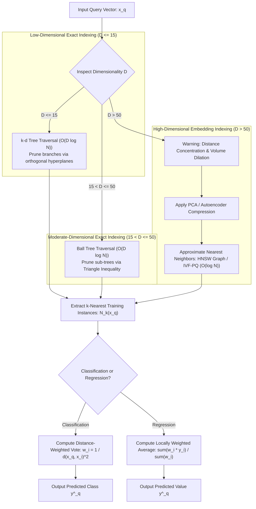

# Lesson 2: Summary and Assessment
## k-Nearest Neighbours: Module Summary and Assessment

The $k$-Nearest Neighbours (KNN) algorithm provides a non-parametric, instance-based approach to supervised learning by deferring functional abstraction until inference. Relying on the smoothness inductive bias, KNN assumes that observations mapped in close spatial proximity share identical categorical classes or continuous target values. Synthesizing lazy learning dynamics, voting mechanisms, the bias-variance trade-off across $k$, metric space geometry, the curse of dimensionality, and spatial indexing acceleration trees equips machine learning practitioners to deploy, calibrate, and scale proximity-based prediction systems.

## Synthesis of Core Week 6 Foundations

### The Lazy Learning Paradigm and Non-Parametric Capacity

- **Instance-based memory mechanics:** KNN executes zero parameter optimization during training ($O(1)$ time complexity), storing empirical training observations directly in memory:
  $$\mathcal{D} = \{(x^{(1)}, y^{(1)}), (x^{(2)}, y^{(2)}), \dots, (x^{(N)}, y^{(N)})\} \subset \mathbb{R}^D \times \mathcal{Y}$$
- **Inference latency trade-off:** All computational complexity shifts to the query phase ($O(N \cdot D)$), where the model computes pairwise distances between an unlabelled query vector $x_q$ and all stored training samples.
- **Dynamic local hypotheses:** Instead of optimizing a global decision boundary across the entire feature space, KNN constructs a custom localized hypothesis valid strictly within the immediate neighborhood $N_k(x_q)$.
- **Non-parametric capacity scaling:** The model makes zero structural assumptions regarding the true functional form $f(x)$, allowing its effective representational capacity to grow organically as sample size expands ($N \to \infty$).

### Decision Engines: Classification Voting and Continuous Regression

- **Unweighted majority voting:** Categorical predictions evaluate as the plurality mode across the $k$ nearest neighbors:
  $$\hat{y}_q = \arg\max_{c \in \{1, \dots, C\}} \sum_{i \in N_k(x_q)} \mathbf{1}[y^{(i)} = c]$$
- **Distance-weighted consensus:** Weighing neighbor votes inversely by squared Euclidean distance dampens boundary distortion from distant samples:
  $$w_i = \frac{1}{d(x_q, x^{(i)})^2 + \epsilon} \implies \hat{y}_q = \arg\max_c \sum_{i \in N_k(x_q)} w_i \mathbf{1}[y^{(i)} = c]$$
- **Locally weighted continuous regression:** Continuous targets ($y \in \mathbb{R}$) evaluate as the local weighted arithmetic mean across neighbors:
  $$\hat{y}_q = \frac{\sum_{i \in N_k(x_q)} w_i y^{(i)}}{\sum_{i \in N_k(x_q)} w_i}, \quad w_i = \frac{1}{d(x_q, x^{(i)})}$$
- **The regularizing effect of $k$:**
  - $k = 1$: Partitions space into a Voronoi tessellation. The model exhibits zero training error ($R_{\text{emp}} = 0$), low bias, and high variance, fitting isolated noise points (**overfitting**).
  - $k = N$: Averages the entire dataset, outputting global majority classes or sample means, yielding high bias and zero variance (**underfitting**).
- **The Cover-Hart bound:** As $N \to \infty$, the asymptotic error rate of a 1-NN classifier is upper-bounded by at most twice the optimal Bayes error rate:
  $$R^* \le R_{1\text{-NN}} \le 2 R^* (1 - R^*) \le 2 R^*$$

### Metric Space Geometries and Feature Scaling Imperatives

- **Minkowski distance metric family:** Parameterized by order $p \ge 1$:
  $$D(x, z) = \left( \sum_{d=1}^D |x_d - z_d|^p \right)^{\frac{1}{p}}$$
  encompassing Manhattan distance ($L_1, p=1$), Euclidean distance ($L_2, p=2$), and Chebyshev distance ($L_\infty, p \to \infty$).
- **The scale distortion phenomenon:** Distance metrics sum numerical differences across dimensions. An attribute with scale $[0, 100,000]$ contributes $10^{10}$ to squared Euclidean sums, rendering an attribute with scale $[0, 1]$ mathematically irrelevant.
- **Mandatory standardization:** All continuous features must undergo Z-score standardization ($x_{\text{std}} = \frac{x - \mu}{\sigma}$) or Min-Max scaling estimated strictly from the training split before computing nearest neighbors.

> [!Tip]
> **Calibrate k using odd numbers in binary tasks**: selecting an odd integer for $k$ eliminates binary voting ties, while distance-weighted voting ($\frac{1}{d^2}$) allows larger neighborhood sizes without sacrificing local boundary precision.

## The Proximity Search and Dimensionality Pipeline

> [!Important]
> **Exact search structures break down in high dimensions**: $k$-d trees degrade to brute-force $O(N)$ when $D > 20$ due to hypersphere-hyperplane intersections; high-dimensional embeddings require Ball trees ($D \le 50$) or Approximate Nearest Neighbor graphs like HNSW.

## Comprehensive Proximity Search Strategies Matrix

| Retrieval Method | Index Construction Complexity | Query Latency Complexity | Memory Overhead | Maximum Practical Dimensionality ($D$) | Mathematical Guarantee |
|---|---|---|---|---|---|
| **Brute-Force Scan** | $O(1)$ (No index constructed) | **$O(N \cdot D)$ (Exhaustive search)** | $O(N \cdot D)$ (Raw data storage) | Unbounded ($D > 10,000$) | **Exact** ($100\%$ precision) |
| **$k$-d Tree** | $O(D \cdot N \log N)$ | **$O(D \log N)$ (Low dimensions)** | $O(N \cdot D)$ (Tree node pointers) | Effective strictly for $D \le 15$ | **Exact** ($100\%$ precision) |
| **Ball Tree** | $O(D \cdot N \log N)$ | **$O(D \log N)$ (Moderate dimensions)** | $O(N \cdot D)$ (Hypersphere centroids/radii) | Effective for $D \le 50$ | **Exact** ($100\%$ precision) |
| **HNSW (Graph ANN)** | $O(N \log N \cdot M)$ | **$O(\log N)$ (High throughput)** | $O(N \cdot M)$ (Graph edge adjacency) | Scales to $D > 1,000$ | **Approximate** ($\approx 95-99\%$ recall) |
| **IVF-PQ (Inverted File)**| $O(N \cdot D \cdot I)$ (K-Means clustering) | **$O(C_{\text{probe}} \cdot \frac{N}{K} + D')$** | $O(N \cdot B)$ (Quantized byte codes) | Scales to $D > 1,000$ | **Approximate** (Vector compression) |

> [!Tip]
> **Select retrieval methods based on dimensions and latency constraints**: deploy $k$-d trees for physical spatial coordinates ($D \le 3$), Ball trees for intermediate tabular features ($D \le 50$), and HNSW vector graphs for deep learning embeddings ($D > 100$).

## Assessment Preparation

### Conceptual Review Questions

- **Question 1 (The Theoretical Bounds of the Cover-Hart Theorem):** What are the mathematical implications of the Cover-Hart bound $R^* \le R_{1\text{-NN}} \le 2 R^* (1 - R^*)$ on asymptotic error rates?
  - *Answer:* The Cover-Hart theorem proves that as the volume of training data approaches infinity ($N \to \infty$), the probability of error for an unparameterized 1-Nearest Neighbour classifier ($R_{1\text{-NN}}$) is lower-bounded by the optimal Bayes error rate ($R^*$) and upper-bounded by at most twice the Bayes error rate ($2R^*$). Because $2R^*(1 - R^*) \le 2R^*$, if the true underlying classes are completely separable ($R^* = 0$), the 1-NN classifier achieves an asymptotic error rate of zero ($R_{1\text{-NN}} = 0$). If the Bayes error is $10\%$ ($R^* = 0.10$), the 1-NN error rate cannot exceed $2(0.10)(0.90) = 18\%$, demonstrating that nearest-neighbor classification recovers substantial predictive information from empirical data without parametric training.
- **Question 2 (The Breakdown of $k$-d Trees in High Dimensions):** Explain why the query time complexity of a $k$-d tree degrades from $O(\log N)$ to brute-force $O(N)$ when feature dimensionality exceeds $D > 20$.
  - *Answer:* A $k$-d tree accelerates queries by checking whether a query hypersphere (centered at query point $x_q$ with radius equal to the current nearest distance $d_{\text{best}}$) intersects the axis-aligned splitting hyperplanes of adjacent branches. If no intersection occurs, the entire adjacent sub-tree is pruned from search. As dimensionality $D$ expands, the volume of a hypersphere concentrates toward its outer surface, and the number of orthogonal coordinate hyperplanes surrounding any query point expands exponentially ($2^D$). Consequently, the query hypersphere intersects almost every partitioning hyperplane in the tree, preventing branch pruning. The search algorithm is forced to backtrack and inspect almost every leaf node, reducing query performance to a brute-force linear scan ($O(N \cdot D)$).
- **Question 3 (The Distance Concentration Phenomenon):** State the mathematical theorem governing distance concentration in high-dimensional metric spaces, and explain its consequence on nearest-neighbor selection.
  - *Answer:* Kevin Beyer et al. (1999) proved that under broad distributional conditions, as dimensionality approaches infinity ($D \to \infty$), the difference between the distance to the farthest observation ($d_{\max}$) and the distance to the nearest observation ($d_{\min}$) normalized by the minimum distance converges to zero:
    $$\lim_{D \to \infty} \frac{d_{\max} - d_{\min}}{d_{\min}} = 0$$
    In high-dimensional feature spaces, the contrast between the closest neighbor and the farthest observation vanishes; all pairs of points become approximately equidistant from each other. Proximity-based nearest-neighbor selection loses discriminative validity because query points cannot distinguish local neighbors from distant points.
- **Question 4 (Volume Dilation and Neighborhood Non-Locality):** Derive why capturing a fixed fraction $f$ of training instances in a $D$-dimensional unit hypercube forces the neighborhood to span almost the entire range of every coordinate axis.
  - *Answer:* Consider a uniform data distribution over a $D$-dimensional unit hypercube $[0, 1]^D$, possessing total volume $V = 1.0$. To encompass a local neighborhood containing a fraction $f \in (0, 1)$ of the total data volume, an axis-aligned sub-cube of uniform edge length $e$ must satisfy:
    $$\text{Volume}_{\text{sub-cube}} = e^D = f$$
    Solving for the required edge length $e$ yields:
    $$e = f^{\frac{1}{D}}$$
    As dimensionality $D$ grows large, the exponent $\frac{1}{D}$ approaches zero, driving the edge length toward unity:
    $$\lim_{D \to \infty} f^{\frac{1}{D}} = f^0 = 1.0$$
    To capture even a tiny fraction of data (e.g., $f = 0.01$ or 1% of instances) in $D = 100$ dimensions, the edge length must span $e = (0.01)^{0.01} \approx 0.955$ ($95.5\%$ of each coordinate axis). The neighborhood ceases to be "local," violating the foundational smoothness assumption of lazy learning.

### Applied Analytical Scenarios

- **Scenario A (Sub-Millisecond Inference Bottlenecks in Face Recognition):** A security platform deploys a 1-NN classifier over 5 million facial embedding vectors ($D = 512$) to authenticate users at an entry gate. Using a brute-force scan, the query takes 1.8 seconds per user, causing long physical queues. The engineering team constructs a $k$-d tree, but query latency remains unchanged at 1.8 seconds.
  - *Diagnosis:* The pipeline is failing due to two structural issues: brute-force scanning scales linearly with sample size ($5 \times 10^6 \times 512 \approx 2.5 \times 10^9$ operations per query), and $k$-d trees break down completely when $D > 20$ due to hyperplane intersections, reverting to brute-force speeds.
  - *Remedy:* Replace the $k$-d tree with an **Approximate Nearest Neighbor (ANN)** graph structure, specifically **Hierarchical Navigable Small World (HNSW)** or **FAISS IVF-PQ**. HNSW indexes embeddings into multi-layer proximity graphs that evaluate queries in $O(\log N)$ time, cutting query latency from 1.8 seconds to under 2 milliseconds while maintaining $\ge 98\%$ retrieval accuracy.
- **Scenario B (Distance Metric Failure on Unnormalized Clinical Telemetry):** A hospital emergency room builds a 5-NN patient monitoring model using raw clinical telemetry. The feature set includes `Heart_Rate` (range $[40, 180]$ bpm) and `Blood_Potassium` (range $[3.1, 5.8]$ mmol/L). The model achieves 99% accuracy predicting tachycardia, but completely fails to detect critical hyperkalemia (lethal potassium spikes).
  - *Diagnosis:* The features were fed into Euclidean distance calculations without normalization. Heart rate differences (spanning up to 140 units) generate squared differences up to $(140)^2 = 19,600$, while potassium differences (spanning 2.7 units) generate squared differences at most $(2.7)^2 = 7.29$. The heart rate feature contributes over 99.9% of the distance metric, rendering the potassium feature mathematically invisible during neighbor retrieval.
  - *Remedy:* Insert a **Z-Score Standardization** transformer into the preprocessing pipeline: $x_{\text{std}} = \frac{x - \mu}{\sigma}$. Standardizing features ensures both heart rate and blood potassium contribute with equal variance to metric distances.
- **Scenario C (Label Noise Corruption in Low-k Classifiers):** An e-commerce platform classifies customer return risk using a 1-NN classifier. Audit logs reveal that approximately 3% of historical training returns were incorrectly labeled by customer service agents. Model validation accuracy on new users drops by 14%.
  - *Diagnosis:* A 1-NN classifier has zero tolerance for label noise. When $k=1$, the decision boundary wraps around every single mislabeled training point, creating isolated Voronoi error pockets that misclassify legitimate users residing nearby.
  - *Remedy:* Increase the neighborhood size to an intermediate odd integer ($k = 7$ or $k = 9$) and implement **Distance-Weighted Voting** ($w_i = \frac{1}{d_i^2}$). Expanding $k$ allows the consensus of surrounding correctly labeled neighbors to override isolated label noise.

> [!Important]
> **Noise requires larger neighborhood consensus**: a 1-NN classifier memorizes training label noise and creates erroneous Voronoi pockets; increasing $k$ to an odd integer and applying distance weighting filters out mislabeled outliers.

### Self-Assessment Technical Calculations

#### Problem 1: Stepwise 2D KNN Classification (Unweighted Versus Distance-Weighted Voting)

A training dataset contains five observations across two classes:
- $x_1 = [1.0, \; 2.0]^T \implies y_1 = \text{Class } A$
- $x_2 = [2.0, \; 3.5]^T \implies y_2 = \text{Class } B$
- $x_3 = [3.5, \; 2.0]^T \implies y_3 = \text{Class } B$
- $x_4 = [5.0, \; 6.0]^T \implies y_4 = \text{Class } A$
- $x_5 = [0.0, \; 0.0]^T \implies y_5 = \text{Class } A$

A query observation arrives at coordinates $x_q = [2.0, \; 2.0]^T$. The model is configured with hyperparameter $k = 3$ under Euclidean distance.

1. Compute the squared Euclidean distance $\|x_q - x_i\|_2^2$ and true Euclidean distance $d_i$ from query point $x_q$ to all five training observations.
2. Identify the $k = 3$ nearest neighbors forming neighborhood $N_3(x_q)$.
3. Predict the target class using **Unweighted Majority Voting**.
4. Predict the target class using **Distance-Weighted Voting** ($w_i = \frac{1}{d_i^2}$), and contrast the outcome.

*Stepwise Solution:*
1. Distance Computations to $x_q = [2.0, \; 2.0]^T$:
   - For $x_1 = [1.0, \; 2.0]^T$:
     $$\|x_q - x_1\|_2^2 = (2.0 - 1.0)^2 + (2.0 - 2.0)^2 = 1.0^2 + 0.0 = \mathbf{1.00} \implies d_1 = \mathbf{1.000}$$
   - For $x_2 = [2.0, \; 3.5]^T$:
     $$\|x_q - x_2\|_2^2 = (2.0 - 2.0)^2 + (2.0 - 3.5)^2 = 0.0 + (-1.5)^2 = \mathbf{2.25} \implies d_2 = \mathbf{1.500}$$
   - For $x_3 = [3.5, \; 2.0]^T$:
     $$\|x_q - x_3\|_2^2 = (2.0 - 3.5)^2 + (2.0 - 2.0)^2 = (-1.5)^2 + 0.0 = \mathbf{2.25} \implies d_3 = \mathbf{1.500}$$
   - For $x_4 = [5.0, \; 6.0]^T$:
     $$\|x_q - x_4\|_2^2 = (2.0 - 5.0)^2 + (2.0 - 6.0)^2 = (-3.0)^2 + (-4.0)^2 = 9.0 + 16.0 = \mathbf{25.00} \implies d_4 = \mathbf{5.000}$$
   - For $x_5 = [0.0, \; 0.0]^T$:
     $$\|x_q - x_5\|_2^2 = (2.0 - 0.0)^2 + (2.0 - 0.0)^2 = 4.0 + 4.0 = \mathbf{8.00} \implies d_5 = \sqrt{8} \approx \mathbf{2.828}$$
2. Neighborhood Extraction ($k = 3$ smallest distances):
   - Sorted distances: $d_1 (1.000) < d_2 (1.500) = d_3 (1.500) < d_5 (2.828) < d_4 (5.000)$.
   - The $k=3$ nearest neighbors are:
     $$N_3(x_q) = \{x_1, \; x_2, \; x_3\}$$
     with labels $\{y_1 = A, \; y_2 = B, \; y_3 = B\}$.
3. Unweighted Majority Voting:
   - Count votes across neighbors:
     $$\text{Votes}(A) = \sum_{i \in \{1, 2, 3\}} \mathbf{1}[y_i = A] = \mathbf{1}$$
     $$\text{Votes}(B) = \sum_{i \in \{1, 2, 3\}} \mathbf{1}[y_i = B] = 1 + 1 = \mathbf{2}$$
   - Unweighted prediction:
     $$\hat{y}_q = \arg\max(1, 2) = \mathbf{\text{Class } B}$$
4. Distance-Weighted Voting ($w_i = \frac{1}{d_i^2}$):
   - Calculate weights:
     $$w_1 = \frac{1}{d_1^2} = \frac{1}{1.00} = \mathbf{1.0000}$$
     $$w_2 = \frac{1}{d_2^2} = \frac{1}{2.25} \approx \mathbf{0.4444}$$
     $$w_3 = \frac{1}{d_3^2} = \frac{1}{2.25} \approx \mathbf{0.4444}$$
   - Aggregate weights by class:
     $$\text{Weight}(A) = w_1 = \mathbf{1.0000}$$
     $$\text{Weight}(B) = w_2 + w_3 = 0.4444 + 0.4444 = \mathbf{0.8888}$$
   - Distance-weighted prediction:
     $$\hat{y}_q = \arg\max(1.0000, \; 0.8888) = \mathbf{\text{Class } A}$$
*Conclusion:* Unweighted voting selects Class B because two neighbors vote for B. Distance-weighted voting reverses the decision, selecting Class A because neighbor $x_1$ is substantially closer to the query point than $x_2$ and $x_3$.

#### Problem 2: Volume Dilation and Neighborhood Non-Locality Derivation

To investigate the curse of dimensionality, an analyst evaluates the hypercube edge length $e$ required to capture a local neighborhood containing exactly $f = 0.05$ (5% of total data volume) within a uniform unit hypercube $[0, 1]^D$.

1. State the mathematical formula expressing edge length $e$ as a function of volume fraction $f$ and dimensionality $D$.
2. Compute the exact required edge length $e$ for dimensions $D = 1$, $D = 2$, $D = 10$, and $D = 100$.
3. Explain why the result in $D = 100$ violates the local smoothness assumption of lazy learning.

*Stepwise Solution:*
1. Edge Length Formula Derivation:
   - The volume of a $D$-dimensional hypercube with edge length $e \in [0, 1]$ evaluates as $V = e^D$.
   - To capture a volume fraction $f$:
     $$e^D = f \implies e = f^{\frac{1}{D}}$$
2. Numerical Edge Length Evaluations for $f = 0.05$:
   - **For $D = 1$ Dimension:**
     $$e = (0.05)^{\frac{1}{1}} = \mathbf{0.0500} \quad (\text{Spans } 5.0\% \text{ of the coordinate axis})$$
   - **For $D = 2$ Dimensions:**
     $$e = (0.05)^{\frac{1}{2}} = \sqrt{0.05} \approx \mathbf{0.2236} \quad (\text{Spans } 22.4\% \text{ of each axis})$$
   - **For $D = 10$ Dimensions:**
     $$e = (0.05)^{\frac{1}{10}} = (0.05)^{0.10} \approx \mathbf{0.7411} \quad (\text{Spans } 74.1\% \text{ of each axis})$$
   - **For $D = 100$ Dimensions:**
     $$e = (0.05)^{\frac{1}{100}} = (0.05)^{0.01} \approx \mathbf{0.9705} \quad (\text{Spans } 97.1\% \text{ of each axis})$$
3. Violation of Local Smoothness:
   - In 100-dimensional space, capturing even 5% of the data points requires the neighborhood to span $97.1\%$ of the entire length of every single coordinate axis.
   - The neighborhood ceases to be "local" and instead encompasses virtually the entire feature space. Points included in the neighborhood differ across multiple attributes, violating the Lipschitz smoothness assumption that nearby points share similar target values.

#### Problem 3: Locally Weighted Continuous Regression Prediction

A 1D continuous dataset stores four training points pairing feature $x$ with target $y$:
- $x_1 = 2.0 \implies y_1 = 10.0$
- $x_2 = 4.0 \implies y_2 = 14.0$
- $x_3 = 5.0 \implies y_3 = 20.0$
- $x_4 = 9.0 \implies y_4 = 40.0$

A regression query arrives at $x_q = 3.0$ with neighborhood size $k = 3$.

1. Identify the $k = 3$ nearest neighbors under Manhattan/Euclidean distance ($|x_q - x_i|$).
2. Calculate the unweighted KNN regression prediction $\hat{y}_{\text{unweighted}}$.
3. Calculate the distance-weighted regression prediction $\hat{y}_{\text{weighted}}$ using linear inverse distance weights: $w_i = \frac{1}{d(x_q, x_i)}$.

*Stepwise Solution:*
1. Identify Nearest Neighbors to $x_q = 3.0$:
   - $d_1 = |3.0 - 2.0| = \mathbf{1.0}$
   - $d_2 = |3.0 - 4.0| = \mathbf{1.0}$
   - $d_3 = |3.0 - 5.0| = \mathbf{2.0}$
   - $d_4 = |3.0 - 9.0| = 6.0$ (Excluded from $k=3$)
   - The $k=3$ neighbors are $\{x_1, x_2, x_3\}$ with target values $\{10.0, 14.0, 20.0\}$.
2. Unweighted Regression Prediction:
   $$\hat{y}_{\text{unweighted}} = \frac{1}{3} (y_1 + y_2 + y_3) = \frac{10.0 + 14.0 + 20.0}{3} = \frac{44.0}{3} \approx \mathbf{14.6667}$$
3. Distance-Weighted Regression Prediction:
   - Compute individual weights:
     $$w_1 = \frac{1}{d_1} = \frac{1}{1.0} = \mathbf{1.0000}$$
     $$w_2 = \frac{1}{d_2} = \frac{1}{1.0} = \mathbf{1.0000}$$
     $$w_3 = \frac{1}{d_3} = \frac{1}{2.0} = \mathbf{0.5000}$$
   - Sum of weights:
     $$\sum_{i=1}^3 w_i = 1.0 + 1.0 + 0.5 = \mathbf{2.5000}$$
   - Compute weighted numerator:
     $$\sum_{i=1}^3 w_i y_i = (1.0 \times 10.0) + (1.0 \times 14.0) + (0.5 \times 20.0) = 10.0 + 14.0 + 10.0 = \mathbf{34.0000}$$
   - Evaluate weighted prediction:
     $$\hat{y}_{\text{weighted}} = \frac{34.0000}{2.5000} = \mathbf{13.6000}$$
*Conclusion:* Distance weighting pulls the prediction from $14.67$ down to $13.60$, dampening the influence of distant neighbor $x_3$ ($y_3 = 20.0$) in favor of the closer observations $x_1$ and $x_2$.

> [!Tip]
> **Manual calculation clarifies proximity mechanics**: walking through distance-weighted voting tallies, volume dilation powers, and local regression weights confirms how metric parameters govern non-parametric inference.

## Key Takeaways

- **KNN is an instance-based lazy learner**, storing raw observations without optimization ($O(1)$ training) and deferring distance calculations to query time ($O(N \cdot D)$).
- **The algorithm assumes local smoothness**, relying on spatial proximity under Lipschitz continuity assumptions to estimate target labels.
- **The hyperparameter $k$ governs model capacity**: setting $k=1$ produces non-linear Voronoi partitions prone to overfitting, while setting $k=N$ outputs global sample means, causing underfitting.
- **The Cover-Hart Theorem bounds asymptotic 1-NN error**: as sample size approaches infinity ($N \to \infty$), the 1-NN error rate is bounded by at most twice the optimal Bayes error rate ($R^* \le R_{1\text{-NN}} \le 2R^*$).
- **Feature standardization is mandatory**: because distance metrics evaluate numerical differences across coordinate axes, unscaled attributes dominate distance calculations.
- **The curse of dimensionality causes distance concentration**: as $D \to \infty$, the difference between minimum and maximum distances approaches zero, making points appear equidistant.
- **Volume dilation invalidates local neighborhoods**: in high dimensions, capturing even 5% of data volume requires neighborhoods to span almost the entire range of every coordinate axis.
- **Spatial indexing trees accelerate low-dimensional queries**: $k$-d trees and Ball trees prune sub-trees using orthogonal hyperplanes and triangle inequalities, achieving $O(\log N)$ query times when $D$ is small.
- **Approximate Nearest Neighbor (HNSW) graphs power high-dimensional retrieval**, trading exact mathematical precision for sub-millisecond search speeds across vector embeddings.

> [!Tip]
> The foundational law of instance-based prediction: **local proximity defines target likelihood, but feature scaling and dimensionality control validity**; ensuring attributes are standardized and compressing high-dimensional spaces allows nearest-neighbor estimators to deliver reliable non-parametric predictions.
