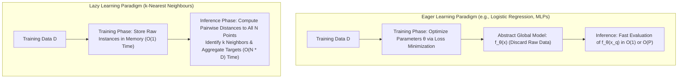

# Migration in progress
# Week 6: Supervised Learning: k-Nearest Neighbour

## Supervised Learning: k-Nearest Neighbours Foundations, Metrics, and Scalability

The $k$-Nearest Neighbours (KNN) algorithm represents the primary non-parametric, instance-based approach to supervised learning. Unlike eager learning algorithms that optimize an explicit global mathematical function during a dedicated training phase, KNN defers computation until inference time, storing raw observations in memory to generate localized predictions. Examining its lazy learning mechanics, classification and regression decision engines, metric space formulations, the curse of dimensionality, and spatial indexing acceleration trees establishes the theoretical and operational foundations of proximity-based supervised prediction.

## Foundations of Instance-Based Lazy Learning

### Lazy Versus Eager Learning Paradigms

- **Eager Learning:** Algorithms (such as Logistic Regression, Decision Trees, and Neural Networks) process the training dataset $\mathcal{D}$ during an upfront fitting phase, optimizing parameter weights $\theta$ to construct an abstract global hypothesis function $f_\theta(x)$. Once training concludes, raw training instances can be discarded; inference requires evaluating only the compact mathematical function $f_\theta(x)$.
- **Lazy Learning (Instance-Based / Memory-Based):** The algorithm executes zero parameter optimization during training, simply ingesting and storing the empirical observations:
  $$\text{Training Phase: } \mathcal{D} = \{(x^{(1)}, y^{(1)}), (x^{(2)}, y^{(2)}), \dots, (x^{(N)}, y^{(N)})\} \to \text{Memory Allocation}$$
- Computational cost shifts entirely to the **query phase**: when presented with an unseen test point $x_q$, the model computes pairwise distances between $x_q$ and all stored training samples, dynamically constructing a local hypothesis tailored to the immediate neighborhood.

### The Local Smoothness and Lipschitz Continuity Assumption

- KNN relies on the foundational **smoothness assumption**: observations residing in close spatial proximity within feature space $\mathbb{R}^D$ are assumed to share identical target labels or similar continuous responses:
  $$d(x_i, x_j) \approx 0 \implies P(Y \mid X = x_i) \approx P(Y \mid X = x_j)$$
- This assumes that the underlying data-generating function $f(x)$ satisfies **Lipschitz continuity**, bounding the rate at which target values can change relative to spatial displacement:
  $$|f(x_1) - f(x_2)| \le L \|x_1 - x_2\|$$
  where $L < \infty$ represents the Lipschitz constant.

### Non-Parametric Capacity Scaling

- Parametric models enforce a fixed number of parameters (e.g., $w \in \mathbb{R}^D$ in linear models), bounding model capacity independently of dataset size $N$.
- KNN is strictly **non-parametric**: it does not assume a functional form for $f(x)$, and its effective capacity scales dynamically with dataset size $N$.
- As the volume of training instances expands ($N \to \infty$), the spatial neighborhoods around query points shrink toward zero ($d \to 0$), allowing KNN to approximate arbitrary continuous functions or non-linear decision boundaries.

> [!Important]
> **Lazy learning shifts compute from training to inference**: KNN requires zero training time ($O(1)$) by storing raw data directly, but incurs high inference latency ($O(N \cdot D)$) because every query requires calculating distances across all stored observations.

## The KNN Decision Engine: Classification and Regression

### Majority Voting and Distance-Weighted Classification

- Given a query vector $x_q$, the algorithm identifies the set of $k$ closest training points under distance metric $d(\cdot)$, denoted $N_k(x_q) \subset \mathcal{D}$.
- **Unweighted Majority Voting:** Each neighbor casts an equal vote, and the query point assigns to the most frequent categorical mode:
  $$\hat{y} = \arg\max_{c \in \{1, \dots, C\}} \sum_{i \in N_k(x_q)} \mathbf{1}[y^{(i)} = c]$$
- **Distance-Weighted Voting:** Assigning equal votes can cause errors if distant neighbors overpower closer instances. Weighting votes inversely by distance prioritizes closer samples:
  $$w_i = \frac{1}{d(x_q, x^{(i)})^2 + \epsilon}$$
  $$\hat{y} = \arg\max_{c \in \{1, \dots, C\}} \sum_{i \in N_k(x_q)} w_i \mathbf{1}[y^{(i)} = c]$$
  where $\epsilon \approx 10^{-8}$ prevents division by zero when a query point coincides with a training observation.

### Continuous Regression and Locally Weighted Averaging

- For continuous regression targets ($y \in \mathbb{R}$), KNN estimates the conditional expectation $\mathbb{E}[Y \mid X = x_q]$ by computing the arithmetic mean of the neighboring responses:
  $$\hat{y} = \frac{1}{k} \sum_{i \in N_k(x_q)} y^{(i)}$$
- Applying distance weighting constructs a **locally weighted kernel smoother**:
  $$\hat{y} = \frac{\sum_{i \in N_k(x_q)} w_i y^{(i)}}{\sum_{i \in N_k(x_q)} w_i}, \quad w_i = \frac{1}{d(x_q, x^{(i)})}$$

### The Capacity Spectrum: $k=1$ Voronoi Overfitting to $k=N$ Underfitting

- The hyperparameter $k$ acts as an explicit regularizer, controlling model complexity across the bias-variance spectrum:
  - **$k = 1$ (1-Nearest Neighbour):**
    - The decision boundary forms a non-linear **Voronoi tessellation** around individual training points.
    - Training error evaluates to zero ($R_{\text{emp}} = 0$).
    - The model exhibits **low bias and high variance**, creating sharp, jagged decision boundaries that fit isolated outliers, measurement noise, and sample quirks (**overfitting**).
  - **Intermediate $k$ (e.g., $k \in [3, 15]$):**
    - Averages out local noise by aggregating consensus over a local neighborhood, producing smooth, robust decision boundaries.
  - **$k = N$ (Global Average):**
    - The neighborhood expands to encompass the entire dataset.
    - For classification, the model predicts the global majority class for all inputs; for regression, it outputs the global sample mean $\bar{y}$.
    - The model exhibits **high bias and zero variance**, ignoring local feature variations (**underfitting**).

### The Cover-Hart Theoretical Generalization Bound

- In a foundational theoretical result, Thomas Cover and Peter Hart (1967) proved that as dataset size approaches infinity ($N \to \infty$), the asymptotic probability of error for a 1-Nearest Neighbour classifier ($R_{1\text{-NN}}$) is tightly bounded by the theoretical **Bayes error rate** ($R^*$):
  $$R^* \le R_{1\text{-NN}} \le 2 R^* (1 - R^*) \le 2 R^*$$
  where $R^*$ represents the lowest achievable error rate by any classifier given complete knowledge of true distributions $P(X, Y)$.
- This theorem proves that even a simple 1-NN model captures at least half of the information contained in an infinite training set without parametric tuning.

> [!Tip]
> **Use odd values of k for binary classification**: selecting an odd integer (e.g., $k = 3, 5, 7$) eliminates voting ties in two-class problems, while cross-validation determines the optimal point on the bias-variance spectrum.

## Metric Spaces and Distance Formulations

### Minkowski Metrics: Manhattan, Euclidean, and Chebyshev

- The choice of distance metric defines the geometric topology of the neighborhood. The generalized **Minkowski distance** between vectors $x, z \in \mathbb{R}^D$ is parameterized by order $p \ge 1$:
  $$D_{\text{Minkowski}}(x, z) = \left( \sum_{d=1}^D |x_d - z_d|^p \right)^{\frac{1}{p}}$$
- **Manhattan Distance ($L_1$ Norm, $p = 1$):**
  $$D_{L_1}(x, z) = \sum_{d=1}^D |x_d - z_d|$$
  Evaluates rectilinear grid displacements (city-block paths). Iso-distance contours form diamond-shaped geometries. It is less sensitive to extreme outliers along individual dimensions than higher-order norms.
- **Euclidean Distance ($L_2$ Norm, $p = 2$):**
  $$D_{L_2}(x, z) = \sqrt{\sum_{d=1}^D (x_d - z_d)^2}$$
  Evaluates straight-line physical displacement. Iso-distance contours form isotropic hyperspheres.
- **Chebyshev Distance ($L_\infty$ Norm, $p \to \infty$):**
  $$D_{L_\infty}(x, z) = \max_{d \in \{1, \dots, D\}} |x_d - z_d|$$
  Measures the maximum single coordinate deviation. Iso-distance contours form hypercubes.

### Cosine Distance for Angular Orientation

- In text mining, document retrieval, and high-dimensional representation learning, vector magnitude reflects document length rather than thematic content.
- **Cosine Distance** normalizes vector lengths to evaluate angular disparity:
  $$D_{\text{Cosine}}(x, z) = 1 - \frac{x \cdot z}{\|x\|_2 \|z\|_2} = 1 - \frac{\sum_{d=1}^D x_d z_d}{\sqrt{\sum x_d^2} \sqrt{\sum z_d^2}}$$
- Cosine distance ranges within $[0, 2]$, measuring semantic directional alignment while remaining invariant to uniform vector scaling ($c \cdot x$).

### Mahalanobis Distance for Covariance-Aware Geometry

- Standard Euclidean metrics assume that feature dimensions are uncorrelated and share identical unit variance.
- When features exhibit correlation and unequal variance, Euclidean distances become distorted.
- **Mahalanobis Distance** incorporates the empirical covariance matrix $\Sigma \in \mathbb{R}^{D \times D}$ to decorrelate features and scale by directional variance:
  $$D_{\text{Mahalanobis}}(x, z) = \sqrt{(x - z)^T \Sigma^{-1} (x - z)}$$
- If features are uncorrelated with unit variance ($\Sigma = I$), Mahalanobis distance simplifies to standard Euclidean distance.

### The Imperative of Feature Scaling

- Distance metrics sum differences across all coordinate axes.
- If attribute $A_1$ (e.g., Annual Income) has range $[10,000, \; 500,000]$ and attribute $A_2$ (e.g., Number of Children) has range $[0, \; 5]$:
  $$d(x, z) = \sqrt{(50,000 - 45,000)^2 + (3 - 1)^2} = \sqrt{25,000,000 + 4} \approx 5,000.0004$$
- The unscaled income feature completely dominates the distance metric, rendering the child count attribute mathematically irrelevant.
- Continuous attributes must be rescaled using **Z-score standardization** ($x_{\text{std}} = \frac{x - \mu}{\sigma}$) or **Min-Max normalization** ($x_{\text{norm}} = \frac{x - x_{\min}}{x_{\max} - x_{\min}}$) before computing nearest neighbors.

> [!Important]
> **Unscaled features distort distance metrics**: attributes with large raw numerical ranges dominate Euclidean calculations; features must be standardized to unit variance to ensure all dimensions contribute equally to neighborhood selection.

## The Curse of Dimensionality in Proximity Estimation

### The Distance Concentration Phenomenon

- As feature dimensionality $D$ expands, the volume of the space grows exponentially relative to the data, causi